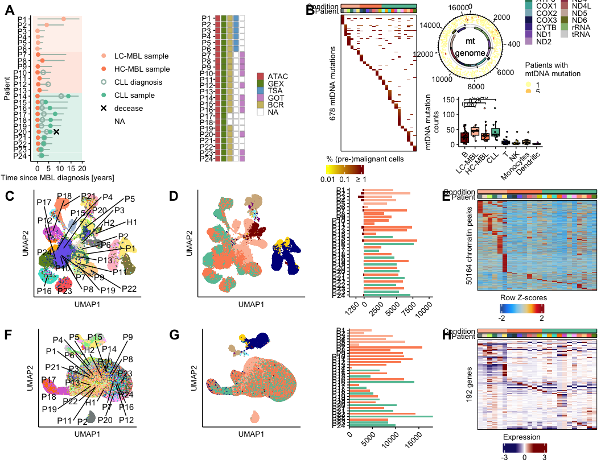
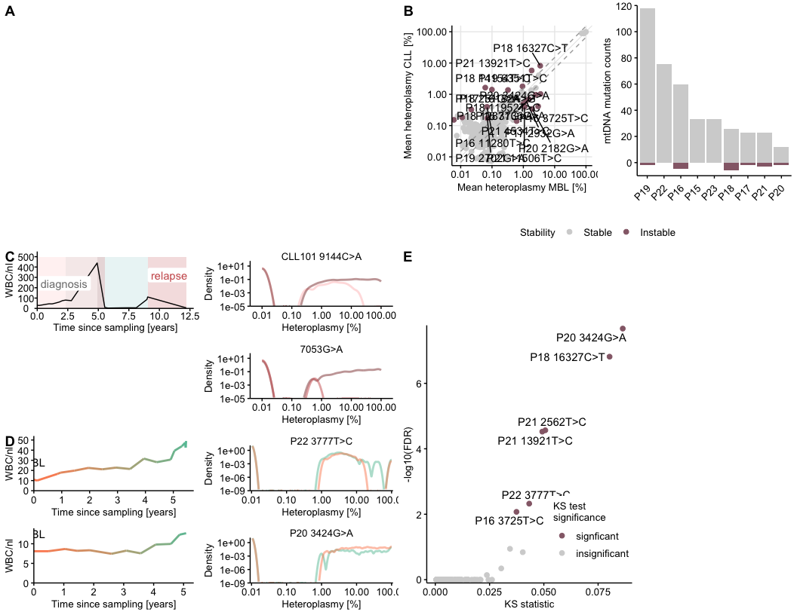
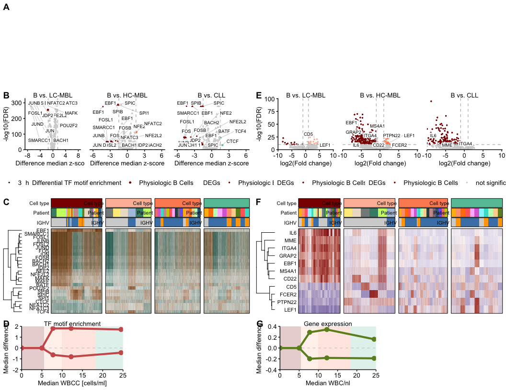
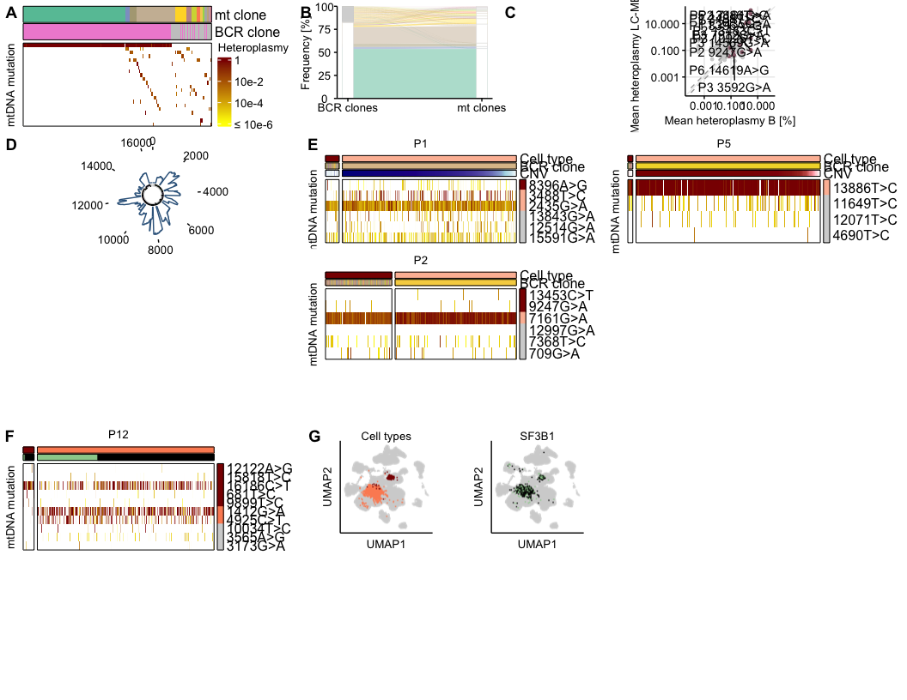
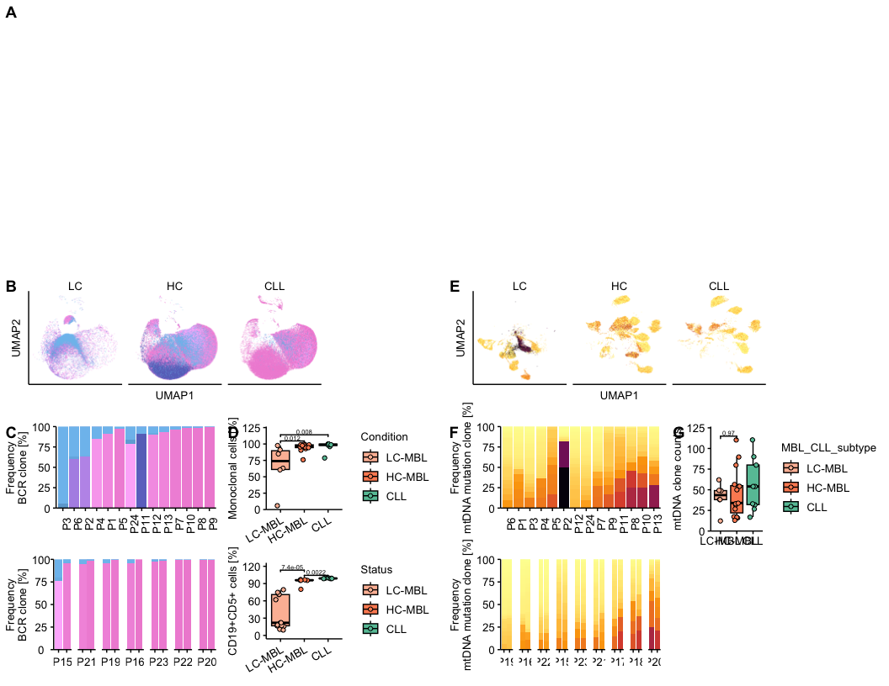

Publication Main Figures
================
Anja Rathgeber
24 March, 2026

- [GOAL](#goal)
- [Load Libraries](#load-libraries)
- [Set Paths](#set-paths)
- [Load Data](#load-data)
- [Recreate Plots](#recreate-plots)
  - [Figure 1](#figure-1)
  - [Figure 2](#figure-2)
  - [Figure 4](#figure-4)
  - [Figure 6](#figure-6)
- [Plot Publication Figures](#plot-publication-figures)
  - [Fig.1 Cohort Characterisation and Experimental
    Setup](#fig1-cohort-characterisation-and-experimental-setup)
  - [Fig.2 Cell type annotation](#fig2-cell-type-annotation)
  - [Fig.3 Heteroplasmy Analysis](#fig3-heteroplasmy-analysis)
  - [Fig.4 Pseudobulk Differential
    Analysis](#fig4-pseudobulk-differential-analysis)
  - [Fig.5 Cross Validation mtDNA mtRNA
    Variants](#fig5-cross-validation-mtdna-mtrna-variants)
  - [Fig.6 Clonal Dynamics](#fig6-clonal-dynamics)

# GOAL

The aim of this script is to prepare publication ready plots, which
summarise the most important aspects.

# Load Libraries

``` r
library(tidyverse)
library(ggpubr)
library(cowplot)
library(ggrepel)
library(Seurat)
```

# Set Paths

``` r
data_dir <- file.path(project_dir, "data")
result_dir <- file.path(project_dir, "results")
summary_dir <- file.path(project_dir, "Summary_Plots")

RDS_dir <- file.path(project_dir, "RDS_Objects")
DCA_RDS_dir <- file.path(result_dir, "DCA_analysis/RDS_objects")
DPA_RDS_dir <- file.path(result_dir, "DPA_analysis/RDS_objects")
GEX_RDS_dir <- file.path(result_dir, "GEX_analysis/RDS_objects")
mtDNA_mutation_RDS_dir <- file.path(result_dir, "mtDNA_mutation_analysis/RDS_Objects")
heteroplasmy_RDS_dir <- file.path(result_dir, "Heteroplasmy_analysis/RDS_Objects")
VDJ_RDS_dir <- file.path(result_dir, "VDJ_analysis/RDS_Objects")
mtDNA_BCR_analysis_RDS_dir <- file.path(result_dir, "mtDNA_BCR_analysis/RDS_objects")
mtDNA_mutation_analysis_RDS_dir <- file.path(result_dir, "mtDNA_mutation_analysis/RDS_Objects")
biclonal_analysis_RDS_dir <- file.path(result_dir, "Biclonal_analysis/RDS_Objects")
longread_mtDNA_BCR_analysis_RDS_dir <- file.path(result_dir, "longread_mtDNA_BCR_analysis/RDS_Objects")
Surface_marker_RDS_dir <- file.path(result_dir, "Surface_marker_analysis/RDS_Objects")
DESeq2_RDS_dir <- file.path(result_dir, "DESeq2_analysis/RDS_Objects")
Clinical_data_RDS_dir <- file.path(result_dir, "Clinical_data_analysis/RDS_Objects")

FACs_data_analysis_tsv_dir <- file.path(result_dir, "FACs_data_analysis/tsv_data")
GEX_tsv_dir <- file.path(result_dir, "GEX_analysis/tsv_data")
DCA_tsv_dir <- file.path(result_dir, "DCA_analysis/tsv_data")
VDJ_tsv_dir <- file.path(result_dir, "VDJ_analysis/tsv_data")
DESeq2_tsv_dir <- file.path(result_dir, "DESeq2_analysis/tsv_data")
mtDNA_mutation_tsv_dir <- file.path(result_dir, "mtDNA_mutation_analysis/tsv_data")
mtDNA_mutation_analysis_tsv_dir <- file.path(result_dir, "mtDNA_mutation_analysis/tsv_data")
```

# Load Data

``` r
source(file.path(project_dir, "scripts/publication_theme.R"))
```

``` r
metadata <- read_tsv(file = file.path(data_dir, "20260309_Tidy_MBL_CLL_metadata.tsv"))
metadata_healthy_atac <- read_tsv(file.path(data_dir, "20250812_Healthy_controls_mtscATACseq.tsv"))
metadata_healthy_gex <- read_tsv(file = file.path(data_dir, "20250812_Healthy_controls_scRNAseq.tsv"))

# Figure 1
swimmers_plot <- readRDS(file.path(Clinical_data_RDS_dir, "swimmers_plot.RDS"))
metadata_heatmap <- readRDS(file.path(Clinical_data_RDS_dir, "metadata_heatmap.RDS"))
mtDNA_mutation_count_radial_plot <- readRDS(file.path(mtDNA_mutation_analysis_RDS_dir, "mt_count_radial_plot.RDS"))
mtDNA_mutation_patient_heatmap <- readRDS(file.path(mtDNA_mutation_analysis_RDS_dir, "mtDNA_mutation_patient_heatmap.RDS"))
downsampled_variant_counts_depthnorm_celltype_data <- read_tsv(file.path(mtDNA_mutation_tsv_dir, "downsampled_variant_counts_depthnorm_celltype_data.tsv"))

# Figure 2
ATAC_healthy_cell_annotation_umap_data <- read_tsv(file.path(DCA_tsv_dir, "20250325_ATAC_celltype_annotation_healthy.tsv"))
ATAC_healthy_patient_annotation_umap_data <- read_tsv(file.path(DCA_tsv_dir, "20250325_ATAC_patient_annotation_healthy.tsv"))
ATAC_healthy_patient_annotation_umap_centroids <- read_tsv(file.path(DCA_tsv_dir, "20250325_ATAC_patient_annotation_healthy_centroids.tsv"))
all_b_cell_plot_vertical <- readRDS(file = file.path(DCA_RDS_dir, "all_b_cell_plot_vertical.RDS"))
patient_peak_heatmap <- readRDS(file.path(DPA_RDS_dir, "Differential_peaks_patients_heatmap.RDS"))
GEX_healthy_patient_annotation_umap_data <- read_tsv(file.path(GEX_tsv_dir, "20260316_GEX_healthy_patient_annotation_noIG_umap_data.tsv"))
GEX_healthy_patient_annotation_umap_centroids <- read_tsv(file.path(GEX_tsv_dir, "20260316_GEX_healthy_patient_annotation_noIG_umap_centroids.tsv"))
GEX_healthy_cell_annotation_noIG_noB_umap_data <- read_tsv(file.path(GEX_tsv_dir, "20250326_UMAP_10X_seurat_all_no_IG_celltypes_MBL_CLL_subtype_split_noB_data.tsv"))
all_malignant_cell_plot_vertical <- readRDS(file.path(GEX_RDS_dir, "all_malignant_cell_plot_vertical.RDS"))
patient_genes_heatmap <- readRDS(file.path(GEX_RDS_dir, "genes_patient_heatmap.RDS"))

# Figure 3
## Penter and Gohil et al.
WBCC_CLL101_plot <- readRDS(file = file.path(project_dir_Penter_Gohil, "RDS_Objects", "WBCC_CLL101_plot.RDS"))
`density_distributions_CLL101_9144C>A` <- readRDS(file.path(project_dir_Penter_Gohil, "RDS_Objects/density_distributions_CLL101_9144C>A.RDS"))
`density_distributions_CLL101_7053G>A` <- readRDS(file.path(project_dir_Penter_Gohil, "RDS_Objects/density_distributions_CLL101_7053G>A.RDS"))

## Our cohort
WBCC_CLL7_plot <- readRDS(file = file.path(Clinical_data_RDS_dir, "WBCC_CLL7_plot.RDS"))
WBCC_CLL4_plot <- readRDS(file = file.path(Clinical_data_RDS_dir, "WBCC_CLL4_plot.RDS"))
`density_distributions_CLL4_3424G>A` <- readRDS(file.path(heteroplasmy_RDS_dir, "density_distributions_CLL4_3424G>A.RDS"))
`density_distributions_CLL9_3777T>C` <- readRDS(file.path(heteroplasmy_RDS_dir, "density_distributions_CLL9_3777T>C.RDS"))
summary_scatterplot_1_5_fc_heteroplasmy_mt_mutations <- readRDS(file.path(mtDNA_mutation_analysis_RDS_dir, "summary_scatterplot_1_5_fc_heteroplasmy_mt_mutations.RDS"))
stability_1_5_fc_histogram <- readRDS(file.path(mtDNA_mutation_analysis_RDS_dir, "stability_1_5_fc_histogram.RDS"))
D_value_signif_mtDNA_mutations <- readRDS(file.path(heteroplasmy_RDS_dir, "D_value_signif_mtDNA_mutations.RDS"))

# Figure 4
## ATAC
volcano.plot_TF_pb_B_LC_MBL <- readRDS(file.path(DCA_RDS_dir, "volcanoplot_TF_enrichment_pb_B_LC_MBL_batches.RDS"))
volcano.plot_TF_pb_B_HC_MBL <- readRDS(file.path(DCA_RDS_dir, "volcanoplot_TF_enrichment_pb_B_HC_MBL_batches_summary.RDS"))
volcano.plot_TF_pb_B_CLL <- readRDS(file.path(DCA_RDS_dir, "volcanoplot_TF_enrichment_pb_B_CLL_batches_summary.RDS"))
TF_enrichment_B_LC_MBL_CLL_marker_heatmap_downsampled <- readRDS(file = file.path(DCA_RDS_dir, "TF_enrichment_B_LC_MBL_CLL_marker_heatmap_downsampled_batch_corrected_by_celltype.RDS"))
TF_motif_scheme <- readRDS(file.path(DCA_RDS_dir, "TF_motif_scheme.RDS"))

## GEX
LC_MBL_pb_volcano <- readRDS(file.path(DESeq2_RDS_dir, "LC_MBL_pb_volcano.RDS"))
HC_MBL_pb_volcano <- readRDS(file.path(DESeq2_RDS_dir, "HC_MBL_pb_volcano.RDS"))
CLL_pb_volcano <- readRDS(file.path(DESeq2_RDS_dir, "CLL_pb_volcano.RDS"))
DEG_gene_expresssion_heatmap <- readRDS(file.path(DESeq2_RDS_dir, "expression_heatmaps_DEGs_batch_corrected.RDS"))
GEX_scheme_input <- read_tsv(file = file.path(DESeq2_tsv_dir, "GEX_motif_scheme_input.tsv"))

# Figure 5
clonotype_matching_plot <- readRDS(file.path(mtDNA_BCR_analysis_RDS_dir, "clonotype_matching_plot_MBL11.RDS"))
ordered_MBL11_heatmap <- readRDS(file.path(mtDNA_BCR_analysis_RDS_dir, "ordered_MBL11_heatmap.RDS"))
summary_scatterplot_1_5_fc_heteroplasmy_B_LC_MBL <- readRDS(file.path(mtDNA_mutation_analysis_RDS_dir, "summary_scatterplot_1_5_fc_heteroplasmy_B_LC_MBL.RDS"))
BCR_matched_clonotype_heatmaps <- readRDS(file.path(longread_mtDNA_BCR_analysis_RDS_dir, "BCR_matched_clonotype_heatmaps.RDS"))
BCR_matched_clonotype_CNV_heatmaps <- readRDS(file.path(longread_mtDNA_BCR_analysis_RDS_dir, "BCR_matched_clonotype_CNV_heatmaps.RDS"))
mt_radial_coverage_plot <- readRDS(file.path(longread_mtDNA_BCR_analysis_RDS_dir, "mt_radial_coverage_plots.RDS"))
SNV_CNV_heteroplasmy_heatmaps <- readRDS(file.path(mtDNA_mutation_analysis_RDS_dir, "SNV_CNV_heteroplasmy_heatmaps.RDS"))
MBL2_celltype_umap <- readRDS(file.path(mtDNA_mutation_analysis_RDS_dir, "MBL2_celltype_umap.RDS"))
MBL2_SF3B1_umap <- readRDS(file.path(mtDNA_mutation_analysis_RDS_dir, "MBL2_SF3B1_umap.RDS"))

# Figure 6
expansion_umap <- readRDS(file.path(VDJ_RDS_dir, "clonal_expansion_umap.RDS"))
BCR_individual_plot_manual_clonotypes <- readRDS(file.path(VDJ_RDS_dir, "BCR_individual_plot_manual_clonotypes_expansion_colours.RDS"))
BCR_paired_plot_manual_clonotypes <- readRDS(file.path(VDJ_RDS_dir, "BCR_paired_plot_manual_clonotypes_expansion_colours.RDS"))
BCR_monoclonal_percentage_data <- read_tsv(file.path(VDJ_tsv_dir, "monoclonal_percentage.tsv"))
clonotype_quantification_individual_plots <- readRDS(file.path(mtDNA_mutation_analysis_RDS_dir, "clonotype_quantification_individual_plots.RDS"))
clonotype_quantification_plots <- readRDS(file.path(mtDNA_mutation_analysis_RDS_dir, "clonotype_quantification_plots.RDS"))
facs_data <- read_tsv(file.path(FACs_data_analysis_tsv_dir, "facs_data.tsv")) %>%
  dplyr::mutate(Status = factor(Status, levels = c("LC-MBL", "HC-MBL", "CLL")))
sankey_diagrams_data <- c(imap(c("CLL5", "CLL4"), ~read_tsv(file.path(mtDNA_mutation_tsv_dir, paste0(.x, "_sankey_diagram_data.tsv")))) %>% purrr::set_names(c("CLL5", "CLL4")), list("CLL1"=read_tsv(file.path(mtDNA_mutation_tsv_dir, "CLL1_alternative_clonotypes_sankey_diagram_data.tsv"))))
circular_mtDNA_clone_trees <- readRDS(file.path(mtDNA_mutation_analysis_RDS_dir, "circular_mtDNA_clone_trees.RDS"))
```

``` r
patient_id2plotting_id <- metadata %>%
  dplyr::select(patient_id, plotting_id) %>%
  unique() %>%
  deframe()

mtDNAcloneColours <- read_tsv(file.path(mtDNA_mutation_tsv_dir, "mtDNAclone_colours.tsv")) %>% dplyr::filter(!(patient_id %in% c("CLL3", "MBL15", "CLL1", "CLL7", "CLL8") ))

alternative_mtDNAclone_colours <- read_tsv(file.path(mtDNA_mutation_tsv_dir, "alternative_mtDNAclone_colours.tsv"))

mtDNAcloneColours <- bind_rows(mtDNAcloneColours, alternative_mtDNAclone_colours) %>% 
  split(.$patient_id) %>% 
  map(~dplyr::select(.x,mtDNAclone, colour) %>%                                                                                     dplyr::mutate(mtDNAclone=factor(mtDNAclone)) %>%                                                                            deframe())
```

# Recreate Plots

## Figure 1

``` r
downsampled_variant_counts_depthnorm_celltype_plot <- downsampled_variant_counts_depthnorm_celltype_data %>%
  dplyr::mutate(My_annotation_healthy=factor(My_annotation_healthy, levels=c("B", "LC_MBL_B_Cells", "HC_MBL_B_Cells", "CLL_B_Cells"))) %>% 
ggplot(aes(x=My_annotation_healthy, y=norm_n_celltype, colour=My_annotation_healthy))+
geom_boxplot(colour = "black", aes(fill = My_annotation_healthy), outliers=FALSE)+
geom_jitter(width = 0.2, colour = "black", aes(fill = My_annotation_healthy), pch = 21, size=0.5) +
geom_signif(comparisons = list(c('B', 'LC_MBL_B_Cells'),
                               c('B', 'HC_MBL_B_Cells'),
                               c('B', "CLL_B_Cells")),
            step_increase = 0.1, textsize = 3, colour="black") +
scale_colour_manual("Cell type", values=c(annotation_colours_named),labels=c("B"="B", "LC_MBL_B_Cells"="LC-MBL", "HC_MBL_B_Cells"="HC-MBL", "CLL_B_Cells"="CLL"))+
scale_fill_manual("Cell type", values=c(annotation_colours_named),labels=c("B"="B", "LC_MBL_B_Cells"="LC-MBL", "HC_MBL_B_Cells"="HC-MBL", "CLL_B_Cells"="CLL"))+
scale_x_discrete(labels=c("B"="B", "LC_MBL_B_Cells"="LC-MBL", "HC_MBL_B_Cells"="HC-MBL", "CLL_B_Cells"="CLL"))+
scale_y_continuous(expand=c(0,0), breaks=seq(0, 2, 1), limits = c(0, 2.6))+
labs(x="Cell type", y= "mtDNA mutations counts\n> 0.1% mean heteroplasmy")+
theme_pub()+
theme(axis.text.x = element_text(angle=45, hjust=1, vjust=1),
      axis.title.x = element_blank(),
      legend.position = "none")
```

## Figure 2

``` r
ATAC_healthy_cell_annotation_umap <- ATAC_healthy_cell_annotation_umap_data %>%
  dplyr::mutate(My_annotation_healthy = factor(My_annotation_healthy, levels = c("B", "LC_MBL_B_Cells", "HC_MBL_B_Cells", "CLL_B_Cells", "T", "NK", "Mono", "DC", "other"))) %>%
  ggplot(aes(x = UMAP1, y = UMAP2, colour = My_annotation_healthy)) +
  geom_point(size = 0.0001) +
  scale_colour_manual(
    name = "Cell types",
    values = annotation_colours_named,
    labels = c(
      "B" = "B cells", "DC" = "Dendritic cells",
      "Mono" = "Monocytes", "other" = "Other cell types",
      "CLL_B_Cells" = "CLL cells", "HC_MBL_B_Cells" = "HC-MBL cells",
      "LC_MBL_B_Cells" = "LC-MBL cells",
      "NK" = "Natural killer cells",
      "T" = "T cells"
    )
  ) +
  labs(x = "UMAP1", y = "UMAP2") +
  theme_pub() +
  theme(
    legend.position = "bottom",
    axis.ticks = element_blank(),
    axis.text.x = element_blank(),
    axis.text.y = element_blank(),
    aspect.ratio = 1
  ) +
  guides(colour = guide_legend(
    keywidth = 0.3,
    keyheight = 0.3,
    override.aes = list(size = 2)
  ))
```

``` r
ATAC_healthy_patient_umap <- ATAC_healthy_patient_annotation_umap_data %>%
  dplyr::left_join(metadata %>% dplyr::select("label", "patient_id", "plotting_id", "disease", "technology", "cell_type", "data_type", "pool") %>% dplyr::filter(data_type == "ATAC") %>% bind_rows(metadata_healthy_atac)) %>%
  dplyr::arrange(plotting_id) %>%
  dplyr::mutate(
    plotting_id = factor(plotting_id, levels = c(paste0("H", 1:4), paste0("P", 1:24))),
    patient_id = factor(patient_id, unique(patient_id))
  ) %>%
  ggplot(aes(x = UMAP1, y = UMAP2, colour = patient_id)) +
  geom_point(size = 0.0001) +
  geom_text_repel(data = ATAC_healthy_patient_annotation_umap_centroids, aes(x = `IterativeLSI#UMAP_Dimension_1`, y = `IterativeLSI#UMAP_Dimension_2`, label = plotting_id), colour = "black", force = 500, max.overlaps = Inf, seed = 123) +
  scale_colour_manual(
    name = "Patients",
    values = c(my_paired_colours_named, my_unpaired_colours_named, control_colours_named),
    labels = metadata %>% dplyr::select("label", "patient_id", "plotting_id", "disease", "technology", "cell_type", "data_type", "pool") %>% dplyr::filter(data_type == "ATAC") %>% bind_rows(metadata_healthy_atac) %>% dplyr::select(patient_id, plotting_id) %>% deframe()
  ) +
  labs(x = "UMAP1", y = "UMAP2") +
  theme_pub() +
  theme(
    plot.title = element_blank(),
    legend.position = "bottom",
    axis.ticks = element_blank(),
    axis.text.x = element_blank(),
    axis.text.y = element_blank(),
    aspect.ratio = 1
  ) +
  guides(colour = guide_legend(
    keywidth = 0.3,
    keyheight = 0.3,
    override.aes = list(size = 2)
  ))
```

``` r
GEX_healthy_patient_annotation_noIG_umap <- GEX_healthy_patient_annotation_umap_data %>%
  ggplot(aes(x = UMAP_1, y = UMAP_2, colour = patient_id)) +
  geom_point(size = 0.0001) +
  geom_text_repel(data = GEX_healthy_patient_annotation_umap_centroids, aes(x = UMAP_1, y = UMAP_2, label = plotting_id), max.overlaps = Inf, force = 500, colour = "black", seed = 123) +
  scale_colour_manual(
    name = "Patients",
    values = c(my_paired_colours_named, my_unpaired_colours_named, control_colours_named),
    labels = metadata %>% 
      dplyr::select("label", "patient_id", "plotting_id", "disease", "technology", "cell_type", "data_type", "pool") %>% 
      dplyr::filter(data_type == "GEX") %>% 
      bind_rows(metadata_healthy_gex) %>% 
      dplyr::select(patient_id, plotting_id) %>% deframe()
  ) +
  labs(x = "UMAP1", y = "UMAP2", title = "") +
  theme_pub() +
  theme(
    plot.title = element_blank(),
    legend.position = "bottom",
    axis.ticks = element_blank(),
    axis.text.x = element_blank(),
    axis.text.y = element_blank(),
    aspect.ratio = 1
  ) +
  guides(colour = guide_legend(
    keywidth = 0.3,
    keyheight = 0.3,
    override.aes = list(size = 2)
  ))
```

``` r
GEX_healthy_cell_annotation_noIG_noB_umap <- GEX_healthy_cell_annotation_noIG_noB_umap_data %>%
  ggplot(aes(x = UMAP_1, y = UMAP_2, colour = My_annotation)) +
  geom_point(size = 0.0001) +
  scale_colour_manual(
    name = "Cell types",
    values = annotation_colours_named,
    labels = c(
      "B" = "B cells", "DC" = "Dendritic cells",
      "Mono" = "Monocytes", "other" = "Other cell types",
      "CLL_B_Cells" = "CLL cells", "HC_MBL_B_Cells" = "HC-MBL cells",
      "LC_MBL_B_Cells" = "LC-MBL cells",
      "NK" = "Natural killer cells",
      "T" = "T cells"
    )
  ) +
  labs(x = "UMAP1", y = "UMAP2") +
  theme_pub() +
  theme(
    plot.title = element_blank(),
    legend.position = "bottom",
    axis.ticks = element_blank(),
    axis.text.x = element_blank(),
    axis.text.y = element_blank(),
    aspect.ratio = 1
  ) +
  guides(colour = guide_legend(
    keywidth = 0.3,
    keyheight = 0.3,
    override.aes = list(size = 2)
  ))
```

## Figure 4

``` r
rect_data <- tibble(
  ymin = rep(-0.4, 4),
  ymax = rep(0.4, 4),
  xmin = c(0, 5.48, 9.96, 18.35),
  xmax = c(5.48, 9.96, 18.35, 25)
)

GEX_scheme <- GEX_scheme_input %>%
  ggplot(aes(x = median_WBC, y = median_deviation_difference, group = direction)) +
  geom_rect(
    data = rect_data,
    mapping = aes(xmin = xmin, xmax = xmax, ymin = ymin, ymax = ymax),
    alpha = 0.2,
    fill = c("darkred", "#fcbda4", "#FC8D62", "#66C2A5"),
    inherit.aes = FALSE
  ) +
  geom_hline(yintercept = 0, linetype = "dashed", colour = "lightgrey") +
  geom_line(colour = "olivedrab", linewidth = 1.5) +
  geom_point(colour = "olivedrab", size = 3) +
  scale_y_continuous(limits = c(-0.4, 0.4), expand = expansion(mult = c(0, 0))) +
  scale_x_continuous(limits = c(0, 25), expand = expansion(mult = c(0, 0))) +
  labs(title = "Gene expression", x = "Median WBC/nl", y = "Median difference") +
  theme_pub() +
  theme(plot.title = element_text(size = 10))
```

## Figure 6

``` r
clonal_B_box <- facs_data %>%
  ggplot(aes(x = Status, y = `19+5+_perc`)) +
  geom_boxplot(colour = "black", aes(fill = Status), outliers = FALSE) +
  geom_jitter(width = 0.2, colour = "black", aes(fill = Status), pch = 21) +
  geom_signif(comparisons = list(c("HC-MBL", "CLL"), c("LC-MBL", "HC-MBL")), step_increase = 0.1, textsize = 2) +
  scale_y_continuous("CD19+CD5+ cells [%]", limits = c(0, 120), breaks = seq(0, 120, 30)) +
  scale_fill_manual(values = my_MBL_CLL_colours_named) +
  scale_colour_manual(values = my_MBL_CLL_colours_named) +
  theme_pub() +
  theme(
    axis.text.x = element_text(angle = 30, hjust = 1),
    legend.position = "none",
    axis.title.x = element_blank()
  )
```

``` r
BCR_monoclonal_percentage_plot <- BCR_monoclonal_percentage_data %>%
  dplyr::mutate(MBL_CLL_subtype = factor(MBL_CLL_subtype, levels = c("LC_MBL", "HC_MBL", "CLL"))) %>%
  ggplot(aes(x = MBL_CLL_subtype, y = percentage, fill = MBL_CLL_subtype)) +
  geom_boxplot(colour = "black", aes(fill = MBL_CLL_subtype), outlier.shape = NA) +
  geom_jitter(width = 0.2, colour = "black", aes(fill = MBL_CLL_subtype), pch = 21) +
  geom_signif(comparisons = list(c("LC_MBL", "HC_MBL"), c("LC_MBL", "CLL")), step_increase = 0.1, textsize = 2) +
  scale_x_discrete(name = "", labels = c("LC_MBL" = "LC-MBL", "HC_MBL" = "HC-MBL", "CLL" = "CLL")) +
  scale_y_continuous(limits = c(0, 115), expand = expansion(mult = c(0, 0.1))) +
  scale_fill_manual(name = "Condition", values = my_MBL_CLL_colours_named, labels = c("LC_MBL" = "LC-MBL", "HC_MBL" = "HC-MBL", "CLL" = "CLL")) +
  scale_colour_manual(name = "Condition", values = my_MBL_CLL_colours_named, labels = c("LC_MBL" = "LC-MBL", "HC_MBL" = "HC-MBL", "CLL" = "CLL")) +
  labs(y = "Monoclonal cells [%]") +
  theme_pub() +
  theme(
    legend.position = "top",
    axis.title.x = element_blank(),
    axis.text.x = element_text(angle = 30, hjust = 1)
  )
```

``` r
sankey_diagrams <- sankey_diagrams_data[c("CLL1", "CLL5", "CLL4")] %>% 
imap(~dplyr::mutate(.x, mtDNA_clone=factor(mtDNA_clone),
                    mtDNA_clone=fct_rev(mtDNA_clone)) %>% 
       ggplot(aes(x=disease, y=percentage, fill=mtDNA_clone))+
  geom_area(alpha=0.6, show.legend = FALSE )+
  geom_col(colour="black", width=0.3, show.legend = FALSE , linewidth = 0.1)+
  labs(y="Frequency\nmtDNA mutation clone [%]", fill="mtDNA clone", title=patient_id2plotting_id[.y])+
  scale_y_continuous(expand = c(0,0))+
  scale_x_continuous(expand = c(0,0), breaks=c(0,1), labels=c("HC-MBL", "CLL"))+
  scale_fill_manual(values = mtDNAcloneColours[[.y]]) +
  theme_pub()+
  theme(axis.title.x = element_blank()))
```

# Plot Publication Figures

## Fig.1 Cohort Characterisation and Experimental Setup

``` r
subpub_f1 <- plot_grid(
      plot_grid(
        swimmers_plot +
          theme(
            legend.position = "right", 
            legend.direction = "vertical",
            legend.title = element_blank(),
            legend.spacing.y = unit(3, "mm")
          ) +
          guides(fill = guide_legend(
            keywidth = 0.15,
            keyheight = 0.15,
            override.aes = list(size = 3),
            ncol = 1
          )),
        metadata_heatmap+
          theme(axis.text.x = element_blank(),
                               axis.ticks.x=element_blank(),
                               legend.position="right")+
          guides(fill = guide_legend(
            keywidth = 0.15,
            keyheight = 0.15,
            override.aes = list(size = 3),
            ncol = 1)),
        ncol = 2,
        axis = "bt",
        align = "h",
        labels = c("", ""),
        rel_widths = c(0.6, 0.4)
      ),
    plot_grid(mtDNA_mutation_patient_heatmap,
              
              plot_grid(mtDNA_mutation_count_radial_plot+
                          theme(legend.position="right")+
                          labs(colour="Patient-shared\nmutations")+
                          guides(fill = guide_legend(
                                  keywidth = 0.01,
                                  keyheight = 0.01,
                                  override.aes = list(size = 3),
                                  ncol = 2),
                                 colour = guide_legend(
                                  keywidth = 0.01,
                                  keyheight = 0.01,
                                  override.aes = list(size = 3),
                                  ncol = 1)),
              plot_grid(downsampled_variant_counts_depthnorm_celltype_plot+
                        theme(legend.position = "none"), 
                        ncol=2, 
                        nrow=1, 
                        rel_widths = c(0.7, 0.3)),
            nrow=2, 
            ncol=1),
            nrow=1,
            ncol=2, 
            rel_widths = c( 0.8, 1.2)),
    ncol = 1,
    nrow = 2,
    axis = "b",
    align = "hv",
    labels = c("A","B"),
    label_size = 18,
    rel_widths = c(0.5, 0.5)
  )

ggsave(subpub_f1,
  device = cairo_pdf,
  file = file.path(project_dir, "Summary_Plots/20260316_Submission_Figure1.pdf"),
  width = 5.5,
  height = 6.8,
  units = "in",
  bg = "transparent"
)

subpub_f1
```

<!-- -->

## Fig.2 Cell type annotation

``` r
subpub_f2 <- plot_grid(
  plot_grid(# middle row
    ATAC_healthy_patient_umap +
      theme(legend.position = "none", aspect.ratio = 1) +
      labs(title = ""),
    ATAC_healthy_cell_annotation_umap +
      theme_pub() +
      scale_colour_manual(
        values = annotation_colours_named,
        name = "Cell type",
        labels = c("B" = "B cells", 
                   "DC" = "Dendritic cells", 
                   "Mono" = "Monocytes", 
                   "other" = "Other cell types", 
                   "CLL_B_Cells" = "CLL cells", 
                   "MBL_B_Cells" = "HC-MBL cells",
                   "LC_MBL_B_Cells" = "LC-MBL cells",
                   "NK" = "NK cells", 
                   "T" = "T cells")
      ) +
      theme(
        aspect.ratio = 1,
        axis.ticks = element_blank(),
        axis.text.x = element_blank(),
        axis.text.y = element_blank(),
        panel.background = element_rect(fill = "transparent"),
        plot.background = element_rect(fill = "transparent", color = NA),
        plot.title = element_blank(),
        legend.position = "none",
        legend.direction = "vertical",
        legend.background = element_rect(fill = "transparent"),
        legend.box.background = element_blank()
      ) +
      guides(colour = guide_legend(
        keywidth = 0.3,
        keyheight = 0.3,
        override.aes = list(size = 3)
      )),
    all_b_cell_plot_vertical + theme(
      legend.position = "none",
      axis.title.x = element_blank(),
      axis.text.x = element_text(angle = 45, hjust = 1, vjust = 1)
    ),
    patient_peak_heatmap,  
    ncol = 4,
    nrow = 1,
    axis = "b",
    align = "hv",
    labels = c("A", "B", "", "C"),
    rel_widths = c( 1.5, 1.5, 1, 1.5),
    label_size = 18
  ),
  plot_grid( # bottom row
    GEX_healthy_patient_annotation_noIG_umap +
      theme(legend.position = "none", aspect.ratio = 1) +
      labs(title = ""),
    GEX_healthy_cell_annotation_noIG_noB_umap  +
      theme_pub() +
      scale_colour_manual(
        values = annotation_colours_named,
        name = "Cell type",
        labels = c("B" = "B cells", 
                   "DC" = "Dendritic cells", 
                   "Mono" = "Monocytes", 
                   "other" = "Other cell types", 
                   "CLL_B_Cells" = "CLL cells", 
                   "MBL_B_Cells" = "HC-MBL cells",
                   "LC_MBL_B_Cells" = "LC-MBL cells",
                   "NK" = "NK cells", 
                   "T" = "T cells")
      ) +
      theme(
        aspect.ratio = 1,
        axis.ticks = element_blank(),
        axis.text.x = element_blank(),
        axis.text.y = element_blank(),
        panel.background = element_rect(fill = "transparent"),
        plot.background = element_rect(fill = "transparent", color = NA),
        plot.title = element_blank(),
        legend.position = "none",
        legend.direction = "vertical",
        legend.background = element_rect(fill = "transparent"),
        legend.box.background = element_blank()
      ) +
      guides(colour = guide_legend(
        keywidth = 0.3,
        keyheight = 0.3,
        override.aes = list(size = 3)
      )),
    all_malignant_cell_plot_vertical + theme(
      legend.position = "none",
      axis.text.x = element_text(angle = 45, hjust = 1, vjust = 1)
    ),
    patient_genes_heatmap, 
    ncol = 4,
    nrow = 1,
    axis = "b",
    align = "hv",
    labels = c("D", "E", "", "F"),
    rel_widths = c( 1.5, 1.5, 1, 1.5),
    label_size = 18
  ),
  nrow = 2,
  ncol = 1)

ggsave(subpub_f2,
  device = cairo_pdf,
  file = file.path(project_dir, "Summary_Plots/20260316_Submission_Figure2.pdf"),
  width = 11,
  height = 5.1,
  units = "in",
  bg = "transparent"
)

subpub_f2
```

<!-- -->

## Fig.3 Heteroplasmy Analysis

``` r
hetplasmy_dist_plot <- function(ggplt) {
  ggplt <- ggplt +
    theme_pub() +
    theme(legend.position = "none")
  return(ggplt)
}

subpub_f3 <- cowplot::plot_grid(
  # top left
  ggarrange(NULL, NULL,
    nrow = 1,
    ncol = 2
  ),

  # top right
  ggarrange(
    summary_scatterplot_1_5_fc_heteroplasmy_mt_mutations +
      theme(
        aspect.ratio = 1,
        legend.direction = "horizontal"
      ),
    stability_1_5_fc_histogram +
      theme(legend.direction = "horizontal"),
    nrow = 1,
    ncol = 2,
    common.legend = T,
    legend = "bottom"
  ),
  nrow = 2,
  ncol = 2,
  rel_heights = c(4, 6),
  labels = c("A", "B"),

  # middle left
  cowplot::plot_grid(
    plot_grid(WBCC_CLL101_plot$CLL101 + labs(y = "WBC/nl"), hetplasmy_dist_plot(`density_distributions_CLL101_9144C>A`) +
      theme(
        legend.direction = "vertical",
        legend.background = element_blank()
      ),
    NULL, hetplasmy_dist_plot(`density_distributions_CLL101_7053G>A`),
    nrow = 2,
    ncol = 2
    ),
    plot_grid(WBCC_CLL7_plot + labs(y = "WBC/nl"), hetplasmy_dist_plot(`density_distributions_CLL9_3777T>C`),
      WBCC_CLL4_plot + labs(y = "WBC/nl"), hetplasmy_dist_plot(`density_distributions_CLL4_3424G>A`),
      nrow = 2,
      ncol = 2
    ),
    nrow = 2,
    ncol = 1,
    labels = c("C", "D")
  ),

  # middle right
  plot_grid(NULL, NULL,
    D_value_signif_mtDNA_mutations, NULL,
    nrow = 2,
    ncol = 2,
    rel_widths = c(0.6, 0.4),
    rel_heights = c(0.2, 0.8),
    labels = c("E")
  )
)

ggsave(subpub_f3,
  file = file.path(project_dir, "Summary_Plots/20260316_Submission_Figure3.pdf"),
  width = 11,
  height = 8.5,
  units = "in"
)

subpub_f3
```

<!-- -->

## Fig.4 Pseudobulk Differential Analysis

``` r
subpub_f4 <- plot_grid(
  plot_grid(NULL,
    ncol = 4,
    nrow = 1,
    labels = c("A")
  ),
  plot_grid(
    volcano.plot_TF_pb_B_LC_MBL +
      labs(title = "B vs. LC-MBL") +
      theme(
        plot.title = element_text(size = 10, face = "plain"),
        legend.position = "bottom",
        legend.direction = "horizontal"
      ),
    volcano.plot_TF_pb_B_HC_MBL +
      labs(title = "B vs. HC-MBL") +
      theme(
        plot.title = element_text(size = 10, face = "plain"),
        legend.position = "bottom",
        legend.direction = "horizontal",
        axis.line.y = element_blank(),
        axis.text.y = element_blank(),
        axis.ticks.y = element_blank(),
        axis.title.y = element_blank()
      ),
    volcano.plot_TF_pb_B_CLL +
      labs(title = "B vs. CLL") +
      theme(
        plot.title = element_text(size = 10, face = "plain"),
        legend.position = "bottom",
        legend.direction = "horizontal",
        axis.line.y = element_blank(),
        axis.text.y = element_blank(),
        axis.ticks.y = element_blank(),
        axis.title.y = element_blank()
      ),
    LC_MBL_pb_volcano +
      labs(title = "B vs. LC-MBL") +
      theme(
        legend.position = "bottom",
        legend.direction = "horizontal",
      ),
    HC_MBL_pb_volcano +
      labs(title = "B vs. HC-MBL") +
      theme(
        legend.position = "bottom",
        legend.direction = "horizontal",
        axis.line.y = element_blank(),
        axis.text.y = element_blank(),
        axis.ticks.y = element_blank(),
        axis.title.y = element_blank()
      ),
    CLL_pb_volcano +
      labs(title = "B vs. CLL") +
      theme(
        legend.position = "bottom",
        legend.direction = "horizontal",
        axis.line.y = element_blank(),
        axis.text.y = element_blank(),
        axis.ticks.y = element_blank(),
        axis.title.y = element_blank()
      ),
    nrow = 1, ncol = 6, labels = c("B", "", "", "", "", "")
  ),
  plot_grid(TF_enrichment_B_LC_MBL_CLL_marker_heatmap_downsampled,
    DEG_gene_expresssion_heatmap,
    nrow = 1,
    ncol = 2,
    labels = c("C", "E")
  ),
  plot_grid(
    TF_motif_scheme +
      labs(y = "Median difference", title = "TF motif enrichment"),
    NULL,
    GEX_scheme +
      labs(
        y = "Median difference",
        title = "Gene expression"
      ),
    NULL,
    ncol = 4,
    nrow = 1,
    labels = c("D", "", "F")
  ),
  nrow = 4,
  ncol = 1,
  rel_heights = c(0.91, 1.09, 1.25, 0.75)
)

ggsave(subpub_f4,
  file = file.path(project_dir, "Summary_Plots/20260316_Submission_Figure4.pdf"),
  width = 11,
  height = 8.5,
  units = "in"
)

subpub_f4
```

<!-- -->

## Fig.5 Cross Validation mtDNA mtRNA Variants

``` r
subpub_5 <- plot_grid(

  # top
  plot_grid(
    ordered_MBL11_heatmap,
    clonotype_matching_plot + theme(plot.title = element_blank()),
    summary_scatterplot_1_5_fc_heteroplasmy_B_LC_MBL +
      theme(aspect.ratio = 1, legend.position = "none"),
    nrow = 1,
    ncol = 3,
    rel_widths = c(1.3, 0.9, 1.8),
    labels = c("A", "B", "C")
  ),

  # middle
  plot_grid(
    plot_grid(mt_radial_coverage_plot$MBL11,
      NULL,
      ncol = 1,
      nrow = 2,
      rel_heights = c(0.75, 1, 0.25),
      labels = c("D")
    ),
    plot_grid(BCR_matched_clonotype_CNV_heatmaps[["MBL12"]],
      BCR_matched_clonotype_heatmaps[["MBL11"]],
      NULL,
      BCR_matched_clonotype_CNV_heatmaps[["MBL15"]],
      byrow = FALSE,
      ncol = 2, nrow = 3,
      rel_heights = c(1, 1, 0.5), labels = c("E")
    ),
    nrow = 1,
    ncol = 2, rel_widths = c(1, 2)
  ),

  # bottom
  plot_grid(plot_grid(
      MBL2_celltype_umap +
        labs(title = "Cell types") +
        theme(legend.position = "none"),
      MBL2_SF3B1_umap +
        labs(title = "SF3B1") +
        theme(legend.position = "none"),
      ncol = 2, nrow = 1
    ),
    SNV_CNV_heteroplasmy_heatmaps$MBL2,
    NULL,
    ncol = 3,
    nrow = 1,
    labels = c("F", "G")
  ),
  nrow = 4,
  ncol = 1,
  rel_heights = c(0.7, 1.54, 0.7, 0.76)
)

ggsave(subpub_5,
  file = file.path(project_dir, "Summary_Plots/20260316_Submission_Figure4.pdf"),
  width = 11,
  height = 8.5,
  units = "in",
  dpi = 600,
  bg = "white",
  device = pdf
)

subpub_5
```

<!-- -->

## Fig.6 Clonal Dynamics

``` r
subpub_f6 <- plot_grid(
  
  #top
  plot_grid(NULL, NULL, NULL,
    nrow = 1,
    ncol = 3,
    labels = c("A", "", "")),
  
  #bottom
    #left
    plot_grid(
      plot_grid(
        expansion_umap +
            theme(legend.position = "none"),
            NULL, 
            nrow=1, 
            ncol=2, 
            rel_widths = c(3,1)),
      
      plot_grid(NULL, NULL, NULL, nrow=1, ncol=3),
      
      plot_grid(BCR_individual_plot_manual_clonotypes,
              BCR_paired_plot_manual_clonotypes,
              axis = "b",
          nrow = 1,
          ncol = 2),
      
      plot_grid(BCR_monoclonal_percentage_plot+
                theme(legend.position="right"),
                clonal_B_box + theme(aspect.ratio = 1, legend.position = "right"),
        nrow=1,  labels=c("D"),
        ncol=2),
    
      #right
        plot_grid(clonotype_quantification_individual_plots,
                  clonotype_quantification_plots +
                    theme(axis.text.x = element_blank()),
          NULL,
          nrow=1, 
          ncol=2),
      
        plot_grid(NULL, NULL, NULL, nrow=1, ncol=3),
      
        plot_grid(plotlist = sankey_diagrams,
            nrow = 1, 
            ncol = 3, axis = "b", labels=c("", "")),
      
      
      plot_grid(plotlist = #circular_mtDNA_clone_trees[c("P18", "P20", "P22")],
                  NULL, NULL, NULL,
             nrow=1, ncol=3, axis="b"),

      nrow = 4,
      rel_heights = c(1,0.1,1,1),
      ncol = 2, 
      byrow = FALSE,
      labels = c("B", "F", "", "", "C", "G","", "")),
  nrow = 2,
  ncol = 1,
  rel_heights = c(2, 3))

ggsave(subpub_f6,
  file = file.path(project_dir, "Summary_Plots/20260316_Submission_Figure6.pdf"),
  width = 11,
  height = 8.5,
  units = "in",
  bg = "white"
)

subpub_f6
```

<!-- -->
