Supplementary Publication Figures
================
Anja Rathgeber
24 March, 2026

- [GOAL](#goal)
- [Load Libraries](#load-libraries)
- [Set Paths](#set-paths)
- [Load Data](#load-data)
- [Recreate Plots](#recreate-plots)
  - [Supp. 1 mtDNA Mutations Chohort
    Characterisation](#supp-1-mtdna-mutations-chohort-characterisation)
  - [Supp. 2 TF Motifs and Gene Scores
    ATAC](#supp-2-tf-motifs-and-gene-scores-atac)
  - [Supp. 3 Marker Gene Expression
    RNA](#supp-3-marker-gene-expression-rna)
  - [Supp. 5 Residual physiologic B
    cells](#supp-5-residual-physiologic-b-cells)
  - [Supp. 6 T cell subsets](#supp-6-t-cell-subsets)
  - [Supp. 7 Cell surface markers](#supp-7-cell-surface-markers)
  - [Supp. 9 Heteroplasmy](#supp-9-heteroplasmy)
  - [Supp. 10 Differential ATAC
    Analysis](#supp-10-differential-atac-analysis)
  - [Supp. 13 Differential GEX
    Analysis](#supp-13-differential-gex-analysis)
  - [Supp. 14 Nanoranger Analysis](#supp-14-nanoranger-analysis)
  - [Supp. 17 Clonotypes](#supp-17-clonotypes)
  - [Supp. 19 HC-MBL Progression](#supp-19-hc-mbl-progression)
- [Plot Supplementary Publication
  Figures](#plot-supplementary-publication-figures)
  - [Supp. 1 mtDNA Cohort
    Characterisation](#supp-1-mtdna-cohort-characterisation)
  - [Supp. 2 TF Motifs and Gene Scores
    ATAC](#supp-2-tf-motifs-and-gene-scores-atac-1)
  - [Supp. 3 Marker Gene Expression
    RNA](#supp-3-marker-gene-expression-rna-1)
  - [Supp. 4 Chromatin Tracks](#supp-4-chromatin-tracks)
  - [Supp. 5 Residual physiologic B
    cells](#supp-5-residual-physiologic-b-cells-1)
  - [Supp. 6 T cell subsets](#supp-6-t-cell-subsets-1)
  - [Supp. 7 Cell Surface Markers](#supp-7-cell-surface-markers-1)
  - [Supp. 8 CNVs](#supp-8-cnvs)
  - [Supp. 9 Heteroplasmy Analysis](#supp-9-heteroplasmy-analysis)
  - [Supp. 10 Differential ATAC
    Analysis](#supp-10-differential-atac-analysis-1)
  - [Supp. 11 TF Activity Analysis](#supp-11-tf-activity-analysis)
  - [Supp. 12 CLLMap Comparison](#supp-12-cllmap-comparison)
  - [Supp. 13 Differential GEX
    Analysis](#supp-13-differential-gex-analysis-1)
  - [Supp. 14 Nanoranger Analysis](#supp-14-nanoranger-analysis-1)
  - [Supp. 15 Heteroplasmy of mtDNA Mutation from mtscATAC-seq with
    CNVs](#supp-15-heteroplasmy-of-mtdna-mutation-from-mtscatac-seq-with-cnvs)
  - [Supp. 16 Heteroplasmy of mtRNA Clones from
    Nanoranger](#supp-16-heteroplasmy-of-mtrna-clones-from-nanoranger)
  - [Supp. 17 Clonotypes](#supp-17-clonotypes-1)
  - [Supp. 18 Heteroplasmy of mtDNA Clones from
    mtscATAC-seq](#supp-18-heteroplasmy-of-mtdna-clones-from-mtscatac-seq)
  - [Supp. 19 HC-MBL Progression](#supp-19-hc-mbl-progression-1)

# GOAL

The aim of this script is to prepare supplementary figures in addition
to the publication main figures.

# Load Libraries

``` r
library(tidyverse)
library(cowplot)
library(ggsignif)
library(RColorBrewer)
library(scales)
library(ggrepel)
library(ggpubr)
library(ggrastr)
library(ggalluvial)
library(Seurat)
```

# Set Paths

``` r
data_dir <- file.path(project_dir, "data")
result_dir <- file.path(project_dir, "results")

GEX_RDS_dir <- file.path(result_dir, "GEX_analysis/RDS_Objects")
GEX_tsv_dir <- file.path(result_dir, "GEX_analysis/tsv_data")
DESeq2_analysis_RDS_dir <- file.path(result_dir, "DESeq2_analysis/RDS_Objects")
DESeq2_analysis_tsv_dir <- file.path(result_dir, "DESeq2_analysis/tsv_data")
VDJ_analysis_tsv_dir <- file.path(result_dir, "VDJ_analysis/tsv_data")
T_cell_analysis_RDS_dir <- file.path(result_dir, "T_cell_analysis/RDS_objects")

FACs_data_analysis_tsv_dir <- file.path(result_dir, "FACs_data_analysis/tsv_data")

DCA_analysis_RDS_dir <- file.path(result_dir, "DCA_analysis/RDS_objects")
DCA_analysis_tsv_dir <- file.path(result_dir, "DCA_analysis/tsv_data")
CNV_RDS_dir <- file.path(result_dir, "CNV_analysis/RDS_objects")

mtDNA_mutation_analysis_RDS_dir <- file.path(result_dir, "mtDNA_mutation_analysis/RDS_objects")
mtDNA_mutation_analysis_tsv_dir <- file.path(result_dir, "mtDNA_mutation_analysis/tsv_data")
heteroplasmy_analysis_RDS_dir <- file.path(result_dir, "Heteroplasmy_analysis/RDS_Objects")
heteroplasmy_analysis_tsv_dir <- file.path(result_dir, "Heteroplasmy_analysis/tsv_data")
mtDNA_BCR_analysis_tsv_dir <- file.path(result_dir, "mtDNA_BCR_analysis/tsv_data")
longread_mtDNA_BCR_analysis_RDS_dir <- file.path(result_dir, "longread_mtDNA_BCR_analysis/RDS_objects")
longread_mtDNA_BCR_analysis_tsv_dir <- file.path(result_dir, "longread_mtDNA_BCR_analysis/tsv_data")
surface_marker_analysis_RDS_dir <- file.path(result_dir, "Surface_marker_analysis/RDS_Objects")
surface_marker_analysis_tsv_dir <- file.path(result_dir, "Surface_marker_analysis/tsv_data")
TF_analysis_RDS_dir <- file.path(result_dir, "TF_analysis/RDS_objects")
```

# Load Data

``` r
source(file.path(project_dir, "scripts/publication_theme.R"))
```

``` r
metadata_all <- read_tsv(file = file.path(data_dir, "20260309_Tidy_MBL_CLL_metadata.tsv"))

label_2_plotting_id <- metadata_all %>%
  dplyr::filter(data_type == "ATAC") %>%
  dplyr::select(label, plotting_id) %>%
  unique() %>%
  deframe()

label_2_plotting_id_disease <- metadata_all %>%
  dplyr::filter(data_type == "GEX") %>%
  dplyr::mutate(MBL_CLL_subtype = case_when(MBL_subtype == "LC" ~ "LC-MBL",
    MBL_subtype == "HC" ~ "HC-MBL",
    .default = "CLL"
  )) %>%
  dplyr::mutate(plotting_id_disease = paste0(plotting_id, " ", MBL_CLL_subtype)) %>%
  dplyr::select(label, plotting_id_disease) %>%
  unique() %>%
  deframe()

patient_id2plotting_id <- metadata_all %>%
  dplyr::filter(data_type == "ATAC") %>%
  dplyr::select(patient_id, plotting_id) %>%
  deframe()
```

``` r
# Supp. 1
ti_tv_data <- read_tsv(file.path(mtDNA_mutation_analysis_tsv_dir, "transition_transversion_data.tsv"))
variant_counts_celltype_data <- read_tsv(file.path(mtDNA_mutation_analysis_tsv_dir, "variant_counts_celltype_data.tsv"))
coverage_celltype_data <- read_tsv(file.path(mtDNA_mutation_analysis_tsv_dir, "coverage_celltype_data.tsv"))

# Supp. 2
TF_motif_zscores <- c(
  "motif_zscore_EBF1_67.tsv", # B cells
  "motif_zscore_PAX5_709.tsv", # B cells
  "motif_zscore_CEBPB_140.tsv", # monocytes
  "motif_zscore_CEBPA_155.tsv", # monocytes
  "motif_zscore_EOMES_788.tsv", # NK cells
  "motif_zscore_RUNX1_733.tsv",
  "motif_zscore_TBX21_780.tsv"
) %>% # T cells
  map(~ read_tsv(file = file.path(DCA_analysis_tsv_dir, .x))) %>% set_names(c(
    "EBF1",
    "PAX5",
    "CEBPB", "CEBPA", "EOMES", "RUNX1",
    "TBX21"
  ))

gene_scores <- c(
  "PAX5", "MS4A1", "EBF1", "MME", # B-Cell Trajectory
  "CD14", "CEBPB", "MPO", # Monocytes
  "CD3D", "CD8A", "TBX21", "IL7R", # TCells
  "CD19", "CD5", "FCER2", "CD79b", # CLL B-Cell Marker
  "GNLY", "NKG7", "NCAM1" # NK cells
) %>%
  map(~ read_tsv(file = file.path(DCA_analysis_tsv_dir, paste0("gene_scores_", .x, ".tsv")))) %>%
  purrr::set_names(c(
    "PAX5", "MS4A1", "EBF1", "MME", # B-Cell Trajectory
    "CD14", "CEBPB", "MPO", # Monocytes
    "CD3D", "CD8A", "TBX21", "IL7R", # TCells
    "CD19", "CD5", "FCER2", "CD79b", # CLL B-Cell Marker
    "GNLY", "NKG7", "NCAM1" # NK cells
  ))

ATAC_IGHV_umap <- read_tsv(file.path(DCA_analysis_tsv_dir, "ATAC_IGHV_umap_data.tsv"))

# Supp. 3

marker_genes <- c(
  "PAX5", "MS4A1", "EBF1", "MME", # B-cell trajectories
  "CD14", "CEBPB", "MPO", "CD33", # Monocytes
  "CD3D", "CD8A", "TBX21", "IL7R", "CD3E", "CD3G", "CD4", "CD8B", # TCells
  "CD19", "CD5", "FCER2", "CD79B", # CLL B-Cell Marker
  "GNLY", "NKG7", "NCAM1", # NK cells
  "PF4", # platelets
  "CA1", "HBA1" # erythrocytes
) %>%
  map(~ read_tsv(file = file.path(GEX_tsv_dir, paste0("marker_gene_expression_", .x, ".tsv"))) %>% arrange(expression)) %>%
  purrr::set_names(c(
    "PAX5", "MS4A1", "EBF1", "MME", # B-cell trajectories
    "CD14", "CEBPB", "MPO", "CD33", # Monocytes
    "CD3D", "CD8A", "TBX21", "IL7R", "CD3E", "CD3G", "CD4", "CD8B", # TCells
    "CD19", "CD5", "FCER2", "CD79B", # CLL B-Cell Marker
    "GNLY", "NKG7", "NCAM1", # NK cells
    "PF4", # platelets
    "CA1", "HBA1" # erythrocytes
  ))

celltype_marker_dotplot_data <- read_tsv(file.path(GEX_tsv_dir, "celltype_marker_dotplot.tsv"))
GEX_IGHV_umap <- read_tsv(file.path(VDJ_analysis_tsv_dir, "GEX_IGHV_umap.tsv"))

# Supp. 4
celltype_tracks <- readRDS(file.path(project_dir_ext, "ArchR_35_samples/ArchR_all_samples_subsetted/RDS_objects/Celltype_tracks.RDS"))

# Supp. 5
GEX_Bcell_umap_data <- read_tsv(file.path(GEX_tsv_dir, "GEX_Bcell_umap_data.tsv"))
GEX_Bcell_celltype_proportions_data <- read_tsv(file.path(GEX_tsv_dir, "GEX_celltype_proportions_noIG.tsv"))
GEX_Bcell_summary_celltype_proportions_data <- read_tsv(file.path(GEX_tsv_dir, "GEX_summary_celltype_proportions_noIG.tsv"))
GEX_Bcell_markerheatmap_noIG <- readRDS(file.path(GEX_RDS_dir, "GEX_Bcell_markerheatmap_noIG.RDS"))
Bmem_plot_data <- read_tsv( file.path(GEX_tsv_dir, "Bmem_plot_data.tsv"))

# Supp. 6
T_cell_counts_per_sample <- readRDS(file.path(T_cell_analysis_RDS_dir, "T_cell_counts_per_sample.RDS"))
T_cell_counts_per_condition <- readRDS(file.path(T_cell_analysis_RDS_dir, "T_cell_counts_per_condition.RDS"))
gex_integrated_T_10X_seurat_all <- readRDS(file = file.path(T_cell_analysis_RDS_dir, "gex_integrated_T_10X_seurat_all.RDS"))
quantification_plot_l2_Tcells <- readRDS(file.path(T_cell_analysis_RDS_dir, "quantification_plot_l2_Tcells.RDS"))
Tmarker_heatmap <- readRDS(file.path(T_cell_analysis_RDS_dir, "Tmarker_heatmap.RDS"))

# Supp. 7
distance_quantification_data <- read_tsv(file.path(DCA_analysis_tsv_dir, "distance_quantification.tsv"))
distance_LC_quantification_data <- read_tsv(file.path(DCA_analysis_tsv_dir, "distance_LC_quantification.tsv"))
wnn_tsa_celltype_data <- read_tsv(file.path(surface_marker_analysis_tsv_dir, "wnn_tsa_celltype_umap_data.tsv"))
dotplot_lineage_marker_data <- read_tsv(file.path(surface_marker_analysis_tsv_dir, "dotplot_lineage_marker_data.tsv"))
wnn_tsa_selected_lineage_data <- map(
  c(
    "CD19", # B
    "CD5", "CD20-2H7", # CLL
    "CD3-UCHT1", # T
    "CD56", "CD16", # NK, NK+Mono
    "CD33", # Mono
    "CD14-M5E2", # Monocytes
    "CD11b", "CD11c",
    "CD141",
    "CD86", "CD123", "CD303", "CD304" # DC
  ),
  ~ read_tsv(paste0(surface_marker_analysis_tsv_dir, "/", .x, "_wnn_tsa_selected_lineage_data.tsv"))
) %>%
  set_names(c(
    "CD19", # B
    "CD5", "CD20-2H7", # CLL
    "CD3-UCHT1", # T
    "CD56", "CD16", # NK, NK+Mono
    "CD33", # Mono
    "CD14-M5E2", # Monocytes
    "CD11b", "CD11c",
    "CD141",
    "CD86", "CD123", "CD303", "CD304" # DC
  ))
volcanoplot_TSA <- readRDS(file.path(surface_marker_analysis_RDS_dir, "volcanoplot_TSA_LC_MBL_B.RDS"))
dotplot_surfacemarkers <- readRDS(file.path(surface_marker_analysis_RDS_dir, "Dotplot_surfacemarker.RDS"))

# Supp. 8
LC_CNV_heatmaps <- readRDS(file.path(CNV_RDS_dir, "LC_MBL_CNV_heatmaps_LC_T_reference.RDS"))
hm_MBL12_grob <- readRDS(file.path(GEX_RDS_dir, "hm_MBL12_grob.RDS"))
hm_MBL15_grob <- readRDS(file.path(GEX_RDS_dir, "hm_MBL15_grob.RDS"))

# Supp. 9
WBCC_scatter_data <- read_tsv(file.path(heteroplasmy_analysis_tsv_dir, "WBCC_scatter.tsv"))
duration_scatter_data <- read_tsv(file.path(heteroplasmy_analysis_tsv_dir, "duration_scatter.tsv"))

## Penter and Gohil
WBCC_CLL101_plot <- readRDS(file.path(project_dir_Penter_Gohil, "RDS_Objects", "WBCC_CLL101_plot.RDS"))
`density_distributions_CLL101_9144C>A` <- readRDS(file.path(project_dir_Penter_Gohil, "RDS_Objects/density_distributions_CLL101_9144C>A.RDS"))
`density_distributions_CLL101_7053G>A` <- readRDS(file.path(project_dir_Penter_Gohil, "RDS_Objects/density_distributions_CLL101_7053G>A.RDS"))

density_distribution_data <- read_tsv(file.path(heteroplasmy_analysis_tsv_dir, "density_distribution_data.tsv"))
qqplot_data <- read_tsv(file.path(heteroplasmy_analysis_tsv_dir, "qqplot_data.tsv"))

# Supp. 10
enrichment_LC_violinplot_data <- read_tsv(file.path(DCA_analysis_tsv_dir, "enrichment_LC_violinplot_data.tsv"))
enrichment_HC_violinplot_data <- read_tsv(file.path(DCA_analysis_tsv_dir, "enrichment_HC_violinplot_data.tsv"))
enrichment_CLL_violinplot_data <- read_tsv(file.path(DCA_analysis_tsv_dir, "enrichment_CLL_violinplot_data.tsv"))
volcano_TF_enrichment_pb_HC_CLL <- readRDS(file.path(DCA_analysis_RDS_dir, "volcanoplot_TF_enrichment_pb_HC_MBL_CLL_batches_summary.RDS"))

# Supp. 11
TF_mean_violinplot_summary <- readRDS(file.path(GEX_RDS_dir, "TF_mean_violinplot_summary.RDS"))

# Supp. 12
DEG_expression_IGHV <- readRDS(file = file.path(GEX_RDS_dir, "DEG_expression_IGHV.RDS"))
all_km_plots_U <- readRDS(file = file.path(GEX_RDS_dir, "all_km_plots_U.RDS"))
all_km_plots_M <- readRDS(file = file.path(GEX_RDS_dir, "all_km_plots_M.RDS"))

# Supp. 13
volcano_GEX_pb_HC_CLL_data <- readRDS(file.path(DESeq2_analysis_RDS_dir, "HC_CLL_pb_volcano.RDS"))$data
reactome_dotplot_data <- file.path(paste0(DESeq2_analysis_tsv_dir, c(
  "/Reactome_B_LC_vs_LC-MBL B Cell_LC",
  "/Reactome_B_HCCLL_vs_HC-MBL B Cell_HC",
  "/Reactome_B_HCCLL_vs_CLL B Cell_CLL",
  "/Reactome_HC-MBL B Cell_HC_vs_CLL B Cell_CLL"
), ".tsv")) %>%
  map(~ read_tsv(.)) %>%
  set_names(c(
    "Reactome_B_LC_vs_LC-MBL B Cell_LC",
    "Reactome_B_HCCLL_vs_HC-MBL B Cell_HC",
    "Reactome_B_HCCLL_vs_CLL B Cell_CLL",
    "Reactome_HC-MBL B Cell_HC_vs_CLL B Cell_CLL"
  ))

# Supp. 14
mtDNA_coverage_GEX_samples <- read_tsv(file = file.path(mtDNA_BCR_analysis_tsv_dir, "mtDNA_coverage_GEX_samples.tsv"))
mtDNA_coverage_GEX_MBL11 <- read_tsv(file.path(mtDNA_BCR_analysis_tsv_dir, "mtDNA_coverage_GEX_MBL11.tsv"))
clone_matching_data_complete <- read_tsv(file.path(longread_mtDNA_BCR_analysis_tsv_dir, "clone_matching_data_complete.tsv"))
summary_scatterplot_1_5_fc_heteroplasmy_B_HC_MBL <- readRDS(file.path(mtDNA_mutation_analysis_RDS_dir, "summary_scatterplot_1_5_fc_heteroplasmy_B_HC_MBL.RDS"))
summary_scatterplot_1.5_fc_heteroplasmy_B_HC_MBL_CLL <- readRDS(file.path(mtDNA_mutation_analysis_RDS_dir, "summary_scatterplot_1.5_fc_heteroplasmy_B_HC_MBL_CLL.RDS"))
MBL12_celltype_umap <- readRDS(file.path(longread_mtDNA_BCR_analysis_RDS_dir, "MBL12_celltype_umap.RDS"))
MBL12_CNV_umap <- readRDS(file.path(longread_mtDNA_BCR_analysis_RDS_dir, "MBL12_CNV_umap.RDS"))
MBL12_BCRclone_umap <- readRDS(file.path(longread_mtDNA_BCR_analysis_RDS_dir, "MBL12_BCRclone_umap.RDS"))
MBL12_2435_umap <- readRDS(file.path(longread_mtDNA_BCR_analysis_RDS_dir, "MBL12_2435_umap.RDS"))
gotcha_quantification_data <- read_tsv(file.path(mtDNA_mutation_analysis_tsv_dir, "gotcha_mutation_quantification_data.tsv"))
SNV_CNV_heteroplasmy_heatmaps <- readRDS(file.path(mtDNA_mutation_analysis_RDS_dir, "SNV_CNV_heteroplasmy_heatmaps.RDS"))

# Supp. 15
all_signif_variant_heatmaps <- readRDS(file.path(mtDNA_mutation_analysis_RDS_dir, "all_signif_variant_heatmaps.RDS"))
all_CNV_signif_variant_heatmaps <- readRDS(file.path(mtDNA_mutation_analysis_RDS_dir, "all_CNV_signif_variant_heatmaps.RDS"))

# Supp. 16
nanoranger_mtDNAclone_celltype_heteroplasmy_heatmaps <- readRDS(file.path(longread_mtDNA_BCR_analysis_RDS_dir, "nanoranger_mtDNAclone_celltype_heteroplasmy_heatmaps.RDS"))

# Supp. 17
BCR_clonotypes <- read_tsv(file = file.path(VDJ_analysis_tsv_dir, "BCR_clonotype_umap.tsv"))
BCR_clonotype_counts <- read_tsv(file = file.path(VDJ_analysis_tsv_dir, "BCR_clonotype_counts.tsv"))
BCR_clonotype_persistence <- read_tsv(file = file.path(VDJ_analysis_tsv_dir, "BCR_clonotype_persistance_histogram_vertical.tsv"))
facs_data <- read_tsv(file.path(FACs_data_analysis_tsv_dir, "facs_data.tsv")) %>%
  dplyr::mutate(Status = factor(Status, levels = c("LC-MBL", "HC-MBL", "CLL")))

mt_clones_expansion_data <- read_tsv(file = file.path(mtDNA_mutation_analysis_tsv_dir, "umap_mtDNA_clones_expansion_data.tsv"))
prop_df <- read_tsv(file.path(mtDNA_mutation_analysis_tsv_dir, "transition_transversion_data.tsv"))
mt_mutation_counts <- read_tsv(file = file.path(mtDNA_mutation_analysis_tsv_dir, "mt_mutation_count_data.tsv"))
mt_clone_counts <- read_tsv(file = file.path(mtDNA_mutation_analysis_tsv_dir, "mtDNA_clone_counts_data.tsv"))
mt_clone_scatter_stability <- read_tsv(file = file.path(mtDNA_mutation_analysis_tsv_dir, "stability_mt_clone_scatter_data.tsv"))
mt_clone_hist_stability <- read_tsv(file = file.path(mtDNA_mutation_analysis_tsv_dir, "stability_mt_clones_data.tsv"))

# Supp. 18
alternative_mtDNAclone_celltype_heteroplasmy_heatmaps <- readRDS(file.path(mtDNA_mutation_analysis_RDS_dir, "alternative_mtDNAclone_celltype_heteroplasmy_heatmaps.RDS"))
mtDNAclone_celltype_heteroplasmy_heatmaps <- readRDS(file.path(mtDNA_mutation_analysis_RDS_dir, "mtDNAclone_celltype_heteroplasmy_heatmaps.RDS")) %>% .[!names(.) %in% c(names(alternative_mtDNAclone_celltype_heteroplasmy_heatmaps), "P14")]
mtDNAclone_celltype_heteroplasmy_heatmaps_filtered <- c(alternative_mtDNAclone_celltype_heteroplasmy_heatmaps, mtDNAclone_celltype_heteroplasmy_heatmaps)

# Supp. 19
diagnosis_segments <- read_tsv(file.path(DESeq2_analysis_tsv_dir, "diagnosis_segments_swimmersplot_progression.tsv"))
condition <- read_tsv(file.path(DESeq2_analysis_tsv_dir, "condition_swimmersplot_progression.tsv"))
condition_samples <- read_tsv(file.path(DESeq2_analysis_tsv_dir, "condition_samples_swimmersplot_progression.tsv"))

GEX_progression_volcano_data <- read_tsv(file.path(DESeq2_analysis_tsv_dir, "volcanoplot_HC_MBL_progression_data.tsv"))

ATAC_peaks_volcano_data <- read_tsv(file.path(DCA_analysis_tsv_dir, "Peaks_MBL_Progression_Volcanoplot.tsv"))
ATAC_TF_volcano_data <- read_tsv(file.path(DCA_analysis_tsv_dir, "volcanoplot_MBL_Progression_data.tsv"))

progression_clonotype_counts_boxplot_data <- read_tsv(file.path(mtDNA_mutation_analysis_tsv_dir, "progression_clonotype_counts_boxplot_data.tsv"))
mtDNA_depth_boxplot_data <- read_tsv(file.path(mtDNA_mutation_analysis_tsv_dir, "mtDNA_depth_boxplot_data.tsv"))
```

# Recreate Plots

## Supp. 1 mtDNA Mutations Chohort Characterisation

``` r
wbcc_plot <- metadata_all %>%
  dplyr::filter(label != "MBL7dup") %>%
  dplyr::select(label, patient_id, MBL_subtype, disease, `WBC_[cells/nl]`) %>%
  unique() %>%
  tidyr::unite("MBL_CLL_subtype", c(MBL_subtype, disease), sep = "_", remove = FALSE, na.rm = TRUE) %>%
  dplyr::mutate(MBL_CLL_subtype = factor(MBL_CLL_subtype, levels = c("LC_MBL", "HC_MBL", "CLL"))) %>%
  ggplot(aes(x = MBL_CLL_subtype, y = `WBC_[cells/nl]`, colour = MBL_CLL_subtype)) +
  geom_jitter(width = 0.2, colour = "black", aes(fill = MBL_CLL_subtype), pch = 21) +
  geom_violin(scale = "width", show.legend = FALSE, color = "black", fill = NA) +
  scale_y_continuous(limits = c(0, 120), breaks = seq(0, 120, 30)) +
  scale_x_discrete(labels = c("LC_MBL" = "LC-MBL", "HC_MBL" = "HC-MBL", "CLL" = "CLL")) +
  scale_fill_manual(
    name = "'Condition", values = my_MBL_CLL_colours_named,
    labels = c("LC_MBL" = "LC MBL", "HC_MBL" = "HC MBL", "CLL" = "CLL")
  ) +
  labs(title = "", y = "WBC/nl", x = "") +
  theme_pub() +
  theme(
    axis.text.x = element_text(angle = 30, hjust = 1, vjust = 1),
    legend.position = "none"
  )
```

``` r
ti_tv_plot <- ggplot(prop_df, aes(x = change_plot, fill = strand, y = fc_my_variants)) +
  geom_bar(stat = "identity", position = "dodge") +
  geom_hline(yintercept = 1, linetype = 2, color = "black") +
  scale_fill_manual(values = c("firebrick", "dodgerblue3")) +
  scale_y_continuous(expand = c(0, 0)) +
  labs(x = "Change in nucleotide", y = "Substitution Rate\n(Expected / Observed)") +
  theme_pub() +
  theme(
    axis.title.x = element_blank(),
    axis.text.x = element_text(angle = 90),
    legend.position = "bottom"
  )
```

``` r
variant_counts_celltype_plot <- variant_counts_celltype_data %>%
  dplyr::mutate(My_annotation_healthy = factor(My_annotation_healthy, levels = c("B", "LC_MBL_B_Cells", "HC_MBL_B_Cells", "CLL_B_Cells", "T", "NK", "Mono", "DC", "other"))) %>%
  ggplot(aes(x = My_annotation_healthy, y = variant_counts_norm, colour = My_annotation_healthy)) +
  geom_boxplot(colour = "black", aes(fill = My_annotation_healthy), outliers = FALSE) +
  geom_jitter(width = 0.2, colour = "black", aes(fill = My_annotation_healthy), pch = 21, size = 0.5) +
  scale_colour_manual("Cell type",
    values = c(annotation_colours_named),
    labels = c("B" = "B", "LC_MBL_B_Cells" = "LC-MBL", "HC_MBL_B_Cells" = "HC-MBL", "CLL_B_Cells" = "CLL", "T" = "T", "NK" = "NK", "Mono" = "Monocytes", "DC" = "Dendritic", "other" = "Other cell types")
  ) +
  scale_fill_manual("Cell type",
    values = c(annotation_colours_named),
    labels = c("B" = "B", "LC_MBL_B_Cells" = "LC-MBL", "HC_MBL_B_Cells" = "HC-MBL", "CLL_B_Cells" = "CLL", "T" = "T", "NK" = "NK", "Mono" = "Monocytes", "DC" = "Dendritic", "other" = "Other cell types")
  ) +
  scale_x_discrete(
    labels = c("B" = "B", "LC_MBL_B_Cells" = "LC-MBL", "HC_MBL_B_Cells" = "HC-MBL", "CLL_B_Cells" = "CLL", "T" = "T", "NK" = "NK", "Mono" = "Monocytes", "DC" = "Dendritic", "other" = "Other cell types"),
    breaks = c("B", "LC_MBL_B_Cells", "HC_MBL_B_Cells", "CLL_B_Cells", "T", "NK", "Mono", "DC", "other")
  ) +
  labs(x = "Cell type", y = "Normalized\nmtDNA mutations counts\n> 0.1% mean heteroplasmy") +
  theme_pub() +
  theme(
    axis.text.x = element_text(angle = 45, hjust = 1, vjust = 1),
    axis.title.x = element_blank(),
    legend.position = "none"
  )
```

``` r
coverage_celltype_plot <- coverage_celltype_data %>%
  dplyr::mutate(My_annotation_healthy = factor(My_annotation_healthy, levels = c("B", "LC_MBL_B_Cells", "HC_MBL_B_Cells", "CLL_B_Cells", "T", "NK", "Mono", "DC", "other"))) %>%
  ggplot(aes(x = My_annotation_healthy, y = mean_depth, colour = My_annotation_healthy)) +
  geom_boxplot(colour = "black", aes(fill = My_annotation_healthy), outlier.shape = NA) +
  geom_jitter(width = 0.2, colour = "black", aes(fill = My_annotation_healthy), pch = 21, size = 0.5) +
  geom_signif(
    comparisons = list(
      c("B", "LC_MBL_B_Cells"),
      c("B", "HC_MBL_B_Cells"),
      c("B", "CLL_B_Cells"),
      c("B", "T")
    ),
    step_increase = 0.1, textsize = 3, colour = "black"
  ) +
  scale_colour_manual("Cell type", values = c(annotation_colours_named), labels = c("B" = "B", "LC_MBL_B_Cells" = "LC-MBL", "HC_MBL_B_Cells" = "HC-MBL", "CLL_B_Cells" = "CLL", "T" = "T", "NK" = "NK", "Mono" = "Monocytes", "DC" = "DC", "other" = "Unannotated")) +
  scale_fill_manual("Cell type", values = c(annotation_colours_named), labels = c("B" = "B", "LC_MBL_B_Cells" = "LC-MBL", "HC_MBL_B_Cells" = "HC-MBL", "CLL_B_Cells" = "CLL", "T" = "T", "NK" = "NK", "Mono" = "Monocytes", "DC" = "DC", "other" = "Unannotated")) +
  scale_x_discrete(labels = c("B" = "B", "LC_MBL_B_Cells" = "LC-MBL", "HC_MBL_B_Cells" = "HC-MBL", "CLL_B_Cells" = "CLL", "T" = "T", "NK" = "NK", "Mono" = "Monocytes", "DC" = "DC", "other" = "Unannotated")) +
  scale_y_continuous(breaks = seq(0, 100, 20), limits = c(0, 100)) +
  labs(x = "Cell type", y = "mtDNA coverage") +
  theme_pub() +
  theme(
    axis.text.x = element_text(angle = 45, hjust = 1, vjust = 1),
    axis.title.x = element_blank(),
    legend.position = "none"
  )
```

## Supp. 2 TF Motifs and Gene Scores ATAC

``` r
TF_motif_zscores_plots <- TF_motif_zscores %>%
  imap(~ ggplot(., aes(x = x, y = y, colour = color)) +
    geom_point_rast(size = 0.5, stroke = NA) +
    scale_colour_gradientn(
      name = "Z-score",
      colours = rev(brewer.pal(11, "RdYlBu")),
      breaks = c(-max(abs(.x$color)), 0, max(abs(.x$color))),
      labels = scales::label_number(accuracy = 0.01),
      limits = c(-max(abs(.x$color)), max(abs(.x$color)))
    ) +
    coord_equal() +
    labs(x = "UMAP1", y = "UMAP2", title = .y) +
    theme_pub() +
    theme(
      axis.ticks = element_blank(),
      axis.text.x = element_blank(),
      axis.text.y = element_blank(),
      legend.position = "right",
      legend.direction = "vertical",
      aspect.ratio = 1
    ) +
    guides(colour = guide_colourbar(
      barwidth = 0.5,
      barheight = 3,
      override.aes = list(size = 3)
    )))
```

``` r
gene_scores_plots <- gene_scores %>%
  imap(~ ggplot(., aes(x = x, y = y, colour = color)) +
    geom_point_rast(size = 0.1, stroke = NA) +
    scale_colour_gradientn(
      name = "Gene score",
      colours = brewer.pal(9, "YlOrRd"),
      breaks = seq(from = min(.x$color, na.rm = TRUE), to = max(.x$color, na.rm = TRUE), length.out = 3),
      labels = scales::label_number(accuracy = 0.01),
      limits = c(min(.x$color, na.rm = TRUE), max(.x$color, na.rm = TRUE))
    ) +
    coord_equal() +
    labs(x = "UMAP1", y = "UMAP2", title = .y) +
    theme_pub() +
    theme(
      axis.ticks = element_blank(),
      axis.text.x = element_blank(),
      axis.text.y = element_blank(),
      legend.position = "right",
      legend.direction = "vertical",
      aspect.ratio = 1
    ) +
    guides(colour = guide_colourbar(
      barwidth = 0.5,
      barheight = 3,
      override.aes = list(size = 3)
    )))
```

``` r
ATAC_IGHV_umap_plot <- ATAC_IGHV_umap %>%
  ggplot(aes(x = `IterativeLSI#UMAP_Dimension_1`, y = `IterativeLSI#UMAP_Dimension_2`, colour = IGHV_inferred)) +
  geom_point_rast(size = 0.5, stroke = NA) +
  coord_equal() +
  scale_colour_manual(name = "IGHV mutational status", values = IGHV_colours, na.value = "lightgrey") +
  labs(x = "UMAP1", y = "UMAP2", title = "IGHV\nmutational status") +
  theme_pub() +
  theme(
    plot.title = element_blank(),
    axis.ticks = element_blank(),
    axis.text.x = element_blank(),
    axis.text.y = element_blank(),
    legend.position = "bottom",
    legend.direction = "horizontal",
    aspect.ratio = 1
  ) +
  guides(colour = guide_legend(
    keywidth = 0.5,
    keyheight = 0.5,
    override.aes = list(size = 3)
  ))
```

## Supp. 3 Marker Gene Expression RNA

``` r
gex_marker_genes <- c(
  "PAX5", "MS4A1", "EBF1", "MME", # B-cell trajectories
  "CD14", "CEBPB", "MPO", "CD33", # Monocytes
  "CD3D", "CD8A", "TBX21", "IL7R", "CD3E", "CD3G", "CD4", "CD8B", # TCells
  "CD19", "CD5", "FCER2", "CD79B", # CLL B-Cell Marker
  "GNLY", "NKG7", "NCAM1", # NK cells
  "PF4", # platelets
  "CA1", "HBA1" # erythrocytes
)

gex_marker_gene_plots <- imap(
  marker_genes,
  ~ ggplot(., aes(x = UMAP_1, y = UMAP_2, color = expression)) +
    geom_point_rast(size = 0.5, stroke = NA) +
    scale_colour_distiller(
      name = "Expression",
      palette = "YlGnBu",
      direction = 1,
      na.value = "lightgrey",
      breaks = round(seq(min(.x$expression), max(.x$expression), length.out = 4), digits = 2),
      limits = round(c(min(.x$expression), max(.x$expression)), digits = 2)
    ) +
    coord_equal() +
    labs(x = "UMAP1", y = "UMAP2", title = .y) +
    theme_pub() +
    theme(
      axis.ticks = element_blank(),
      axis.text.x = element_blank(),
      axis.text.y = element_blank(),
      legend.position = "right",
      legend.direction = "vertical",
      aspect.ratio = 1
    ) +
    guides(colour = guide_colourbar(
      barwidth = 0.5,
      barheight = 3,
      override.aes = list(size = 3)
    ))
)
```

``` r
celltype_marker_dotplot <- celltype_marker_dotplot_data %>%
  dplyr::mutate(
    features.plot = factor(features.plot, levels = c(
      "MS4A1", # B cells
      "CD19", "CD5", "FCER2", "CD79B", # CLL
      "IL7R", "CD3E", # T cells
      "GNLY", "NKG7", # NK cells
      "CD14", # Monocytes
      "CA1", "HBA1" # Erythrocytes
    )),
    id = factor(id, levels = rev(c("B", "MBL B Cell", "CLL B Cell", "T", "NK", "Mono", "DC", "other")))
  ) %>%
  ggplot(aes(x = features.plot, y = id, colour = avg.exp.scaled, size = pct.exp)) +
  geom_point() +
  scale_color_distiller(
    name = "Average expression",
    palette = "YlGnBu", direction = 1
  ) +
  scale_y_discrete(labels = c("MBL B Cell" = "MBL", "CLL B Cell" = "CLL", "T" = "T", "NK" = "NK", "Mono" = "Monocytes", "DC" = "DC", "other" = "Erythroid")) +
  scale_size_area(name = "Percent expressed", max_size = 2.5) +
  labs(y = "Cell type", x = "Marker gene") +
  theme_pub() +
  theme(
    axis.text.x = element_text(angle = 45, hjust = 1, vjust = 1, face = "italic"),
    panel.background = element_rect(fill = "white"),
    plot.title = element_text(hjust = 0.5),
    legend.position = "right"
  )
```

``` r
GEX_IGHV_umap_plot <- GEX_IGHV_umap %>%
  dplyr::mutate(
    MBL_CLL_subtype = case_when(MBL_CLL_subtype == "LC" ~ "LC-MBL",
      MBL_CLL_subtype == "HC" ~ "HC-MBL",
      .default = MBL_CLL_subtype
    ),
    MBL_CLL_subtype = factor(MBL_CLL_subtype, levels = c("LC-MBL", "HC-MBL", "CLL"))
  ) %>%
  ggplot(aes(x = UMAP_1, y = UMAP_2, colour = IGHV_status)) +
  geom_point_rast(size = 0.5, stroke = NA) +
  scale_colour_manual(
    name = "IGHV mutational status",
    values = IGHV_colours, na.value = "lightgrey"
  ) +
  coord_equal() +
  labs(x = "UMAP1", y = "UMAP2", title = "IGHV mutational status") +
  theme_pub() +
  theme(
    plot.title = element_blank(),
    axis.ticks = element_blank(),
    axis.text.x = element_blank(),
    axis.text.y = element_blank(),
    legend.position = "none",
    aspect.ratio = 1
  )
```

## Supp. 5 Residual physiologic B cells

``` r
GEX_Bcell_umap_samples <- GEX_Bcell_umap_data %>%
  ggplot(aes(x = UMAP_1, y = UMAP_2, colour = orig.ident)) +
  geom_point_rast(size = 0.1, stroke = NA) +
  scale_colour_manual(
    name = "Sample",
    values = c(my_paired_colours_named, my_unpaired_colours_named)
  ) +
  coord_equal() +
  labs(x = "UMAP1", y = "UMAP2") +
  theme_pub() +
  theme(
    axis.ticks = element_blank(),
    axis.text.x = element_blank(),
    axis.text.y = element_blank(),
    legend.position = "none",
    aspect.ratio = 1
  )

GEX_Bcell_umap_celltype <- GEX_Bcell_umap_data %>%
  ggplot(aes(x = UMAP_1, y = UMAP_2, colour = predicted.celltype.l2)) +
  geom_point_rast(size = 0.1, stroke = NA) +
  scale_colour_manual(
    name = "Cell type",
    values = c(
      "B intermediate" = "plum3",
      "B memory" = "mediumpurple4",
      "B naive" = "indianred",
      "Plasmablast" = "hotpink4"
    )
  ) +
  coord_equal() +
  labs(x = "UMAP1", y = "UMAP2") +
  theme_pub() +
  theme(
    axis.ticks = element_blank(),
    axis.text.x = element_blank(),
    axis.text.y = element_blank(),
    legend.position = "bottom",
    aspect.ratio = 1
  ) +
  guides(colour = guide_legend(
    ncol = 2,
    keywidth = 0.5,
    keyheight = 0.5,
    override.aes = list(size = 3)
  ))

GEX_Bcell_umap_condition <- GEX_Bcell_umap_data %>%
  ggplot(aes(x = UMAP_1, y = UMAP_2, colour = MBL_CLL_subtype)) +
  geom_point_rast(size = 0.1, stroke = NA) +
  scale_colour_manual(
    name = "Condition", breaks = c("Healthy", "LC", "HC", "CLL"),
    values = c(my_MBL_CLL_colours_named, "Healthy" = "azure4"),
    labels = c("Healthy" = "Healthy", "LC" = "LC-MBL", "HC" = "HC-MBL", "CLL" = "CLL")
  ) +
  coord_equal() +
  labs(x = "UMAP1", y = "UMAP2") +
  theme_pub() +
  theme(
    axis.ticks = element_blank(),
    axis.text.x = element_blank(),
    axis.text.y = element_blank(),
    legend.position = "bottom",
    aspect.ratio = 1
  ) +
  guides(colour = guide_legend(
    ncol = 2,
    keywidth = 0.5,
    keyheight = 0.5,
    override.aes = list(size = 3)
  ))

GEX_Bcell_umap_IGHV <- GEX_Bcell_umap_data %>%
  ggplot(aes(x = UMAP_1, y = UMAP_2, colour = IHGV_inferred)) +
  geom_point_rast(size = 0.1, stroke = NA) +
  scale_colour_manual(
    name = "IGHV", na.value = "lightgrey",
    breaks = c("mutated", "unmutated", NA),
    values = c(IGHV_colours)
  ) +
  coord_equal() +
  labs(x = "UMAP1", y = "UMAP2") +
  theme_pub() +
  theme(
    axis.ticks = element_blank(),
    axis.text.x = element_blank(),
    axis.text.y = element_blank(),
    legend.position = "bottom",
    aspect.ratio = 1
  ) +
  guides(colour = guide_legend(
    ncol = 2,
    keywidth = 0.5,
    keyheight = 0.5,
    override.aes = list(size = 3)
  ))
```

``` r
GEX_Bcell_celltype_proportions <- GEX_Bcell_celltype_proportions_data %>%
  dplyr::mutate(
    plotting_id = factor(plotting_id, levels = c(paste0("H", 3:4), paste0("P", 1:24))),
    predicted.celltype.l2 = factor(predicted.celltype.l2, levels = c("B naive", "B intermediate", "B memory", "Plasmablast"))
  ) %>%
  ggplot(aes(x = MBL_CLL_subtype, y = pct, fill = predicted.celltype.l2)) +
  geom_bar(position = "stack", stat = "identity", colour = "black", linewidth = 0.25) +
  scale_y_continuous(expand = c(0, 0)) +
  scale_fill_manual(name = "B cell subtype", values = c("B intermediate" = "plum3", "B memory" = "mediumpurple4", "B naive" = "indianred", "Plasmablast" = "hotpink4"), na.value = "lightgrey", labels = c("Plasmablast" = "Plasma cell")) +
  labs(y = "Frequency [%]") +
  theme_pub() +
  theme(axis.title.x = element_blank()) +
  theme(
    plot.title = element_text(hjust = 0.5),
    axis.text.x = element_blank(),
    strip.text = element_text(face = "plain", hjust = 0.5, angle = 45, vjust = 0.5)
  ) +
  facet_wrap(~plotting_id,
    scales = "free_x",
    nrow = 1,
    strip.position = "bottom"
  )
```

``` r
GEX_Bcell_summary_celltype_proportions <- GEX_Bcell_summary_celltype_proportions_data %>%
  dplyr::mutate(
    MBL_CLL_subtype = factor(MBL_CLL_subtype, levels = c("Healthy", "LC", "HC", "CLL")),
    predicted.celltype.l2 = factor(predicted.celltype.l2, levels = c("B naive", "B intermediate", "B memory", "Plasmablast"))
  ) %>%
  ggplot(aes(x = MBL_CLL_subtype, y = median, fill = predicted.celltype.l2)) +
  geom_bar(position = "fill", stat = "identity", colour = "black", linewidth = 0.25) +
  scale_x_discrete(labels = c("LC" = "LC-MBL", "HC" = "HC-MBL")) +
  scale_y_continuous(expand = c(0, 0), labels = seq(0, 100, 25)) +
  scale_fill_manual(name = "B cell subtype", values = c("B intermediate" = "plum3", "B memory" = "mediumpurple4", "B naive" = "indianred", "Plasmablast" = "hotpink4"), na.value = "lightgrey") +
  labs(y = "Frequency [%]") +
  theme_pub() +
  theme(
    axis.title.x = element_blank(),
    axis.text.x = element_text(angle = 45, hjust = 1, vjust = 1)
  ) +
  theme(plot.title = element_text(hjust = 0.5))
```

``` r
Bmem_plot <- Bmem_plot_data%>% 
  dplyr::mutate(MBL_CLL_subtype = factor(MBL_CLL_subtype, 
                                         levels = c('Healthy', 'LC', 'HC', 'CLL'))) %>% 
  ggplot(aes(x=MBL_CLL_subtype, y=percent, colour = MBL_CLL_subtype)) + 
  stat_summary(geom='crossbar', 
               width=0.5, 
               fun = median, 
               fun.min = median, 
               fun.max = median, colour="black") + 
  geom_jitter(width = 0.2, colour = "black", aes(fill = MBL_CLL_subtype), pch = 21) +
  geom_signif(comparisons = list( c('LC', 'HC'), c('HC', 'CLL'),c('LC', 'CLL')), 
              test = 't.test',
            step_increase = 0.1, textsize = 3, colour="black") +
  scale_x_discrete(labels = c("LC" = "LC-MBL", "HC" = "HC-MBL", "CLL" = "CLL")) +
  scale_y_continuous('B memory [%]') + 
  scale_fill_manual(
    name = "'Condition", 
    values = my_MBL_CLL_colours_named,
    labels = c("LC_MBL" = "LC MBL", "HC_MBL" = "HC MBL", "CLL" = "CLL")
  ) +
  theme_pub() + 
  theme(legend.position = 'none', 
        axis.title.x = element_blank(),
        axis.text.x = element_text(angle=45, hjust=1, vjust=1))
```

## Supp. 6 T cell subsets

``` r
T_cell_barcodes <- gex_integrated_T_10X_seurat_all@meta.data %>%
  rownames_to_column("label_cellbarcode") %>%
  dplyr::filter(predicted.celltype.l2 %in% c("gdT", "MAIT", "CD8 Naive", "CD8 TCM", "CD8 TEM", "CD4 Naive", "CD4 TCM", "CD4 TEM", "CD4 CTL", "Treg")) %>%
  pull(label_cellbarcode)

umap_T_patients_lt_l2 <- DimPlot(gex_integrated_T_10X_seurat_all,
  cells = T_cell_barcodes,
  reduction = "umap",
  raster = TRUE,
  raster.dpi = c(150, 150),
  na.value = "lightgrey",
  shuffle = TRUE,
  group.by = c("patient_id")
) +
  theme_pub() +
  theme(
    aspect.ratio = 1,
    legend.position = "right"
  ) +
  scale_colour_manual(values = c(my_paired_colours_named, my_unpaired_colours_named, control_colours_named)) +
  labs(x = "UMAP1", y = "UMAP2", title = "Patients") +
  theme_pub() +
  theme(
    legend.position = "none",
    aspect.ratio = 1,
    axis.ticks.x = element_blank(),
    axis.ticks.y = element_blank(),
    axis.text.x = element_blank(),
    axis.text.y = element_blank()
  )
```

``` r
umap_T_types_lt_l2 <- DimPlot(gex_integrated_T_10X_seurat_all,
  cells = T_cell_barcodes,
  reduction = "umap",
  raster = TRUE,
  raster.dpi = c(150, 150),
  na.value = "lightgrey",
  shuffle = TRUE,
  group.by = c("predicted.celltype.l2")
) +
  theme_pub() +
  theme(
    aspect.ratio = 1,
    legend.position = "right"
  ) +
  scale_colour_manual(values = T_cell_annotation_colours_named) +
  labs(x = "UMAP1", y = "UMAP2", title = "Cell type") +
  theme_pub() +
  theme(
    legend.direction = "vertical",
    legend.position = "none",
    aspect.ratio = 1,
    axis.ticks.x = element_blank(),
    axis.ticks.y = element_blank(),
    axis.text.x = element_blank(),
    axis.text.y = element_blank()
  )
```

## Supp. 7 Cell surface markers

``` r
comp <- list(
  c("LC-MBL", "HC-MBL"),
  # c("HC_MBL", "CLL"),
  c("LC-MBL", "CLL")
)

distance_quantification <- distance_quantification_data %>%
  dplyr::mutate(My_annotation_LC = factor(My_annotation_LC, levels = c("LC-MBL", "HC-MBL", "CLL"))) %>%
  ggplot(aes(x = My_annotation_LC, y = dist_to_B, fill = My_annotation_LC)) +
  geom_violin() +
  geom_boxplot(outlier.shape = NA, width = 0.2, fill = "white") +
  stat_compare_means(comparisons = comp, method = "wilcox", size = 3) +
  scale_x_discrete(name = "Cell type", expand = c(0, 0)) +
  scale_y_continuous(name = "Distance to\nclosest B cell", expand = expansion(mult = c(0, 0.05)), limits = c(0, 7), oob = squish_infinite) +
  scale_fill_manual(name = "Cell type", values = my_MBL_CLL_colours_named) +
  theme_pub() +
  guides(fill = guide_legend(
    keywidth = 0.5,
    keyheight = 0.5,
    ncol = 1,
    override.aes = list(size = 3)
  ))
```

``` r
# sorted by size of largest clone based on CD5
patient_order <- metadata_all %>%
  dplyr::filter(data_type == "ATAC") %>%
  dplyr::select(patient_id, `CD5/CD19%`) %>%
  dplyr::filter(patient_id %in% c("MBL11", "MBL10", "MBL12", "MBL15", "MBL13", "MBL14")) %>%
  arrange(`CD5/CD19%`) %>%
  pull(patient_id)

patient_id2_cd19cd5 <- metadata_all %>%
  dplyr::filter(data_type == "ATAC") %>%
  dplyr::select(patient_id, `CD5/CD19%`) %>%
  dplyr::filter(patient_id %in% c("MBL11", "MBL10", "MBL12", "MBL15", "MBL13", "MBL14")) %>%
  arrange(`CD5/CD19%`) %>%
  dplyr::select(patient_id, `CD5/CD19%`) %>%
  deframe()

distance_LC_quantification <- distance_LC_quantification_data %>%
  dplyr::mutate(label = factor(label, levels = patient_order)) %>%
  ggplot(aes(x = label, y = dist_to_B, fill = My_annotation_LC, group = label)) +
  geom_violin() +
  scale_x_discrete(
    name = "Cell type", expand = c(0, 0),
    labels = label_2_plotting_id[c("MBL11", "MBL10", "MBL12", "MBL15", "MBL13", "MBL14")]
  ) +
  scale_y_continuous(name = "Distance to\nclosest B cell", expand = expansion(mult = c(0, 0.05)), limits = c(0, 5), oob = squish_infinite, breaks = seq(0, 5, 1)) +
  scale_fill_manual(values = my_MBL_CLL_colours_named) +
  theme_pub() +
  theme(
    axis.text.x = element_text(angle = 45, hjust = 1),
    axis.title.x = element_blank(),
    legend.position = "none"
  )
```

``` r
dotplot_lineage_marker_plot <- dotplot_lineage_marker_data %>%
  dplyr::mutate(
    features.plot = factor(features.plot, levels = c("CD19", "CD5", "CD20-2H7", "CD3-UCHT1", "CD56", "CD16", "CD33", "CD14-M5E2", "CD11b", "CD11c", "CD141", "CD86", "CD123", "CD303", "CD304")),
    id = factor(id, levels = c("B", "LC_MBL_B_Cells", "HC_MBL_B_Cells", "CLL_B_Cells", "T", "NK", "Mono", "DC", "other"))
  ) %>%
  ggplot(aes(x = features.plot, y = id, colour = avg.exp.scaled, size = pct.exp)) +
  geom_point() +
  scale_color_gradient2(
    name = "Average\nExpression",
    high = "darkmagenta",
    mid = "white",
    low = "darkolivegreen",
    midpoint = 0,
    breaks = seq(-1, 2, 1),
    limits = c(-1, 2.3),
    oob = scales::squish_infinite
  ) +
  scale_y_discrete(labels = c("B" = "B", "T" = "T", "NK" = "NK", "DC" = "DC", "LC_MBL_B_Cells" = "LC-MBL", "other" = "Unannotated", "Mono" = "Monocytes")) +
  scale_x_discrete(labels = c("CD19", "CD5", "CD20-2H7" = "CD20", "CD3-UCHT1" = "CD3", "CD56", "CD16", "CD33", "CD14-M5E2" = "CD14", "CD11b", "CD11c", "CD141", "CD86", "CD123", "CD303", "CD304")) +
  scale_size_area(name = "Percent\nexpressed", max_size = 2.5) +
  labs(y = "Cell type", x = "Marker gene") +
  theme_pub() +
  theme(
    axis.text.x = element_text(angle = 45, hjust = 1, vjust = 1),
    axis.title = element_blank(),
    legend.position = "right",
    legend.direction = "vertical",
    legend.box = "horizontal"
  ) +
  guides(colour = guide_colourbar(
    barwidth = 0.5,
    barheight = 3
  ))
```

``` r
wnn_tsa_celltype_umap <- wnn_tsa_celltype_data %>%
  ggplot(aes(x = wnnUMAP_1, y = wnnUMAP_2, colour = My_annotation)) +
  geom_point_rast(size = 0.2, stroke = NA) +
  coord_equal() +
  scale_colour_manual(
    name = "Cell type",
    values = annotation_colours_named,
    labels = c("B" = "B", "LC_MBL_B_Cells" = "LC-MBL", "T" = "T", "Mono" = "Monocytes", "NK" = "NK", "DC" = "DC", "other" = "Unannotated"),
    breaks = c("B", "LC_MBL_B_Cells", "T", "NK", "Mono", "DC", "other")
  ) +
  labs(x = "UMAP1", y = "UMAP2") +
  theme_pub() +
  theme(
    plot.title = element_blank(),
    axis.ticks = element_blank(),
    axis.text.x = element_blank(),
    axis.text.y = element_blank(),
    legend.position = "right",
    legend.direction = "vertical",
    aspect.ratio = 1
  ) +
  guides(colour = guide_legend(
    keywidth = 0.5,
    keyheight = 0.5,
    ncol = 1,
    override.aes = list(size = 3)
  ))
```

``` r
wnn_tsa_selected_lineage_umaps <- wnn_tsa_selected_lineage_data %>%
  imap(~ ggplot(.x, aes(x = wnnUMAP_1, y = wnnUMAP_2, color = colour)) +
    geom_point_rast(size = 0.2, stroke = NA) +
    scale_colour_distiller(
      name = "Expression",
      palette = "YlOrRd",
      direction = 1,
      na.value = "lightgrey",
      breaks = round(seq(min(.x$colour), max(.x$colour), length.out = 4), digits = 2),
      limits = round(c(min(.x$colour), max(.x$colour)), digits = 2)
    ) +
    labs(x = "UMAP1", y = "UMAP2", title = .y) +
    theme_pub() +
    theme(
      axis.ticks = element_blank(),
      axis.text.x = element_blank(),
      axis.text.y = element_blank(),
      legend.position = "right",
      legend.direction = "vertical",
      aspect.ratio = 1
    ) +
    guides(colour = guide_colourbar(
      barwidth = 0.5,
      barheight = 3,
      override.aes = list(size = 3)
    )))
```

## Supp. 9 Heteroplasmy

``` r
hetplasmy_dist_plot <- function(ggplt) {
  ggplt <- ggplt +
    theme_pub() +
    theme(legend.position = "none")
  return(ggplt)
}
```

``` r
WBCC_scatter <- WBCC_scatter_data %>%
  dplyr::mutate(significance = factor(significance, levels = c("significant", "insignificant"))) %>%
  dplyr::arrange(desc(significance)) %>%
  ggplot2::ggplot(aes(x = WBCC_diff, y = fc_means, colour = significance, label = label)) +
  geom_point(size = 0.5) +
  geom_smooth(
    method = lm,
    colour = "black",
    fill = "lightgrey",
    linetype = 2,
    se = TRUE,
    alpha = 0.3,
    level = 0.95
  ) +
  geom_text_repel(
    colour = "black", size = 2.5,
    fontface = "plain", force = 900, max.overlaps = Inf
  ) +
  scale_y_continuous(
    limits = c(-10, 60),
    breaks = seq(-20, 60, 20),
    expand = expansion(mult = c(0.01, 0.01))
  ) +
  scale_x_continuous(
    breaks = seq(0, 80, 20),
    expand = expansion(mult = c(0.1, 0.05))
  ) +
  scale_colour_manual(
    name = "Significance",
    values = c("stable" = "#956A77", "unstable" = "lightgray")
  ) +
  labs(y = "Fold change heteroplasmy\n(CLL / MBL)", x = "WBC increase [cells/nl]") +
  theme_pub() +
  theme(aspect.ratio = 1) +
  guides(colour = guide_legend(override.aes = list(size = 2.5)))
```

``` r
duration_scatter <- duration_scatter_data %>%
  dplyr::mutate(significance = factor(significance, levels = c("significant", "insignificant"))) %>%
  dplyr::arrange(desc(significance)) %>%
  ggplot2::ggplot(aes(x = `time between samples`, y = fc_means, colour = significance, label = label)) +
  geom_point(size = 0.5) +
  geom_smooth(
    method = lm,
    colour = "black",
    fill = "lightgrey",
    linetype = 2,
    se = TRUE,
    alpha = 0.3,
    level = 0.95
  ) +
  geom_text_repel(
    colour = "black", size = 2.5,
    fontface = "plain", force = 900
  ) +
  scale_y_continuous(
    limits = c(-10, 40),
    breaks = seq(0, 40, 20),
    expand = expansion(mult = c(0.01, 0.01))
  ) +
  scale_x_continuous(
    breaks = seq(0, 8, 2),
    expand = expansion(mult = c(0.1, 0.05))
  ) +
  scale_colour_manual(
    name = "Significance",
    values = c("stable" = "#956A77", "unstable" = "lightgray")
  ) +
  labs(y = "Fold change heteroplasmy (CLL / MBL)", x = "Sampling period [years]") +
  theme_pub() +
  theme(aspect.ratio = 1) +
  guides(colour = guide_legend(override.aes = list(size = 2.5)))
```

``` r
density_distributions <- density_distribution_data %>%
  dplyr::mutate(
    label = factor(label, levels = c("MBL", "CLL")),
    plotting_id = patient_id2plotting_id[patient_id],
    plotting_id = factor(plotting_id, levels = paste0("P", 1:24)),
    title = paste(plotting_id, Variant, sep = "_")
  ) %>%
  arrange(plotting_id, Variant) %>%
  ggplot(aes(x = Heteroplasmy * 100, colour = label)) +
  geom_density(bw = 0.03, linewidth = 1) +
  labs(
    y = "Density", x = "Heteroplasmy [%]",
    # title = paste0(patient_id2plotting_id[unique(.$patient_id)], " ", var)
  ) +
  scale_x_log10(
    expand = expansion(mult = c(0.01, 0.01)),
    labels = scales::comma,
    breaks = c(0.001, 0.01, 0.1, 1, 10, 100)
  ) +
  scale_y_log10(
    limits = c(10^(-9), 10),
    expand = expansion(mult = c(0, 0.01))
  ) +
  theme_pub() +
  theme(legend.position = "none") +
  scale_colour_manual(values = c("CLL" = "#66C2A580", "MBL" = "#FC8D6280")) +
  guides(colour = guide_legend(ncol = 9)) +
  facet_wrap(~title, nrow = 3, dir = "v", scales = "free_x")
```

``` r
# QQ plots
qqplots <- qqplot_data %>%
  dplyr::mutate(
    plotting_id = patient_id2plotting_id[patient_id],
    plotting_id = factor(plotting_id, levels = paste0("P", 1:24)),
    title = paste(plotting_id, variant_id, sep = " ")
  ) %>%
  ggplot(
    data = .,
    mapping = aes(
      x = MBL,
      y = CLL,
      colour = quantile
    )
  ) +
  geom_abline(aes(slope = 1, intercept = 0), linetype = 2) +
  geom_point(size = .5) +
  scale_colour_gradientn(
    colours = c("#D9D9D9", "#B3B3B3", "#808080", "#666666", "#404040"),
    breaks = seq(0, 100, 25),
    labels = seq(0, 100, 25),
    limits = c(0, 100)
  ) +
  scale_x_log10(
    labels = 10^seq(-3, 2, 1),
    limits = c(0.0001, 1),
    breaks = 10^seq(-5, 0, 1),
    expand = expansion(mult = c(0.05, 0.05)),
    oob = scales::squish_infinite
  ) +
  scale_y_log10(
    labels = 10^seq(-3, 2, 1),
    limits = c(0.0001, 1),
    breaks = 10^seq(-5, 0, 1),
    expand = expansion(mult = c(0.05, 0.05)),
    oob = scales::squish_infinite
  ) +
  theme_pub() +
  theme(
    legend.position = "bottom",
    aspect.ratio = 1
  ) +
  guides(color = guide_colorbar(barwidth = 3, barheight = 0.5)) +
  labs(
    colour = "Percentile",
    x = "MBL heteroplasmy [%]",
    y = "CLL heteroplasmy [%]"
  ) +
  facet_wrap(~title, ncol = 2, nrow = 3, dir = "v", scales = "free_x")
```

## Supp. 10 Differential ATAC Analysis

``` r
enrichment_violinplots <- list(
  enrichment_LC_violinplot_data,
  enrichment_HC_violinplot_data,
  enrichment_CLL_violinplot_data
) %>%
  map(~ ggplot(., aes(x = str_split(string = gene, pattern = "_") %>%
    map_chr(~ .[[1]]), y = enrichment, fill = celltype)) +
    geom_violin(position = position_dodge(1)) +
    # geom_boxplot(aes(group = interaction(celltype, gene)),
    #              colour="black",fill = NA,
    #              position=position_dodge(1),width=0.2, outlier.shape = NA )+
    labs(x = "TF", y = "Enrichment", fill = "Cell type") +
    scale_fill_manual(values = my_MBL_CLL_colours_named, labels = c("LC" = "LC-MBL", "HC" = "HC-MBL", "CLL" = "CLL")) +
    theme_pub() +
    theme(
      axis.text.x = element_text(angle = 45, vjust = 1, hjust = 1),
      legend.position = "none",
      axis.title.y = element_blank()
    ))
```

``` r
enrichment_violinplots <- list(
  enrichment_LC_violinplot_data,
  enrichment_HC_violinplot_data,
  enrichment_CLL_violinplot_data
) %>%
  set_names(c(
    "B vs. LC-MBL",
    "B vs. HC-MBL",
    "B vs. CLL"
  )) %>%
  map(~ dplyr::mutate(., Category = case_when(str_starts(gene, pattern = "NFAT") ~ "NFAT family",
    str_starts(gene, pattern = "SPI") ~ "SPI family",
    str_starts(gene, pattern = "FOS") ~ "AP-1 complex",
    str_starts(gene, pattern = "JUN") ~ "AP-1 complex",
    str_starts(gene, pattern = "JDP2") ~ "AP-1 complex",
    str_starts(gene, pattern = "BATF") ~ "AP-1 complex",
    str_starts(gene, pattern = "MAF") ~ "MAFF family",
    .default = str_split(string = gene, pattern = "_") %>% map_chr(~ .[[1]])
  ))) %>%
  map(~ ggplot(., aes(x = celltype, y = enrichment, fill = celltype)) +
    geom_violin(position = position_dodge(width = 0.9), width = 0.9, trim = FALSE) +
    geom_boxplot(aes(group = celltype),
      position = position_dodge(width = 0.9),
      width = 0.2,
      outlier.shape = NA,
      fill = NA,
      colour = "black"
    ) +
    scale_fill_manual(values = my_MBL_CLL_colours_named) +
    labs(y = "Enrichment", x = "Cell type", fill = "Cell type") +
    theme_pub() +
    theme(
      axis.text.x = element_blank(),
      axis.title.x = element_blank(),
      legend.position = "none",
      strip.text = element_text(angle = 45, hjust = 0.5, vjust = 0.5)
    ) +
    facet_wrap(~Category, nrow = 1, strip.position = "bottom"))
```

## Supp. 13 Differential GEX Analysis

``` r
reactome_dotplots <- reactome_dotplot_data[1:3] %>%
  set_names(c(
    "B vs. LC-MBL",
    "B vs. HC-MBL",
    "B vs. CLL"
  )) %>%
  imap(~ arrange(.x, GeneRatio) %>%
    dplyr::mutate(
      ID = str_replace_all(
        string = tolower(str_remove(ID, "REACTOME_")),
        pattern = "_",
        replacement = " "
      ),
      ID = str_wrap(ID, width = 40),
      ID = factor(ID, ID)
    ) %>%
    ggplot(aes(x = GeneRatio, y = ID, , fill = p.adjust, size = Count)) +
    geom_point(pch = 21, colour = "black") +
    labs(title = str_remove(string = .y, pattern = "Reactome_"), fill = "FDR") +
    scale_fill_distiller(
      palette = "YlOrRd",
      breaks = c(0, 1.4e-08, 2.8e-08),
      limits = c(0, 2.834286e-08), direction = 1
    ) +
    scale_size_continuous(limits = c(30, 50)) +
    scale_x_continuous(limits = c(0.2, 1.0)) +
    theme_pub() +
    theme(
      axis.title.y = element_blank(),
      legend.position = "bottom"
    ))
```

``` r
volcano_GEX_pb_HC_CLL <- volcano_GEX_pb_HC_CLL_data %>%
  ggplot(aes(x = log2FoldChange, y = -log10(padj), colour = significant, label = disgenet_reactome_marker_gene)) +
  geom_point(size = 0.5) +
  geom_vline(xintercept = c(-1, 1), color = "grey", linetype = "dashed") +
  geom_hline(yintercept = c(10), color = "grey", linetype = "dashed") +
  geom_label_repel(
    size = 2.5,
    label.size = NA,
    label.padding = 0.1,
    segment.size = 0.25,
    segment.colour = "grey",
    min.segment.length = 0.1,
    max.overlaps = 40, colour = "black"
  ) +
  labs(y = "-log10(FDR)", x = "log2(Fold change)") +
  scale_y_continuous(limits = c(0, 100), expand = expansion(mult = c(0, 0.01))) +
  scale_x_continuous(limits = c(-10, 10), expand = expansion(mult = c(0, 0.01))) +
  scale_colour_manual(
    name = "Differentially expressed genes",
    values = c("upregulated" = "#66C2A5", "downregulated" = "#FC8D62", "not significant" = "lightgrey"),
    labels = c("upregulated" = "CLL Cells", "downregulated" = "Physiologic B Cells")
  ) +
  theme_pub() +
  theme(
    legend.position = "bottom",
    plot.title = element_blank()
  )
```

## Supp. 14 Nanoranger Analysis

``` r
mtDNA_mutation_data <- bind_rows(
  mtDNA_coverage_GEX_MBL11 %>% mutate(Label = "MBL11"),
  mtDNA_coverage_GEX_samples %>% dplyr::mutate(
    Label = label,
    label = NA,
    variant_id = NA
  )
) %>%
  dplyr::filter(!(Label %in% c("MBL7dup"))) %>%
  dplyr::left_join(metadata_all %>%
    dplyr::filter(data_type == "GEX") %>%
    dplyr::select(label, plotting_id), by = join_by("Label" == "label")) %>%
  dplyr::mutate(
    plotting_id = factor(plotting_id, levels = paste0("P", 1:24)),
    "Samples" = if_else(Label == "MBL11", "MBL11", "Other samples")
  ) %>%
  arrange(plotting_id) %>%
  mutate(Label = factor(Label, levels = unique(Label))) %>%
  dplyr::filter(!is.na(variant_id))

rect_data <- mtDNA_mutation_data %>%
  dplyr::select(position) %>%
  dplyr::mutate(
    xmin = position - 15,
    xmax = position + 15,
    ymin = 0,
    ymax = 1000
  )

mtDNA_coverage_GEX_plot <- bind_rows(
  mtDNA_coverage_GEX_MBL11 %>% mutate(Label = "MBL11"),
  mtDNA_coverage_GEX_samples %>% dplyr::mutate(
    Label = label,
    label = NA,
    variant_id = NA
  )
) %>%
  dplyr::filter(!(Label %in% c("MBL7dup"))) %>%
  dplyr::left_join(metadata_all %>%
    dplyr::filter(data_type == "GEX") %>%
    dplyr::select(label, plotting_id), by = join_by("Label" == "label")) %>%
  dplyr::mutate(
    plotting_id = factor(plotting_id, levels = paste0("P", 1:24)),
    "Samples" = if_else(Label == "MBL11", "MBL11", "Other samples")
  ) %>%
  arrange(plotting_id) %>%
  mutate(Label = factor(Label, levels = unique(Label))) %>%
  ggplot(aes(x = position, y = coverage, colour = Samples, label = variant_id)) +
  geom_rect(
    data = rect_data,
    mapping = aes(xmin = xmin, xmax = xmax, ymin = ymin, ymax = ymax),
    alpha = 1,
    fill = "lightgrey",
    inherit.aes = FALSE
  ) +
  geom_line() +
  geom_point(data = mtDNA_mutation_data, aes(x = position, y = 1000), colour = "black", fill = "darkred", pch = 25, size = 3, stroke = NA, alpha = 1) +
  scale_y_continuous(expand = expansion(mult = c(0, 0.08))) +
  scale_x_continuous(limits = c(0, 16500), expand = expansion(mult = c(0, 0.01)), breaks = seq(0, 16000, 4000)) +
  scale_colour_manual(
    name = "Samples",
    values = c("MBL11" = "maroon4", "Other samples" = "steelblue4"),
    labels = label_2_plotting_id_disease
  ) +
  labs(
    x = "mtDNA position [bp]",
    y = "Rolling mean coverage across cells"
  ) +
  theme_pub() +
  theme(
    legend.position = "bottom",
    legend.direction = "horizontal"
  )
```

``` r
set.seed(128)
mt_colours <- clone_matching_data_complete %>%
  dplyr::mutate(
    mtDNA_clone = as.character(mtDNA_clone),
    BCR_clone = as.character(BCR_clone)
  ) %>%
  split(.$patient_id) %>%
  map(~ sample(colorRampPalette(brewer.pal(12, "Set2"))(length(unique(.x$mtDNA_clone))), replace = FALSE) %>%
    setNames(unique(.x$mtDNA_clone)))

clone_matching_plots <- clone_matching_data_complete %>%
  dplyr::mutate(
    mtDNA_clone = factor(mtDNA_clone, levels = c(unique(.$mtDNA_clone), unique(.$BCR_clone))), # important to keep; otherwise strata and alluviae do not match up!
    BCR_clone = factor(BCR_clone, levels = c(unique(.$mtDNA_clone), unique(.$BCR_clone)))
  ) %>%
  split(.$patient_id) %>%
  imap(~ ggplot(
    .x,
    aes(
      y = freq,
      axis1 = mtDNA_clone,
      axis2 = BCR_clone,
      fill = mtDNA_clone
    )
  ) +
    geom_alluvium(width = 1 / 12) +
    geom_stratum(
      width = 1 / 12,
      color = "lightgrey"
    ) +
    scale_x_discrete(
      limits = c("mtDNA clones", "BCR clones"),
      expand = c(.04, .04)
    ) +
    scale_y_continuous(expand = expansion(mult = 0, 0)) +
    scale_fill_manual(values = mt_colours[[.y]], na.value = "white") +
    labs(
      y = "Frequency [%]",
      x = "", title = paste0(.y, "\n", sum(.x$counts), " cells")
    ) +
    theme_pub() +
    theme(
      legend.position = "none",
      plot.title = element_text(
        face = "plain",
        hjust = 0.5
      )
    ))
```

``` r
gotcha_quantification_plot <- gotcha_quantification_data %>%
  dplyr::filter(patient_id == "MBL2", !is.na(celltype)) %>%
  dplyr::mutate(celltype = factor(celltype, levels = c("B", "HC_MBL_B_Cells", "CLL", "NA"))) %>%
  ggplot(aes(x = celltype, y = mutated_perc, fill = SNV)) +
  geom_bar(stat = "identity") +
  scale_x_discrete(labels = c("B" = "B", "HC_MBL_B_Cells" = "HC-MBL", "CLL" = "CLL", "NA" = "NA")) +
  scale_y_continuous(expand = c(0, NA), breaks = c(0, 15, 30), limits = c(0, 35)) +
  scale_fill_manual(name = "SNV", values = c("SF3B1" = "darkseagreen3", "NOTCH1" = "purple4")) +
  labs(y = "Cells SF3B1Y632C mutated [%]", x = "Cell type") +
  theme_pub() +
  theme(legend.position = "bottom")
```

## Supp. 17 Clonotypes

``` r
mt_mutation_counts_plot <- mt_mutation_counts %>%
  dplyr::mutate(
    plotting_id = factor(plotting_id, levels = paste0("P", 1:24)),
    MBL_CLL_subtype = factor(MBL_CLL_subtype, levels = c("LC_MBL", "HC_MBL", "CLL"))
  ) %>%
  ggplot(aes(x = plotting_id, y = variant_counts, fill = MBL_CLL_subtype)) +
  geom_bar(stat = "identity", position = position_dodge2(preserve = "single")) +
  scale_fill_manual(
    name = "Condition",
    values = my_MBL_CLL_colours_named,
    labels = c("HC_MBL" = "HC-MBL", "LC_MBL" = "LC-MBL", "CLL" = "CLL")
  ) +
  scale_y_continuous(expand = expansion(mult = c(0, NA))) +
  labs(title = "", x = "", y = "mt mutation counts") +
  theme_pub() +
  theme(
    legend.position = c(0.1, 0.8),
    legend.direction = "vertical"
  )
```

``` r
set.seed(123)
mt_clones_expansion_data_plot <- mt_clones_expansion_data %>%
  dplyr::mutate(
    MBL_CLL_subtype = case_when(MBL_CLL_subtype == "LC" ~ "LC-MBL",
      MBL_CLL_subtype == "HC" ~ "HC-MBL",
      .default = MBL_CLL_subtype
    ),
    MBL_CLL_subtype = factor(MBL_CLL_subtype, levels = c("LC-MBL", "HC-MBL", "CLL")),
    label_mtDNA_clone = paste0(label, "_", mtDNA_clonotype)
  ) %>%
  ggplot(aes(x = `IterativeLSI#UMAP_Dimension_1`, y = `IterativeLSI#UMAP_Dimension_2`, colour = label_mtDNA_clone)) +
  geom_point_rast(size = 0.2, stroke = NA) +
  coord_equal() +
  labs(x = "UMAP1", y = "UMAP2") +
  scale_color_manual(values = sample(colorRampPalette(brewer.pal(12, "Set3"))(1557))) +
  theme_pub() +
  theme(
    axis.ticks = element_blank(),
    axis.text.x = element_blank(),
    axis.text.y = element_blank(),
    legend.position = "none",
    aspect.ratio = 1
  ) +
  facet_wrap(~MBL_CLL_subtype)
```

``` r
clonal_B_alc_scatter <- facs_data %>%
  ggplot(aes(x = ALC, y = `19+5+_perc`, fill = Status)) +
  geom_point(color = "black", pch = 21) +
  scale_x_continuous("ALC [cells/nl]") +
  scale_y_continuous("CD19+ CD5+ [%]", limits = c(0, 120), breaks = seq(0, 120, 30)) +
  scale_fill_manual(values = my_MBL_CLL_colours_named) +
  theme_pub() +
  theme(legend.position = "none")

clonal_B_all_scatter <- facs_data %>%
  ggplot(aes(x = `19+5+ + 19+5-`, y = `19+5+_perc`, fill = Status)) +
  geom_point(color = "black", pch = 21) +
  scale_x_continuous("CD19+ [cells/nl]") +
  scale_y_continuous("CD19+ CD5+ [%]", limits = c(0, 120), breaks = seq(0, 120, 30)) +
  scale_fill_manual(values = my_MBL_CLL_colours_named) +
  theme_pub() +
  theme(
    legend.position = "none"
  )
```

``` r
mt_clone_counts_plot <- mt_clone_counts %>%
  dplyr::mutate(MBL_CLL_subtype = factor(MBL_CLL_subtype, levels = c("LC_MBL", "HC_MBL", "CLL"))) %>%
  ggplot(aes(x = MBL_CLL_subtype, y = clonotype_number, fill = MBL_CLL_subtype)) +
  geom_boxplot(colour = "black", aes(fill = MBL_CLL_subtype), outlier.shape = NA) +
  geom_jitter(width = 0.2, colour = "black", aes(fill = MBL_CLL_subtype), pch = 21) +
  scale_x_discrete(name = "", labels = c("LC_MBL" = "LC-MBL", "HC_MBL" = "HC-MBL", "CLL" = "CLL")) +
  scale_y_continuous(limits = c(0, 115), expand = expansion(mult = c(0, 0.1))) +
  scale_fill_manual(values = my_MBL_CLL_colours_named, labels = c("LC_MBL" = "LC-MBL", "HC_MBL" = "HC-MBL", "CLL" = "CLL")) +
  scale_colour_manual(values = my_MBL_CLL_colours_named, labels = c("LC_MBL" = "LC-MBL", "HC_MBL" = "HC-MBL", "CLL" = "CLL")) +
  labs(y = "mtDNA clone\ncounts") +
  theme_pub() +
  theme(
    legend.position = "none",
    axis.title.x = element_blank(),
    axis.text.x = element_text(angle = 30, hjust = 1)
  )
```

``` r
mt_clone_scatter_stability_plot <- mt_clone_scatter_stability %>%
  ggplot2::ggplot(aes(
    x = `Clonotype frequency CLL [% cells]`,
    y = `Clonotype frequency MBL [% cells]`,
    colour = patient_id
  )) +
  geom_point(size = 1) +
  geom_function(fun = function(x) 1.2 * x, colour = "darkgrey", linetype = "dashed") +
  geom_function(fun = function(x) x / 1.2, colour = "darkgrey", linetype = "dashed") +
  scale_y_log10(
    limits = c(0.01, 100),
    oob = oob_squish_infinite,
    breaks = 10^seq(-2, 2, 1),
    labels = c(0.01, 0.1, 1, 10, 100)
  ) +
  scale_x_log10(
    limits = c(0.01, 100),
    oob = oob_squish_infinite,
    breaks = 10^seq(-2, 2, 1),
    labels = c(0.01, 0.1, 1, 10, 100)
  ) +
  labs(
    x = "mtDNA clone frequency in CLL [%]",
    y = "mtDNA clone frequency in MBL [%]"
  ) +
  theme_pub() +
  theme(
    aspect.ratio = 1,
    legend.position = "right",
    legend.direction = "vertical",
    panel.grid.minor = NULL
  ) +
  guides(color = guide_legend(nrow = 8)) +
  scale_colour_manual(
    name = "Patient",
    values = rep("#956A77", 8),
    na.value = "lightgrey",
    labels = patient_id2plotting_id
  )
```

``` r
mt_clone_hist_stability_plot <- mt_clone_hist_stability %>%
  dplyr::mutate(
    patient_id = factor(patient_id, levels = rev(c("CLL8", "CLL9", "CLL7", "CLL3", "CLL10", "CLL1", "CLL2", "CLL5", "CLL4"))),
    Stability = factor(Stability, levels = c("Stable", "Instable"))
  ) %>%
  ggplot(aes(
    x = clonotype_counts,
    y = patient_id,
    fill = `Stability`
  )) +
  geom_bar(stat = "identity") +
  geom_text(aes(label = abs(clonotype_counts)), hjust = 1) +
  scale_fill_manual(values = c("Stable" = "lightgrey", "Instable" = "#956A77")) +
  scale_x_continuous(
    expand = expansion(mult = c(0, NA)),
    limits = c(-120, 120),
    breaks = seq(-120, 120, 30),
    labels = c(seq(-120, 0, 30) * -1, seq(30, 120, 30))
  ) +
  scale_y_discrete(labels = patient_id2plotting_id) +
  labs(x = "mt clone counts", y = "") +
  theme_pub() +
  theme(
    axis.line.y = element_blank(),
    axis.ticks.y = element_blank(),
    strip.text = element_text(face = "plain"),
    legend.position = c(0.8, 0.17),
    legend.direction = "vertical"
  )
```

``` r
BCR_clonotype_counts_plot <- BCR_clonotype_counts %>%
  dplyr::filter(plotting_id != "P9dup") %>%
  dplyr::mutate(
    plotting_id = factor(plotting_id, levels = paste0("P", 1:24)),
    MBL_CLL_subtype = factor(MBL_CLL_subtype, levels = c("LC_MBL", "HC_MBL", "CLL"))
  ) %>%
  ggplot(aes(x = plotting_id, y = `Clonotype counts`, fill = MBL_CLL_subtype)) +
  scale_fill_manual(
    name = "Condition", values = my_MBL_CLL_colours_named,
    labels = c("HC_MBL" = "HC-MBL", "LC_MBL" = "LC-MBL", "CLL" = "CLL")
  ) +
  scale_y_log10(expand = expansion(mult = c(0, NA))) +
  geom_bar(stat = "identity", , position = position_dodge2(preserve = "single")) +
  theme_pub() +
  theme(
    legend.position = "bottom"
  ) +
  labs(x = "", y = "BCR clone counts")
```

``` r
set.seed(123)
BCR_clonotypes_plot <- BCR_clonotypes %>%
  dplyr::mutate(
    BCR_clonotype = factor(BCR_clonotype),
    MBL_CLL_subtype = case_when(MBL_CLL_subtype == "HC" ~ "HC-MBL",
      MBL_CLL_subtype == "LC" ~ "LC-MBL",
      .default = MBL_CLL_subtype
    ),
    MBL_CLL_subtype = factor(MBL_CLL_subtype, levels = c("LC-MBL", "HC-MBL", "CLL"))
  ) %>%
  ggplot(aes(x = UMAP_1, y = UMAP_2, colour = BCR_clonotype)) +
  geom_point_rast(size = 0.1, stroke = NA) +
  scale_color_manual(values = sample(colorRampPalette(brewer.pal(12, "Set3"))(8512))) +
  coord_equal() +
  labs(x = "UMAP1", y = "UMAP2", title = "BCR clones") +
  theme_pub() +
  theme(
    axis.ticks = element_blank(),
    axis.text.x = element_blank(),
    axis.text.y = element_blank(),
    legend.position = "none",
    legend.direction = "vertical",
    aspect.ratio = 1
  ) +
  facet_wrap(~MBL_CLL_subtype)
```

``` r
BCR_clonotype_persistence_plot <- BCR_clonotype_persistence %>%
  dplyr::rename("BCR clone counts" = clonotype_counts) %>%
  ggplot(aes(x = plotting_id, y = `BCR clone counts`, fill = persistance)) +
  geom_bar(position = "stack", stat = "identity", width = 0.7) +
  geom_text(aes(label = count_persistance), hjust = 1) +
  scale_y_continuous(
    breaks = c(-1500, -1000, -500, 0),
    labels = c("1500", "1000", "500", "0"),
    limits = c(-1600, 10),
    expand = expansion(mult = c(0.3, 0.08))
  ) +
  scale_fill_manual(
    name = "Persistence",
    values = c("FALSE" = "lightgrey", "TRUE" = "#956A77"),
    labels = c("FALSE" = "not persistant", "TRUE" = "persistant")
  ) +
  labs(x = "BCR clone counts", title = "") +
  coord_flip() +
  theme_pub() +
  theme(
    legend.position = c(0.3, 0.8),
    axis.line.y = element_blank(),
    axis.ticks.y = element_blank(),
    axis.title.y = element_blank(),
    axis.text.y = element_text(angle = 0),
    plot.title = element_text(margin = margin(t = 8, b = -20))
  )
```

## Supp. 19 HC-MBL Progression

``` r
five_year_MBL_stability <- c("unprogressive" = "slategray3", "progressive" = "lightpink3")

condition <- condition %>% dplyr::mutate(
  five_year_MBL_stability = factor(five_year_MBL_stability, levels = c("unprogressive", "progressive")),
  plotting_id = factor(plotting_id, levels = rev(paste0("P", c(1:9, 13, 11, 15:18, 19, 12, 20, 23, 22, 21, 10))))
)

swimmersplot_progression <- ggplot() +
  geom_tile(data = condition, aes(y = plotting_id, x = 7, width = 16, fill = five_year_MBL_stability), alpha = 0.3, inherit.aes = FALSE) +
  geom_vline(xintercept = c(5), color = "grey", linetype = "dashed") +
  geom_segment(data = diagnosis_segments, aes(x = seg_start, xend = seg_end, y = plotting_id, yend = plotting_id, color = phase), size = 1.5) +
  geom_point(data = condition_samples, aes(x = `time [years]`, y = plotting_id), shape = 21, fill = "#FC8D62", colour = "#FC8D62", size = 4, stroke = 0.8) +
  scale_y_discrete(expand = c(0, 0)) +
  scale_x_continuous(expand = c(0, 0)) +
  scale_color_manual(values = my_MBL_CLL_colours_named) +
  scale_fill_manual(
    name = "Progression status",
    values = five_year_MBL_stability,
    labels = c("unprogressive" = "stable", "progressive" = "progressive")
  ) +
  labs(x = "Time since MBL diagnosis\n[years]", y = "", color = "Condition") +
  theme_pub()
```

    ## Warning: Using `size` aesthetic for lines was deprecated in ggplot2 3.4.0.
    ## ℹ Please use `linewidth` instead.
    ## This warning is displayed once every 8 hours.
    ## Call `lifecycle::last_lifecycle_warnings()` to see where this warning was
    ## generated.

``` r
five_year_MBL_stability_colours <- c("unprogressive HC-MBL" = "slategray3", "progressive HC-MBL" = "lightpink3")

GEX_progression_volcanoplot <- GEX_progression_volcano_data %>%
  dplyr::mutate(threshold_1 = factor(threshold_1, levels = c("unprogressive HC-MBL", "progressive HC-MBL"))) %>%
  ggplot(aes(x = log2FoldChange, y = -log10(padj), colour = threshold_1, label = label)) +
  geom_vline(xintercept = c(-1, 1), color = "grey", linetype = "dashed") +
  geom_hline(yintercept = c(1), color = "grey", linetype = "dashed") +
  geom_point(size = 1) +
  geom_text_repel(
    fontface = "italic",
    size = 2.5,
    box.padding = 0.5,
    segment.size = 0.25,
    segment.colour = "grey",
    min.segment.length = 0.1,
    max.overlaps = Inf,
    force_pull = 150,
    force = 10,
    colour = "black"
  ) +
  labs(title = "Gene expression", y = "-log10(FDR)", x = "log2(Fold change)") +
  scale_y_continuous(limits = c(0, 10), expand = expansion(mult = c(0, 0.01))) +
  scale_x_continuous(limits = c(-30, 30), breaks = seq(-30, 30, 15), expand = expansion(mult = c(0, 0))) +
  scale_colour_manual(
    name = "Differentially\nexpressed genes",
    values = five_year_MBL_stability_colours,
    na.value = "lightgrey",
    labels = c("unprogressive HC-MBL" = "stable", "progressive HC-MBL" = "progressive")
  ) +
  theme_pub() +
  theme(legend.position = "bottom", legend.direction = "horizontal")
```

``` r
ATAC_TF_volcanoplot <- ATAC_TF_volcano_data %>%
  ggplot(aes(x = diff.accessibility, y = -log10(p.adj), colour = significant, label = label)) +
  geom_vline(xintercept = c(-1.5, 1.5), color = "grey", linetype = "dashed") +
  geom_hline(yintercept = c(0.05), color = "grey", linetype = "dashed") +
  geom_point(size = 1) +
  geom_text_repel(
    size = 2.5,
    segment.size = 0.25,
    segment.colour = "grey",
    min.segment.length = 0.1,
    max.overlaps = 40,
    colour = "black"
  ) +
  scale_x_continuous(
    name = "Difference median z-score",
    breaks = seq(-2, 2, 1),
    limits = c(-2, 2)
  ) +
  scale_y_continuous(
    name = "-log10(FDR)",
    limits = c(0, 300),
    expand = expansion(mult = c(0, 0)),
    oob = squish_infinite
  ) +
  scale_colour_manual(
    name = "Differential\nTF motif enrichment",
    values = c("upregulated" = "lightpink3", "downregulated" = "slategray3", "not significant" = "lightgrey"),
    labels = c("upregulated" = "progressive", "downregulated" = "stable")
  ) +
  labs(title = "TF motif enrichment") +
  theme_pub() +
  theme(
    legend.position = "bottom",
    legend.direction = "vertical"
  )
```

``` r
progression_clonotype_counts_boxplot <- progression_clonotype_counts_boxplot_data %>%
  dplyr::mutate(five_year_MBL_stability = factor(five_year_MBL_stability, levels = c("unprogressive", "progressive"))) %>%
  ggplot(aes(x = five_year_MBL_stability, y = mtclone_counts, fill = five_year_MBL_stability)) +
  geom_boxplot(colour = "black", aes(fill = five_year_MBL_stability), outlier.shape = NA) +
  geom_quasirandom_rast(width = 0.2, colour = "black", aes(fill = five_year_MBL_stability), pch = 21) +
  geom_signif(comparisons = list(c("progressive", "unprogressive")), step_increase = 0.1, textsize = 2) +
  labs(y = "mtDNA clone counts", x = "Progression status") +
  scale_fill_manual(
    name = "Progression status",
    values = c("unprogressive" = "slategray3", "progressive" = "lightpink3"),
    labels = c("unprogressive" = "stable", "progressive" = "progressive")
  ) +
  scale_y_continuous(limits = c(0, 115), expand = expansion(mult = c(0, 0.1))) +
  scale_x_discrete(labels = c("unprogressive" = "stable", "progressive" = "progressive")) +
  theme_pub() +
  theme(
    axis.title.x = element_blank(),
    axis.text.x = element_text(angle = 45, hjust = 1),
    legend.position = "bottom", legend.direction = "horizontal"
  )
```

``` r
mtDNA_depth_boxplot <- mtDNA_depth_boxplot_data %>%
  dplyr::mutate(
    five_year_MBL_stability = factor(five_year_MBL_stability, levels = c("unprogressive", "progressive")),
    plotting_id = factor(plotting_id, levels = paste0("P", c(7, 8, 9, 13, 11, 15, 16, 17, 18, 19, 12, 20, 23, 22, 21, 10)))
  ) %>%
  arrange(plotting_id) %>%
  dplyr::mutate(patient_id = factor(patient_id, levels = unique(patient_id))) %>%
  arrange(patient_id) %>%
  ggplot(aes(x = patient_id, y = depth, fill = five_year_MBL_stability)) +
  geom_boxplot(colour = "black", outlier.size = 0.2) +
  labs(y = "mtDNA sequencing depth\nper cell", x = "HC-MBL progression status") +
  scale_fill_manual(
    name = "Progression status",
    values = c("unprogressive" = "slategray3", "progressive" = "lightpink3"),
    labels = c("unprogressive" = "stable", "progressive" = "progressive")
  ) +
  scale_y_log10(limits = c(10, 420)) +
  scale_x_discrete(labels = patient_id2plotting_id) +
  theme_pub() +
  theme(
    axis.title.x = element_blank(),
    legend.position = "bottom",
    legend.direction = "horizontal"
  )
```

# Plot Supplementary Publication Figures

## Supp. 1 mtDNA Cohort Characterisation

``` r
subsupp1 <- plot_grid(
  wbcc_plot +
    theme(aspect.ratio = 1),
  ti_tv_plot, NULL,
  variant_counts_celltype_plot,
  coverage_celltype_plot,
  nrow = 3,
  ncol = 3,
  align = "hv",
  labels = c("A", "B", "", "C", "D")
)

ggsave(
  filename = file.path(project_dir, "Summary_Plots/20260316_Submission_Supplement1.pdf"),
  plot = subsupp1,
  width = 11,
  height = 8.5,
  units = "in",
  bg = "white"
)

subsupp1
```

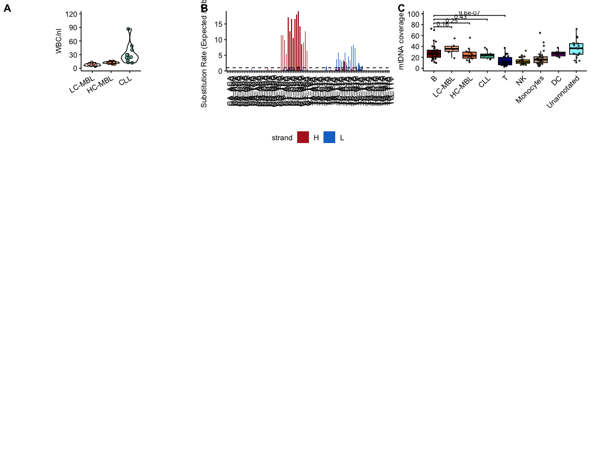<!-- -->

## Supp. 2 TF Motifs and Gene Scores ATAC

``` r
subsupp2 <- annotate_figure(
  plot_grid(
    plot_grid(
      plot_grid(plotlist = TF_motif_zscores_plots[c(
        "EBF1", "PAX5",
        "CEBPB", "CEBPA",
        "TBX21", "RUNX1",
        "EOMES"
      )], ncol = 2, nrow = 6, byrow = TRUE, labels = "A"),
      plot_grid(plotlist = gene_scores_plots[c(
        "EBF1", "PAX5",
        "CD14", "MPO",
        "CD3D", "IL7R",
        "GNLY", "NKG7",
        "CD19", "CD5",
        "FCER2", "CD79b"
      )], ncol = 2, byrow = TRUE, labels = "B"),
      ncol = 2
    ),
    plot_grid(ggarrange(ATAC_IGHV_umap_plot, nrow = 1, ncol = 2, common.legend = TRUE, legend = "bottom"), NULL,
      labels = c("C", ""), ncol = 2, nrow = 1
    ),
    nrow = 2, ncol = 1, rel_heights = c(4, 1)
  ),
  left = text_grob("                                                                                              MBL/CLL cells                      NK cells             T cells            Monocytes             B cells                                          ", color = "black", rot = 90)
)

ggsave(
  filename = file.path(project_dir, "Summary_Plots/20260316_Submission_Supplement2.pdf"),
  plot = subsupp2,
  width = 8.5,
  height = 11,
  units = "in",
  bg = "white"
)

subsupp2
```

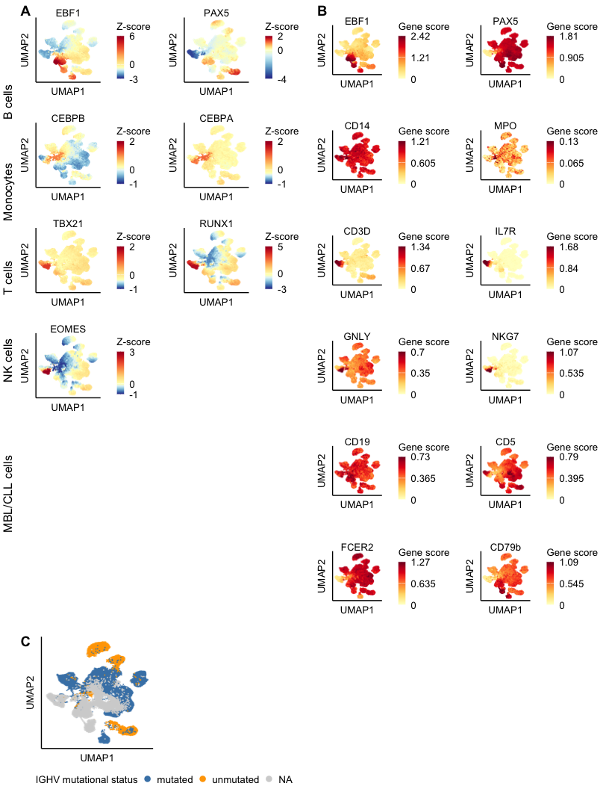<!-- -->

## Supp. 3 Marker Gene Expression RNA

``` r
subsupp3 <- annotate_figure(
  plot_grid(
    plot_grid(
      plotlist = gex_marker_gene_plots[c(
        "PAX5", "MS4A1", "EBF1", "MME", # B-cell trajectories
        "CD19", "CD5", "FCER2", "CD79B", # CLL B-Cell Marker
        "CD3D", "CD8A", "IL7R", "CD4", # T Cells
        "CD14", "MPO", "CD33", "CD33", # Monocytes
        "GNLY", "NKG7", "NCAM1", "NCAM1" # NK cells
      )], ncol = 4,
      nrow = 6,
      byrow = TRUE,
      labels = "A"
    ),
    plot_grid(celltype_marker_dotplot, GEX_IGHV_umap_plot, NULL,
      rel_widths = c(3, 1),
      labels = c("B", "C"), ncol = 2, nrow = 2, rel_heights = c(2, 1)
    ),
    nrow = 2,
    rel_heights = c(5, 2),
    ncol = 1
  ),
  left = text_grob("                                                                                              NK cells         Monocytes          T cells      MBL/CLL cells       B cells ",
    color = "black", rot = 90
  )
)

ggsave(
  filename = file.path(project_dir, "Summary_Plots/20260316_Submission_Supplement3.pdf"),
  plot = subsupp3,
  height = 11,
  width = 8.5,
  units = "in",
  bg = "white"
)

subsupp3
```

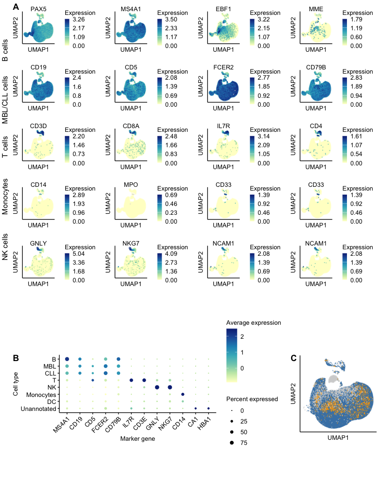<!-- -->

## Supp. 4 Chromatin Tracks

``` r
subsupp4 <- plot_grid(celltype_tracks$CD5, NULL,
  celltype_tracks$FCER2, NULL,
  celltype_tracks$MME,
  nrow = 3, ncol = 2, labels = c("A", "", "B", "", "C")
)

ggsave(
  filename = file.path(project_dir, "Summary_Plots/20260316_Submission_Supplement4.pdf"),
  plot = subsupp4,
  width = 11,
  height = 8.5,
  units = "in",
  bg = "white"
)

subsupp4
```

<!-- -->

## Supp. 5 Residual physiologic B cells

``` r
subsupp5 <- plot_grid(
  plot_grid(
    plot_grid(GEX_Bcell_umap_samples,
      GEX_Bcell_umap_condition + theme(legend.position = "bottom"),
      GEX_Bcell_umap_IGHV + theme(legend.position = "bottom"),
      GEX_Bcell_umap_celltype + theme(legend.position = "bottom"),
      nrow = 2,
      ncol = 2,
      axis = "b",
      align = "v"
    ),
    GEX_Bcell_markerheatmap_noIG,
    ncol = 2, nrow = 1, labels = c("", "B")
  ),
  NULL,
  plot_grid(GEX_Bcell_celltype_proportions + theme(legend.position = "none"),
    GEX_Bcell_summary_celltype_proportions+ theme(legend.position = "none"), Bmem_plot,
    ncol = 3, rel_widths = c(2, 1,0.5),
    align = "v", axis = "b", labels = c("", "D", "E")
  ),
  rel_heights = c(1, .1, 0.5, 0.7, 0.6),
  nrow = 5,
  ncol = 1,
  labels = c("A", "C", "")
)

ggsave(
  filename = file.path(project_dir, "Summary_Plots/20260316_Submission_Supplement5.pdf"),
  plot = subsupp5,
  height = 11,
  width = 8.5,
  units = "in",
  bg = "white"
)

subsupp5
```

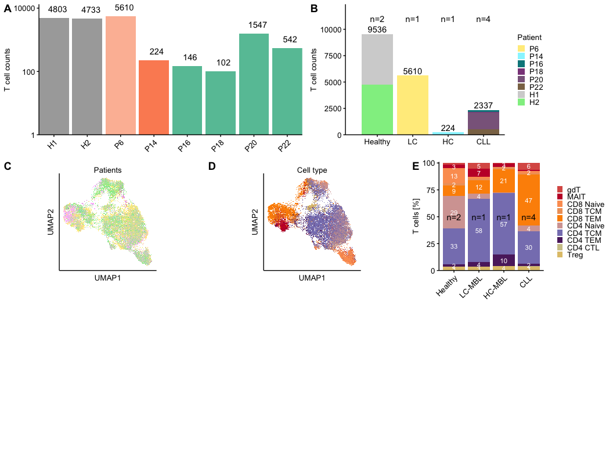<!-- -->

## Supp. 6 T cell subsets

``` r
subsupp6 <- plot_grid(
  plot_grid(T_cell_counts_per_sample,
    T_cell_counts_per_condition,
    ncol = 3,
    nrow = 1,
    axis = "b",
    align = "h", rel_widths = c(0.5, 0.4, 0.1),
    labels = c("A", "B", "")
  ),
  plot_grid(
    plot_grid(
      plot_grid(umap_T_patients_lt_l2,
        umap_T_types_lt_l2 + theme(legend.position = "none"),
        nrow = 1, ncol = 2
      ),
      quantification_plot_l2_Tcells + theme(
        legend.position = "right",
        legend.key.size = unit(0.3, "cm")
      ),
      nrow = 2, ncol = 1, labels = c("", "E")
    ),
    plot_grid(Tmarker_heatmap),
    nrow = 1,
    ncol = 2,
    axis = "b",
    align = "hv",
    labels = c("C", "D")
  ),
  nrow = 3,
  rel_heights = c(1, 1.5, 1),
  ncol = 1,
  align = "v"
)

ggsave(
  plot = subsupp6,
  filename = file.path(project_dir, "Summary_Plots/20260316_Submission_Supplement6.pdf"),
  width = 8.5,
  height = 11,
  unit = "in",
  bg = "white"
)

subsupp6
```

<!-- -->

## Supp. 7 Cell Surface Markers

``` r
subsupp7 <- cowplot::plot_grid(
  cowplot::plot_grid(distance_quantification,
    distance_LC_quantification,
    ncol = 3,
    nrow = 1, rel_widths = c(1, 1, 0.3),
    align = "h",
    axis = "b",
    labels = "A"
  ),
  cowplot::plot_grid(wnn_tsa_celltype_umap,
    dotplot_lineage_marker_plot,
    ncol = 2,
    axis = "b",
    align = "h",
    rel_widths = c(1, 1.5),
    labels = c("B", "C")
  ),
  cowplot::plot_grid(
    plotlist = c(wnn_tsa_selected_lineage_umaps[c("CD19", "CD5", "CD20-2H7", "CD3-UCHT1", "CD56", "CD16", "CD33", "CD14-M5E2", "CD11b", "CD11c", "CD141", "CD86", "CD123", "CD303", "CD304")]),
    ncol = 4,
    labels = "D"
  ),
  cowplot::plot_grid(
    volcanoplot_TSA +
      theme(legend.position = "none") +
      labs(title = ""),
    dotplot_surfacemarkers +
      theme(
        legend.position = "right",
        legend.direction = "vertical",
        legend.box = "horizontal"
      ) +
      guides(colour = guide_colourbar(
        barwidth = 0.5,
        barheight = 3
      )),
    nrow = 1,
    ncol = 2,
    axis = "b",
    rel_widths = c(1, 1.5),
    labels = c("E", "F")
  ),
  nrow = 4,
  ncol = 1,
  rel_heights = c(2, 1.5, 4, 2.5)
)

ggsave(
  filename = file.path(project_dir, "Summary_Plots/20260316_Submission_Supplement7.pdf"),
  plot = subsupp7,
  width = 8.5,
  height = 11,
  units = "in",
  bg = "white"
)

subsupp7
```

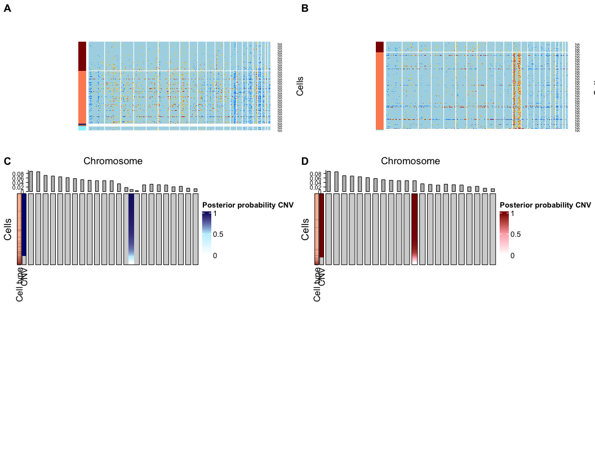<!-- -->

## Supp. 8 CNVs

``` r
subsupp8 <- plot_grid(LC_CNV_heatmaps$MBL12,
  LC_CNV_heatmaps$MBL15,
  hm_MBL12_grob,
  hm_MBL15_grob,
  nrow = 3,
  ncol = 2,
  labels = "AUTO"
)

ggsave(
  filename = file.path(project_dir, "Summary_Plots/20260316_Submission_Supplement8.pdf"),
  plot = subsupp8,
  width = 11,
  height = 8.5,
  units = "in",
  bg = "white"
)

subsupp8
```

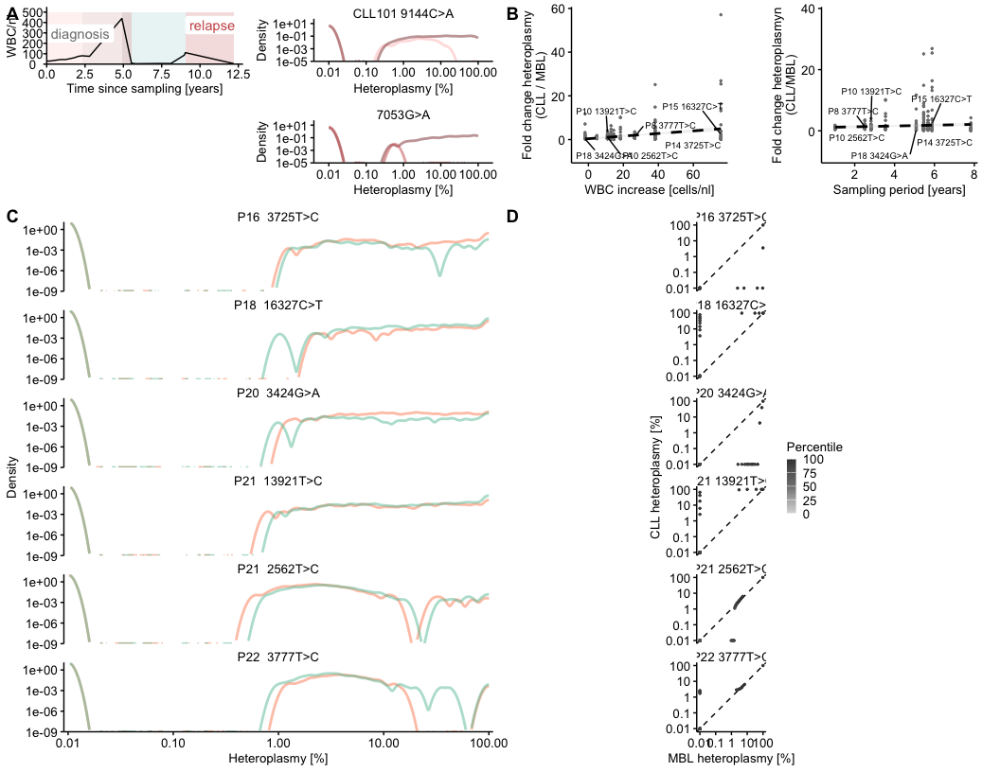<!-- -->

## Supp. 9 Heteroplasmy Analysis

``` r
subsupp9 <- ggarrange(
  # top row
  ggarrange(
    WBCC_scatter +
      theme(aspect.ratio = 1),
    duration_scatter +
      theme(aspect.ratio = 1) +
      labs(y = "Fold change heteroplasmyn\n(CLL/MBL)"),
    NULL,
    NULL,
    nrow = 1,
    ncol = 4, labels = c("", "", "B")
  ),

  # second row first column
  cowplot::plot_grid(density_distributions,
    qqplots,
    labels = c("", "D"),
    rel_widths = c(0.7, 0.3)
  ),
  # second row second column
  ncol = 1,
  nrow = 2,
  heights = c(2.5, 7),
  labels = c("A", "C")
)

ggsave(
  filename = file.path(project_dir, "Summary_Plots/20260316_Submission_Supplement9.pdf"),
  plot = subsupp9,
  height = 11,
  width = 8.5,
  units = "in",
  bg = "white"
)

subsupp9
```

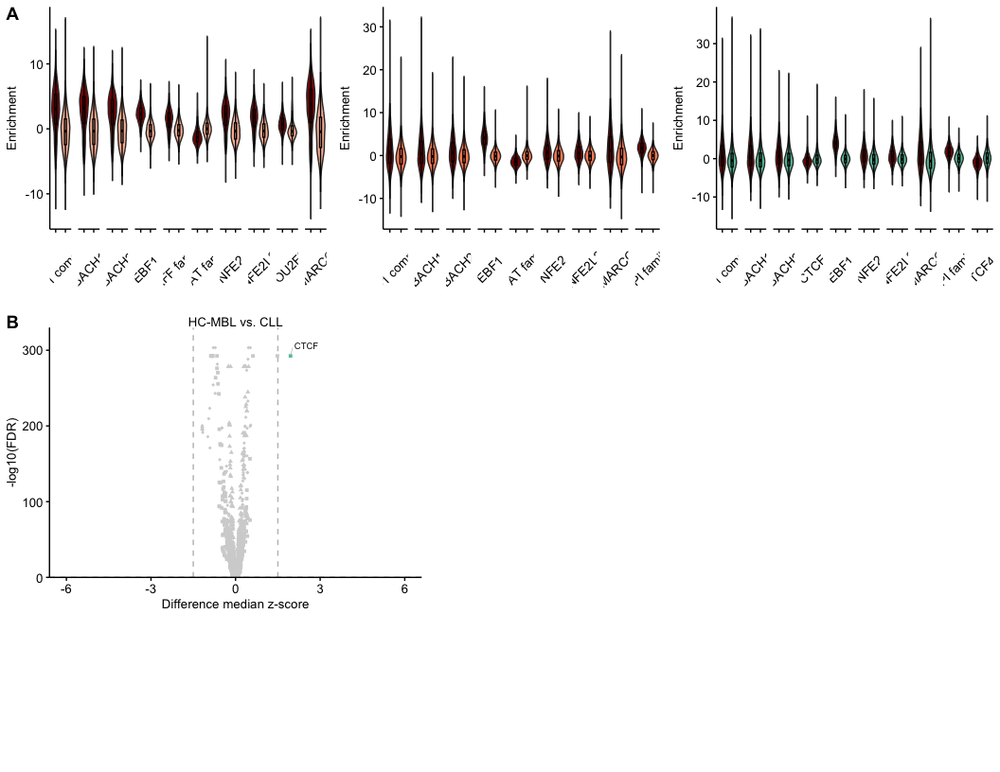<!-- -->

## Supp. 10 Differential ATAC Analysis

``` r
subsupp10 <- plot_grid(
  plot_grid(plotlist = enrichment_violinplots[1:2], nrow = 1, ncol = 3),
  plot_grid(enrichment_violinplots[[3]], volcano_TF_enrichment_pb_HC_CLL,
    nrow = 1,
    ncol = 3,
    labels = c("", "B"), align = "hv", axis = "b"
  ),
  nrow = 3,
  ncol = 1,
  labels = c("A"),
  rel_heights = c(1, 1, 0.5)
)

ggsave(
  filename = file.path(project_dir, "Summary_Plots/20260316_Submission_Supplement10.pdf"),
  plot = subsupp10,
  width = 11,
  height = 8.5,
  units = "in",
  bg = "white"
)

subsupp10
```

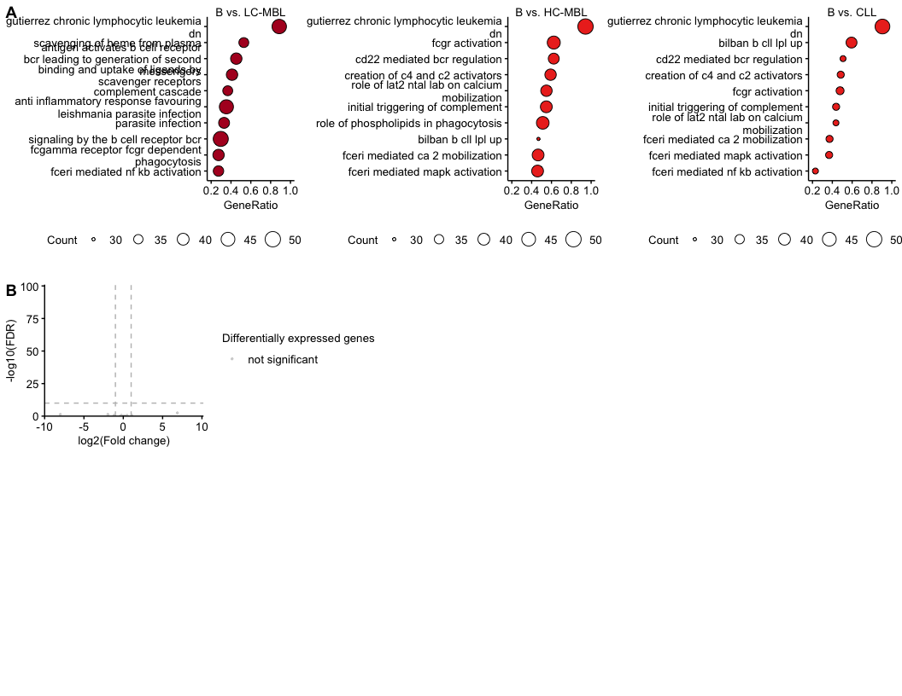<!-- -->

## Supp. 11 TF Activity Analysis

``` r
subsupp11 <- plot_grid(
  TF_mean_violinplot_summary +
    scale_colour_manual(
      name = "Cell type",
      values = annotation_colours_named,
      labels = c(
        "LC-MBL B Cell" = "LC-MBL",
        "HC-MBL B Cell" = "HC-MBL",
        "CLL B Cell" = "CLL"
      )
    ),
  labels = "AUTO"
)

ggsave(
  filename = file.path(project_dir, "Summary_Plots/20260316_Submission_Supplement11.pdf"),
  plot = subsupp11,
  width = 8.5,
  height = 11,
  units = "in",
  bg = "white"
)

subsupp11
```

<!-- -->

## Supp. 12 CLLMap Comparison

``` r
subsupp12 <- cowplot::plot_grid(DEG_expression_IGHV,
  # cowplot::plot_grid(all_km_plots_U$MS4A1$plot,
  #   all_km_plots_M$LEF1$plot, all_km_plots_M$FCER2$plot,
  #   ncol = 2
  # ),
  nrow = 2,
  ncol = 1,
  rel_heights = c(1, 3),
  labels = "AUTO"
)

ggsave(
  filename = file.path(project_dir, "Summary_Plots/20260316_Submission_Supplement12.pdf"),
  plot = subsupp12,
  width = 11,
  height = 8.5,
  units = "in",
  bg = "white"
)

subsupp12
```

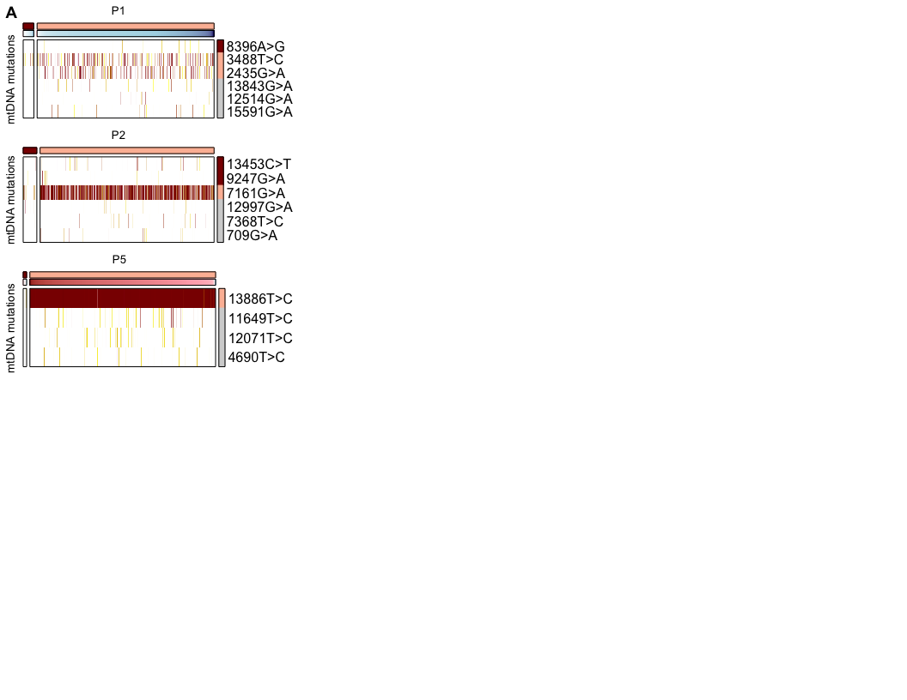<!-- -->

## Supp. 13 Differential GEX Analysis

``` r
subsupp13 <- plot_grid(
  plot_grid(
    reactome_dotplots$`B vs. LC-MBL` +
      theme(legend.position = "bottom", legend.direction = "horizontal", legend.box = "horizontal"),
    reactome_dotplots$`B vs. HC-MBL` +
      theme(legend.position = "bottom", legend.direction = "horizontal", legend.box = "horizontal"),
    ncol = 3,
    nrow = 1,
    common.legend = TRUE,
    legend = "bottom"
  ),
  plot_grid(
    reactome_dotplots$`B vs. CLL` +
      theme(legend.position = "bottom", legend.direction = "horizontal", legend.box = "horizontal"),
    volcano_GEX_pb_HC_CLL +
      theme(
        legend.position = "right",
        legend.direction = "vertical"
      ),
    rel_widths = c(1, 1.5, 1),
    nrow = 1,
    ncol = 3, labels = c("", "B")
  ),
  nrow = 2,
  ncol = 1,
  labels = c("A"), align = "hv", axis = "b"
)

ggsave(
  filename = file.path(project_dir, "Summary_Plots/20260316_Submission_Supplement13.pdf"),
  plot = subsupp13,
  width = 11,
  height = 8.5,
  units = "in",
  bg = "white"
)

subsupp13
```

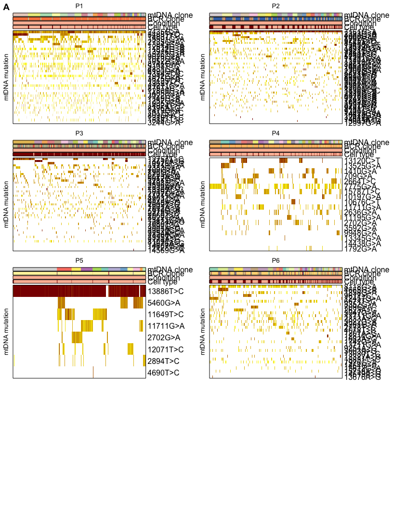<!-- -->

## Supp. 14 Nanoranger Analysis

``` r
subsupp14 <- plot_grid(
  plot_grid(mtDNA_coverage_GEX_plot + theme(legend.position = "top"),
    summary_scatterplot_1_5_fc_heteroplasmy_B_HC_MBL + theme(aspect.ratio = 1),
    summary_scatterplot_1.5_fc_heteroplasmy_B_HC_MBL_CLL + theme(aspect.ratio = 1),
    nrow = 1,
    ncol = 3,
    rel_widths = c(2, 1, 1),
    labels = c("", "B")
  ),
  plot_grid(
    plotlist = clone_matching_plots[c("MBL12", "MBL11", "MBL14", "MBL13", "MBL15", "MBL10")],
    nrow = 1,
    ncol = 6
  ),
  plot_grid(
    plot_grid(MBL12_celltype_umap + theme(legend.position = "none"),
      MBL12_BCRclone_umap + theme(legend.position = "none"),
      MBL12_2435_umap + theme(legend.position = "none"),
      MBL12_CNV_umap + theme(legend.position = "none"),
      nrow = 2,
      ncol = 2
    ),
    gotcha_quantification_plot,
    SNV_CNV_heteroplasmy_heatmaps$MBL4,
    nrow = 1,
    ncol = 3,
    rel_widths = c(1, 0.5, 1.5),
    labels = c("", "E", "F")
  ),
  nrow = 3,
  ncol = 1,
  labels = c("A", "C", "D")
)


ggsave(
  filename = file.path(project_dir, "Summary_Plots/20260316_Submission_Supplement14.pdf"),
  plot = subsupp14,
  width = 11,
  height = 8.5,
  units = "in",
  bg = "white"
)

subsupp14
```

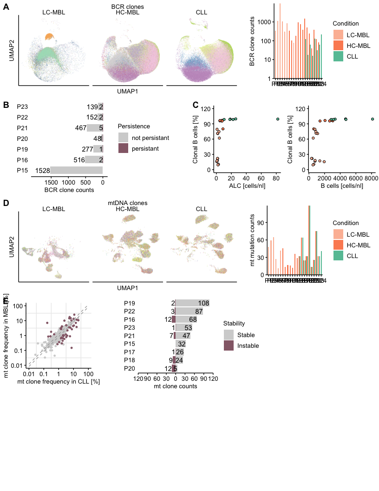<!-- -->

## Supp. 15 Heteroplasmy of mtDNA Mutation from mtscATAC-seq with CNVs

``` r
subsupp15 <- plot_grid( # top
  plot_grid(
    plot_grid(all_CNV_signif_variant_heatmaps[["MBL12"]],
      all_signif_variant_heatmaps[["MBL11"]],
      all_CNV_signif_variant_heatmaps[["MBL15"]],
      nrow = 4,
      ncol = 1, labels = c("A"), rel_heights = c(1, 1, 1, 0.5)
    ),
    plot_grid(NULL, NULL, nrow = 1, ncol = 1),
    plot_grid(NULL, NULL, nrow = 1, ncol = 1),
    nrow = 1, ncol = 3
  ),
  # middle
  plot_grid(NULL, NULL, nrow = 1, ncol = 1),
  # bottom
  plot_grid(NULL, NULL, nrow = 1, ncol = 1),
  nrow = 3,
  ncol = 1,
  rel_heights = c(2.3, 0.7, 0.7)
)

ggsave(
  filename = file.path(project_dir, "Summary_Plots/20260316_Submission_Supplement15.pdf"),
  plot = subsupp15,
  width = 8.5,
  height = 11,
  units = "in",
  bg = "white"
)

subsupp15
```

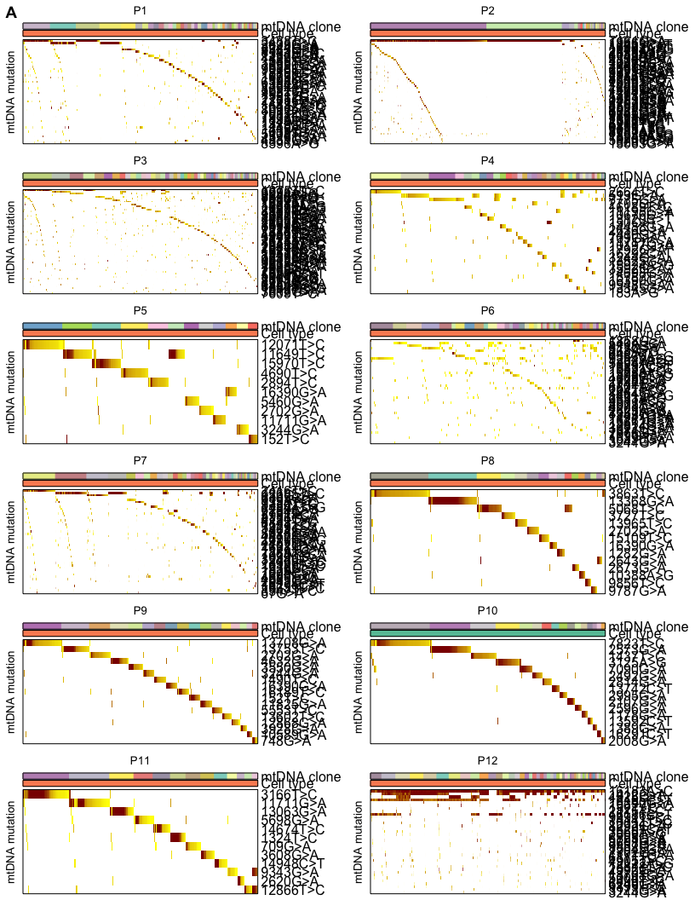<!-- -->

## Supp. 16 Heteroplasmy of mtRNA Clones from Nanoranger

``` r
subsupp16 <- plot_grid(
  plotlist = nanoranger_mtDNAclone_celltype_heteroplasmy_heatmaps[c(paste0("P", 1:12))],
  nrow = 4, ncol = 2, byrow = TRUE, labels = c("A")
)

ggsave(
  filename = file.path(project_dir, "Summary_Plots/20260316_Submission_Supplement16.pdf"),
  plot = subsupp13,
  width = 8.5,
  height = 11,
  units = "in",
  bg = "white"
)

subsupp16
```

<!-- -->

## Supp. 17 Clonotypes

``` r
subsupp17 <- plot_grid(
  plot_grid(BCR_clonotypes_plot,
    BCR_clonotype_counts_plot +
      theme(legend.position = "right"),
    nrow = 1, ncol = 2, rel_widths = c(0.65, 0.35)
  ),
  plot_grid(BCR_clonotype_persistence_plot + theme(aspect.ratio = 1, legend.position = "right"),
    clonal_B_alc_scatter + theme(aspect.ratio = 1),
    clonal_B_all_scatter + theme(aspect.ratio = 1),
    nrow = 1, ncol = 3, rel_widths = c(2, 1, 1), labels = c("", "C")
  ),
  plot_grid(
    mt_clones_expansion_data_plot +
      labs(title = "mtDNA clones"),
    mt_mutation_counts_plot +
      theme(legend.position = "right"),
    ncol = 2, nrow = 1, rel_widths = c(0.65, 0.35)
  ),
  plot_grid(mt_clone_counts_plot,
    mt_clone_scatter_stability_plot +
      theme(
        legend.position = "none",
        aspect.ratio = 1
      ),
    mt_clone_hist_stability_plot +
      theme(
        legend.position = "right",
        aspect.ratio = 1
      ),
    nrow = 1, ncol = 3, rel_widths = c(0.6, 1, 2), labels = c("", "F")
  ),
  nrow = 5, ncol = 1, labels = c("A", "B", "D", "E")
)

ggsave(
  filename = file.path(project_dir, "Summary_Plots/20260316_Submission_Supplement17.pdf"),
  plot = subsupp17,
  width = 8.5,
  height = 11,
  units = "in",
  bg = "white"
)

subsupp17
```

<!-- -->

## Supp. 18 Heteroplasmy of mtDNA Clones from mtscATAC-seq

``` r
subsupp18.1 <- plot_grid(
  plotlist = mtDNAclone_celltype_heteroplasmy_heatmaps_filtered[c(paste0("P", 1:12))],
  nrow = 6, ncol = 2, byrow = TRUE, labels = c("A")
)

subsupp18.2 <- plot_grid(
  plotlist = mtDNAclone_celltype_heteroplasmy_heatmaps_filtered[c(paste0("P", c(13, 15:24)))],
  nrow = 6, ncol = 2, byrow = TRUE
)

ggsave(
  filename = file.path(project_dir, "Summary_Plots/20260316_Submission_Supplement18.1.pdf"),
  plot = subsupp18.1,
  width = 8.5,
  height = 11,
  units = "in",
  bg = "white"
)

ggsave(
  filename = file.path(project_dir, "Summary_Plots/20260316_Submission_Supplement18.2.pdf"),
  plot = subsupp18.2,
  width = 8.5,
  height = 11,
  units = "in",
  bg = "white"
)

subsupp18.1
```

<!-- -->

``` r
subsupp18.2
```

<!-- -->

## Supp. 19 HC-MBL Progression

``` r
subsupp19 <-
  plot_grid(
    plot_grid(
      swimmersplot_progression +
        theme(
          legend.position = "bottom",
          legend.direction = "vertical",
          legend.box = "horizontal"
        ),
      plot_grid(
        GEX_progression_volcanoplot +
          theme(
            legend.position = "right",
            legend.direction = "vertical"
          ),
        ATAC_TF_volcanoplot +
          theme(
            legend.position = "right",
            legend.direction = "vertical"
          ),
        nrow = 2,
        ncol = 1,
        axis = "b",
        labels = c("B", "C")
      ),
      nrow = 1,
      ncol = 2,
      rel_widths = c(1.2, 1.8)
    ),
    NULL,
    ggarrange(progression_clonotype_counts_boxplot,
      mtDNA_depth_boxplot,
      widths = c(0.4, 1.6),
      ncol = 2,
      align = "h",
      common.legend = TRUE,
      legend = "bottom",
      labels = c("D", "E")
    ),
    nrow = 2,
    ncol = 2,
    rel_heights = c(1.5, 1.2, 0.8),
    rel_widths = c(0.7, 0.3),
    labels = c("A")
  )
```

    ## Warning: Removed 3540 rows containing missing values or values outside the scale range
    ## (`geom_point()`).

    ## Warning: Removed 26295 rows containing missing values or values outside the scale range
    ## (`geom_text_repel()`).

    ## Warning: Removed 870 rows containing missing values or values outside the scale range
    ## (`geom_text_repel()`).

    ## Warning in wilcox.test.default(c(32, 54, 27, 54, 17, 33, 80, 110, 90, 56, :
    ## cannot compute exact p-value with ties
    ## Warning in wilcox.test.default(c(32, 54, 27, 54, 17, 33, 80, 110, 90, 56, :
    ## cannot compute exact p-value with ties

``` r
ggsave(
  filename = file.path(project_dir, "Summary_Plots/20260316_Submission_Supplement19.pdf"),
  plot = subsupp19,
  height = 8.5,
  width = 11,
  units = "in",
  bg = "white"
)

subsupp19
```

<!-- -->
