Supplementary Publication Figures
================
Anja Rathgeber
25 August, 2025

- [GOAL](#goal)
- [Load Libraries](#load-libraries)
- [Set Paths](#set-paths)
- [Load Data](#load-data)
- [Receate Plots](#receate-plots)
  - [Supp. 1 mtDNA Mutations Chohort
    Characterisation](#supp-1-mtdna-mutations-chohort-characterisation)
  - [Supp. 2 TF Motifs and Gene Scores
    ATAC](#supp-2-tf-motifs-and-gene-scores-atac)
  - [Supp. 3 Marker Gene Expression
    RNA](#supp-3-marker-gene-expression-rna)
  - [Supp. 5 T cells](#supp-5-t-cells)
  - [Supp. 8 Heteroplasmy](#supp-8-heteroplasmy)
  - [Supp. 9 Differential ATAC
    Analysis](#supp-9-differential-atac-analysis)
  - [Supp. 10 Differential GEX
    Analysis](#supp-10-differential-gex-analysis)
  - [Supp. 11 Nanoranger Analysis](#supp-11-nanoranger-analysis)
  - [Supp. 14 Clonotypes](#supp-14-clonotypes)
- [Plot Supplementary Publication
  Figures](#plot-supplementary-publication-figures)
  - [Supp. 1 mtDNA Cohort
    Characterisation](#supp-1-mtdna-cohort-characterisation)
  - [Supp. 2 TF Motifs and Gene Scores
    ATAC](#supp-2-tf-motifs-and-gene-scores-atac-1)
  - [Supp. 3 Marker Gene Expression
    RNA](#supp-3-marker-gene-expression-rna-1)
  - [Supp. 4 Chromatin Tracks](#supp-4-chromatin-tracks)
  - [Supp. 5 T cells](#supp-5-t-cells-1)
  - [Supp. 6 Cell Surface Markers](#supp-6-cell-surface-markers)
  - [Supp. 7 CNVs](#supp-7-cnvs)
  - [Supp. 8 Heteroplasmy Analysis](#supp-8-heteroplasmy-analysis)
  - [Supp. 9 Differential ATAC
    Analysis](#supp-9-differential-atac-analysis-1)
  - [Supp. 10 Differential RNA
    Analysis](#supp-10-differential-rna-analysis)
  - [Supp. 11 Nanoranger Analysis](#supp-11-nanoranger-analysis-1)
  - [Supp. 12 Heteroplasmy of mtDNA Mutation from mtscATAC-seq with
    CNVs](#supp-12-heteroplasmy-of-mtdna-mutation-from-mtscatac-seq-with-cnvs)
  - [Supp. 13 Heteroplasmy of mtRNA Clones from
    Nanoranger](#supp-13-heteroplasmy-of-mtrna-clones-from-nanoranger)
  - [Supp. 14 Clonotypes](#supp-14-clonotypes-1)
  - [Supp. 15 Heteroplasmy of mtDNA Clones from
    mtscATAC-seq](#supp-15-heteroplasmy-of-mtdna-clones-from-mtscatac-seq)

# GOAL

The aim of this script is to prepare supplementary figures in addition
to the publication main figures.

# Load Libraries

``` r
library(tidyverse)
library(cowplot)
library(ggsignif)
library(RColorBrewer)
library(scales)
library(Seurat)
library(ggrepel)
library(ggpubr)
library(ggrastr)
library(ggalluvial)
```

# Set Paths

``` r
data_dir <- file.path(project_dir, "data")
result_dir <- file.path(project_dir, "results")

T_cell_analysis_RDS_dir <- file.path(result_dir, "T_cell_analysis/RDS_objects")
GEX_RDS_dir <- file.path(result_dir, "GEX_analysis/RDS_Objects")
DESeq2_analysis_RDS_dir <- file.path(result_dir, "DESeq2_analysis/RDS_Objects")
mtDNA_mutation_analysis_RDS_dir <- file.path(result_dir, "mtDNA_mutation_analysis/RDS_objects")
heteroplasmy_analysis_RDS_dir <- file.path(result_dir, "Heteroplasmy_analysis/RDS_Objects")
longread_mtDNA_BCR_analysis_RDS_dir <- file.path(result_dir, "longread_mtDNA_BCR_analysis/RDS_objects")
surface_marker_analysis_RDS_dir <- file.path(result_dir, "Surface_marker_analysis/RDS_Objects")
DCA_analysis_RDS_dir <- file.path(result_dir, "DCA_analysis/RDS_objects")
CNV_RDS_dir <- file.path(result_dir, "CNV_analysis/RDS_objects")

DCA_analysis_tsv_dir <- file.path(result_dir, "DCA_analysis/tsv_data")
GEX_tsv_dir <- file.path(result_dir, "GEX_analysis/tsv_data")
DESeq2_analysis_tsv_dir <- file.path(result_dir, "DESeq2_analysis/tsv_data")
VDJ_analysis_tsv_dir <- file.path(result_dir, "VDJ_analysis/tsv_data")
FACs_data_analysis_tsv_dir <- file.path(result_dir, "FACs_data_analysis/tsv_data")
mtDNA_mutation_analysis_tsv_dir <- file.path(result_dir, "mtDNA_mutation_analysis/tsv_data")
mtDNA_BCR_analysis_tsv_dir <- file.path(result_dir, "mtDNA_BCR_analysis/tsv_data")
heteroplasmy_analysis_tsv_dir <- file.path(result_dir, "Heteroplasmy_analysis/tsv_data")
longread_mtDNA_BCR_analysis_tsv_dir <- file.path(result_dir, "longread_mtDNA_BCR_analysis/tsv_data")
```

# Load Data

``` r
source(file.path(project_dir, "scripts/publication_theme.R"))
```

``` r
metadata_all <- read_tsv(file = file.path(data_dir, "20250403_Tidy_MBL_CLL_metadata.tsv"))

label_2_plotting_id <- metadata_all %>%
  dplyr::filter(data_type == "ATAC") %>%
  dplyr::select(label, plotting_id) %>%
  unique() %>%
  deframe()

label_2_plotting_id_disease <- metadata_all %>%
  dplyr::filter(data_type == "GEX") %>%
  dplyr::mutate(MBL_CLL_subtype = case_when(MBL_subtype == "LC" ~ "LC-MBL",
    MBL_subtype == "HC" ~ "HC-MBL",
    .default = "CLL"
  )) %>%
  dplyr::mutate(plotting_id_disease = paste0(plotting_id, " ", MBL_CLL_subtype)) %>%
  dplyr::select(label, plotting_id_disease) %>%
  unique() %>%
  deframe()

patient_id2plotting_id <- metadata_all %>%
  dplyr::filter(data_type == "ATAC") %>%
  dplyr::select(patient_id, plotting_id) %>%
  deframe()
```

``` r
# Supp. 1
ti_tv_data <- read_tsv(file.path(mtDNA_mutation_analysis_tsv_dir, "transition_transversion_data.tsv"))
coverage_celltype_data <- read_tsv(file.path(mtDNA_mutation_analysis_tsv_dir, "coverage_celltype_data.tsv"))

# Supp. 2
TF_motif_zscores <- c(
  "motif_zscore_EBF1_67.tsv", # B cells
  "motif_zscore_PAX5_709.tsv", # B cells
  "motif_zscore_CEBPB_140.tsv", # monocytes
  "motif_zscore_CEBPA_155.tsv", # monocytes
  "motif_zscore_EOMES_788.tsv", # NK cells
  "motif_zscore_RUNX1_733.tsv", # ?
  "motif_zscore_TBX21_780.tsv"
) %>% # T cells
  map(~ read_tsv(file = file.path(DCA_analysis_tsv_dir, .x))) %>% set_names(c(
    "EBF1",
    "PAX5",
    "CEBPB", "CEBPA", "EOMES", "RUNX1",
    "TBX21"
  ))

# CD3D, NCAM1, CD14, CD19, CD5, CD10, CD23, PAX5X
gene_scores <- c(
  "PAX5", "MS4A1", "EBF1", "MME", # B-Cell Trajectory
  "CD14", "CEBPB", "MPO", # Monocytes
  "CD3D", "CD8A", "TBX21", "IL7R", # TCells
  "CD19", "CD5", "FCER2", "CD79b", # CLL B-Cell Marker
  "GNLY", "NKG7", "NCAM1" # NK cells
) %>%
  map(~ read_tsv(file = file.path(DCA_analysis_tsv_dir, paste0("gene_scores_", .x, ".tsv")))) %>%
  purrr::set_names(c(
    "PAX5", "MS4A1", "EBF1", "MME", # B-Cell Trajectory
    "CD14", "CEBPB", "MPO", # Monocytes
    "CD3D", "CD8A", "TBX21", "IL7R", # TCells
    "CD19", "CD5", "FCER2", "CD79b", # CLL B-Cell Marker
    "GNLY", "NKG7", "NCAM1" # NK cells
  ))

ATAC_IGHV_umap <- read_tsv(file.path(DCA_analysis_tsv_dir, "ATAC_IGHV_umap_data.tsv"))

# Supp. 3

marker_genes <- c(
  "PAX5", "MS4A1", "EBF1", "MME", # B-cell trajectories
  "CD14", "CEBPB", "MPO", "CD33", # Monocytes
  "CD3D", "CD8A", "TBX21", "IL7R", "CD3E", "CD3G", "CD4", "CD8B", # TCells
  "CD19", "CD5", "FCER2", "CD79B", # CLL B-Cell Marker
  "GNLY", "NKG7", "NCAM1", # NK cells
  "PF4", # platelets
  "CA1", "HBA1" # erythrocytes
) %>%
  map(~ read_tsv(file = file.path(GEX_tsv_dir, paste0("marker_gene_expression_", .x, ".tsv"))) %>% arrange(expression)) %>%
  purrr::set_names(c(
    "PAX5", "MS4A1", "EBF1", "MME", # B-cell trajectories
    "CD14", "CEBPB", "MPO", "CD33", # Monocytes
    "CD3D", "CD8A", "TBX21", "IL7R", "CD3E", "CD3G", "CD4", "CD8B", # TCells
    "CD19", "CD5", "FCER2", "CD79B", # CLL B-Cell Marker
    "GNLY", "NKG7", "NCAM1", # NK cells
    "PF4", # platelets
    "CA1", "HBA1" # erythrocytes
  ))

celltype_marker_dotplot_data <- read_tsv(file.path(GEX_tsv_dir, "celltype_marker_dotplot.tsv"))
GEX_IGHV_umap <- read_tsv(file.path(VDJ_analysis_tsv_dir, "GEX_IGHV_umap.tsv"))

# Supp. 4
celltype_tracks <- readRDS(file.path(project_dir_ext, "ArchR_35_samples/ArchR_all_samples_subsetted/RDS_objects/Celltype_tracks.RDS"))

# Supp. 5
T_cell_counts_per_sample <- readRDS(file.path(T_cell_analysis_RDS_dir, "T_cell_counts_per_sample.RDS"))
T_cell_counts_per_condition <- readRDS(file.path(T_cell_analysis_RDS_dir, "T_cell_counts_per_condition.RDS"))
gex_integrated_T_10X_seurat_all <- readRDS(file = file.path(T_cell_analysis_RDS_dir, "gex_integrated_T_10X_seurat_all.RDS"))
quantification_plot_l2_Tcells <- readRDS(file.path(T_cell_analysis_RDS_dir, "quantification_plot_l2_Tcells.RDS"))

# Supp. 6
volcanoplot_TSA <- readRDS(file.path(surface_marker_analysis_RDS_dir, "volcanoplot_TSA_LC_MBL_B.RDS"))
dotplot_surfacemarkers <- readRDS(file.path(surface_marker_analysis_RDS_dir, "Dotplot_surfacemarker.RDS"))

# Supp. 7
LC_CNV_heatmaps <- readRDS(file.path(CNV_RDS_dir, "LC_MBL_CNV_heatmaps_LC_T_reference.RDS"))

hm_MBL12_grob <- readRDS(file.path(GEX_RDS_dir, "hm_MBL12_grob.RDS"))
hm_MBL15_grob <- readRDS(file.path(GEX_RDS_dir, "hm_MBL15_grob.RDS"))

# Supp. 8
WBCC_scatter_data <- read_tsv(file.path(heteroplasmy_analysis_tsv_dir, "WBCC_scatter.tsv"))
duration_scatter_data <- read_tsv(file.path(heteroplasmy_analysis_tsv_dir, "duration_scatter.tsv"))

## Penter and Gohil
WBCC_CLL101_plot <- readRDS(file.path(project_dir_Penter_Gohil, "RDS_Objects", "WBCC_CLL101_plot.RDS"))
`density_distributions_CLL101_9144C>A` <- readRDS(file.path(project_dir_Penter_Gohil, "RDS_Objects/density_distributions_CLL101_9144C>A.RDS"))
`density_distributions_CLL101_7053G>A` <- readRDS(file.path(project_dir_Penter_Gohil, "RDS_Objects/density_distributions_CLL101_7053G>A.RDS"))

density_distribution_data <- read_tsv(file.path(heteroplasmy_analysis_tsv_dir, "density_distribution_data.tsv"))
qqplot_data <- read_tsv(file.path(heteroplasmy_analysis_tsv_dir, "qqplot_data.tsv"))

# Supp. 9
volcano_TF_enrichment_pb_HC_CLL <- readRDS(file.path(DCA_analysis_RDS_dir, "volcanoplot_TF_enrichment_pb_HC_MBL_CLL_batches_summary.RDS"))
enrichment_LC_violinplot_data <- read_tsv(file.path(DCA_analysis_tsv_dir, "enrichment_LC_violinplot_data.tsv"))
enrichment_HC_violinplot_data <- read_tsv(file.path(DCA_analysis_tsv_dir, "enrichment_HC_violinplot_data.tsv"))
enrichment_CLL_violinplot_data <- read_tsv(file.path(DCA_analysis_tsv_dir, "enrichment_CLL_violinplot_data.tsv"))

# Supp. 10
volcano_GEX_pb_HC_CLL_data <- readRDS(file.path(DESeq2_analysis_RDS_dir, "HC_CLL_pb_volcano.RDS"))$data
reactome_dotplot_data <- file.path(paste0(DESeq2_analysis_tsv_dir, c(
  "/Reactome_B_LC_vs_LC-MBL B Cell_LC",
  "/Reactome_B_HCCLL_vs_HC-MBL B Cell_HC",
  "/Reactome_B_HCCLL_vs_CLL B Cell_CLL",
  "/Reactome_HC-MBL B Cell_HC_vs_CLL B Cell_CLL"
), ".tsv")) %>%
  map(~ read_tsv(.)) %>%
  set_names(c(
    "Reactome_B_LC_vs_LC-MBL B Cell_LC",
    "Reactome_B_HCCLL_vs_HC-MBL B Cell_HC",
    "Reactome_B_HCCLL_vs_CLL B Cell_CLL",
    "Reactome_HC-MBL B Cell_HC_vs_CLL B Cell_CLL"
  ))

# Supp. 11
mtDNA_coverage_GEX_samples <- read_tsv(file = file.path(mtDNA_BCR_analysis_tsv_dir, "mtDNA_coverage_GEX_samples.tsv"))
mtDNA_coverage_GEX_MBL11 <- read_tsv(file.path(mtDNA_BCR_analysis_tsv_dir, "mtDNA_coverage_GEX_MBL11.tsv"))
clone_matching_data_complete <- read_tsv(file.path(longread_mtDNA_BCR_analysis_tsv_dir, "clone_matching_data_complete.tsv"))
summary_scatterplot_1_5_fc_heteroplasmy_B_HC_MBL <- readRDS(file.path(mtDNA_mutation_analysis_RDS_dir, "summary_scatterplot_1_5_fc_heteroplasmy_B_HC_MBL.RDS"))
summary_scatterplot_1.5_fc_heteroplasmy_B_HC_MBL_CLL <- readRDS(file.path(mtDNA_mutation_analysis_RDS_dir, "summary_scatterplot_1_5_fc_heteroplasmy_B_HC_MBL_CLL.RDS"))
MBL12_celltype_umap <- readRDS(file.path(longread_mtDNA_BCR_analysis_RDS_dir, "MBL12_celltype_umap.RDS"))
MBL12_CNV_umap <- readRDS(file.path(longread_mtDNA_BCR_analysis_RDS_dir, "MBL12_CNV_umap.RDS"))
MBL12_BCRclone_umap <- readRDS(file.path(longread_mtDNA_BCR_analysis_RDS_dir, "MBL12_BCRclone_umap.RDS"))
MBL12_2435_umap <- readRDS(file.path(longread_mtDNA_BCR_analysis_RDS_dir, "MBL12_2435_umap.RDS"))
gotcha_quantification_data <- read_tsv(file.path(mtDNA_mutation_analysis_tsv_dir, "gotcha_mutation_quantification_data.tsv"))
SNV_CNV_heteroplasmy_heatmaps <- readRDS(file.path(mtDNA_mutation_analysis_RDS_dir, "SNV_CNV_heteroplasmy_heatmaps.RDS"))

# Supp. 12
all_signif_variant_heatmaps <- readRDS(file.path(mtDNA_mutation_analysis_RDS_dir, "all_signif_variant_heatmaps.RDS"))
all_CNV_signif_variant_heatmaps <- readRDS(file.path(mtDNA_mutation_analysis_RDS_dir, "all_CNV_signif_variant_heatmaps.RDS"))

# Supp. 13
nanoranger_mtDNAclone_celltype_heteroplasmy_heatmaps <- readRDS(file.path(longread_mtDNA_BCR_analysis_RDS_dir, "nanoranger_mtDNAclone_celltype_heteroplasmy_heatmaps.RDS"))

# Supp. 14
facs_data <- read_tsv(file.path(FACs_data_analysis_tsv_dir, "facs_data.tsv")) %>%
  dplyr::mutate(Status = factor(Status, levels = c("LC-MBL", "HC-MBL", "CLL")))

b_cell_annotation_umap_data <- read_tsv(file.path(GEX_tsv_dir, "GEX_celltype_annotation_split_noIG_umap_data.tsv"))

BCR_clonotype_counts <- read_tsv(file = file.path(VDJ_analysis_tsv_dir, "BCR_clonotype_counts.tsv"))
BCR_clonotypes <- read_tsv(file = file.path(VDJ_analysis_tsv_dir, "BCR_clonotype_umap.tsv"))
BCR_clonotype_persistence <- read_tsv(file = file.path(VDJ_analysis_tsv_dir, "BCR_clonotype_persistance_histogram_vertical.tsv"))

mt_mutation_counts <- read_tsv(file = file.path(mtDNA_mutation_analysis_tsv_dir, "mt_mutation_count_data.tsv"))
mt_clone_counts <- read_tsv(file = file.path(mtDNA_mutation_analysis_tsv_dir, "mtDNA_clone_counts_data.tsv"))
mt_clone_scatter_stability <- read_tsv(file = file.path(mtDNA_mutation_analysis_tsv_dir, "stability_mt_clone_scatter_data.tsv"))
mt_clone_hist_stability <- read_tsv(file = file.path(mtDNA_mutation_analysis_tsv_dir, "stability_mt_clones_data.tsv"))
mt_clones_expansion_data <- read_tsv(file = file.path(mtDNA_mutation_analysis_tsv_dir, "umap_mtDNA_clones_expansion_data.tsv"))
prop_df <- read_tsv(file.path(mtDNA_mutation_analysis_tsv_dir, "transition_transversion_data.tsv"))

# Supp. 15
alternative_mtDNAclone_celltype_heteroplasmy_heatmaps <- readRDS(file.path(mtDNA_mutation_analysis_RDS_dir, "alternative_mtDNAclone_celltype_heteroplasmy_heatmaps.RDS"))
mtDNAclone_celltype_heteroplasmy_heatmaps <- readRDS(file.path(mtDNA_mutation_analysis_RDS_dir, "mtDNAclone_celltype_heteroplasmy_heatmaps.RDS")) %>% .[!names(.) %in% c(names(alternative_mtDNAclone_celltype_heteroplasmy_heatmaps), "P14")]

mtDNAclone_celltype_heteroplasmy_heatmaps_filtered <- c(alternative_mtDNAclone_celltype_heteroplasmy_heatmaps, mtDNAclone_celltype_heteroplasmy_heatmaps)
```

# Receate Plots

## Supp. 1 mtDNA Mutations Chohort Characterisation

``` r
wbcc_plot <- metadata_all %>%
  dplyr::filter(label != "MBL7dup") %>%
  dplyr::select(label, patient_id, MBL_subtype, disease, `WBC_[cells/nl]`) %>%
  unique() %>%
  tidyr::unite("MBL_CLL_subtype", c(MBL_subtype, disease), sep = "_", remove = FALSE, na.rm = TRUE) %>%
  dplyr::mutate(MBL_CLL_subtype = factor(MBL_CLL_subtype, levels = c("LC_MBL", "HC_MBL", "CLL"))) %>%
  ggplot(aes(x = MBL_CLL_subtype, y = `WBC_[cells/nl]`, colour = MBL_CLL_subtype)) +
  geom_jitter(width = 0.2, colour = "black", aes(fill = MBL_CLL_subtype), pch = 21) +
  geom_violin(scale = "width", show.legend = FALSE, color = "black", fill = NA) +
  scale_y_continuous(limits = c(0, 120), breaks = seq(0, 120, 30)) +
  scale_x_discrete(labels = c("LC_MBL" = "LC-MBL", "HC_MBL" = "HC-MBL", "CLL" = "CLL")) +
  scale_fill_manual(
    name = "'Condition", values = my_MBL_CLL_colours_named,
    labels = c("LC_MBL" = "LC MBL", "HC_MBL" = "HC MBL", "CLL" = "CLL")
  ) +
  labs(title = "", y = "WBC/nl", x = "") +
  theme_pub() +
  theme(
    axis.text.x = element_text(angle = 30, hjust = 1, vjust = 1),
    legend.position = "none"
  )
```

``` r
ti_tv_plot <- ggplot(prop_df, aes(x = change_plot, fill = strand, y = fc_my_variants)) +
  geom_bar(stat = "identity", position = "dodge") +
  geom_hline(yintercept = 1, linetype = 2, color = "black") +
  scale_fill_manual(values = c("firebrick", "dodgerblue3")) +
  scale_y_continuous(expand = c(0, 0)) +
  labs(x = "Change in nucleotide", y = "Substitution Rate (Expected / Observed)") +
  theme_pub() +
  theme(
    axis.title.x = element_blank(),
    axis.text.x = element_text(angle = 90),
    legend.position = "bottom"
  )
```

``` r
coverage_celltype_plot <- coverage_celltype_data %>%
  dplyr::mutate(My_annotation_healthy = factor(My_annotation_healthy, levels = c("B", "LC_MBL_B_Cells", "HC_MBL_B_Cells", "CLL_B_Cells", "T", "NK", "Mono", "DC", "other"))) %>%
  ggplot(aes(x = My_annotation_healthy, y = mean_depth, colour = My_annotation_healthy)) +
  geom_boxplot(colour = "black", aes(fill = My_annotation_healthy), outlier.shape = NA) +
  geom_jitter(width = 0.2, colour = "black", aes(fill = My_annotation_healthy), pch = 21, size = 0.5) +
  geom_signif(
    comparisons = list(
      c("B", "LC_MBL_B_Cells"),
      c("B", "HC_MBL_B_Cells"),
      c("B", "CLL_B_Cells"),
      c("B", "T")
    ),
    step_increase = 0.1, textsize = 3, colour = "black"
  ) +
  scale_colour_manual("Cell type", values = c(annotation_colours_named), labels = c("B" = "B", "LC_MBL_B_Cells" = "LC-MBL", "HC_MBL_B_Cells" = "HC-MBL", "CLL_B_Cells" = "CLL", "T" = "T", "NK" = "NK", "Mono" = "Monocytes", "DC" = "DC", "other" = "Unannotated")) +
  scale_fill_manual("Cell type", values = c(annotation_colours_named), labels = c("B" = "B", "LC_MBL_B_Cells" = "LC-MBL", "HC_MBL_B_Cells" = "HC-MBL", "CLL_B_Cells" = "CLL", "T" = "T", "NK" = "NK", "Mono" = "Monocytes", "DC" = "DC", "other" = "Unannotated")) +
  scale_x_discrete(labels = c("B" = "B", "LC_MBL_B_Cells" = "LC-MBL", "HC_MBL_B_Cells" = "HC-MBL", "CLL_B_Cells" = "CLL", "T" = "T", "NK" = "NK", "Mono" = "Monocytes", "DC" = "DC", "other" = "Unannotated")) +
  scale_y_continuous(breaks = seq(0, 100, 20), limits = c(0, 100)) +
  labs(x = "Cell type", y = "mtDNA coverage") +
  theme_pub() +
  theme(
    axis.text.x = element_text(angle = 45, hjust = 1, vjust = 1),
    axis.title.x = element_blank(),
    legend.position = "none"
  )
```

## Supp. 2 TF Motifs and Gene Scores ATAC

``` r
TF_motif_zscores_plots <- TF_motif_zscores %>%
  imap(~ ggplot(., aes(x = x, y = y, colour = color)) +
    geom_point_rast(size = 0.5, stroke = NA) +
    scale_colour_gradientn(
      name = "Z-score",
      colours = rev(brewer.pal(11, "RdYlBu")),
      breaks = c(floor(min(.x$color)), 0, ceiling(max(.x$color))),
      values = scales::rescale(c(min(.x$color, na.rm = TRUE), 0, max(.x$color, na.rm = TRUE))),
      limits = c(floor(min(.x$color)), ceiling(max(.x$color)))
    ) +
    coord_equal() +
    labs(x = "UMAP1", y = "UMAP2", title = .y) +
    theme_pub() +
    theme(
      axis.ticks = element_blank(),
      axis.text.x = element_blank(),
      axis.text.y = element_blank(),
      legend.position = "right",
      legend.direction = "vertical",
      aspect.ratio = 1
    ) +
    guides(colour = guide_colourbar(
      barwidth = 0.5,
      barheight = 3,
      override.aes = list(size = 3)
    )))
```

``` r
gene_scores_plots <- gene_scores %>%
  imap(~ ggplot(., aes(x = x, y = y, colour = color)) +
    geom_point_rast(size = 0.5, stroke = NA) +
    scale_colour_gradientn(
      name = "Gene score",
      colours = brewer.pal(9, "YlOrRd"),
      breaks = c(0, round(max(.x$color, na.rm = TRUE), digits = 2) / 2, max(.x$color, na.rm = TRUE)),
      values = scales::rescale(c(0, max(.x$color, na.rm = TRUE) / 2, max(.x$color, na.rm = TRUE))),
      labels = c(0, round(max(.x$color, na.rm = TRUE), digits = 2) / 2, round(max(.x$color, na.rm = TRUE), digits = 2)),
      limits = c(0, max(.x$color))
    ) +
    coord_equal() +
    labs(x = "UMAP1", y = "UMAP2", title = .y) +
    theme_pub() +
    theme(
      axis.ticks = element_blank(),
      axis.text.x = element_blank(),
      axis.text.y = element_blank(),
      legend.position = "right",
      legend.direction = "vertical",
      aspect.ratio = 1
    ) +
    guides(colour = guide_colourbar(
      barwidth = 0.5,
      barheight = 3,
      override.aes = list(size = 3)
    )))
```

``` r
ATAC_IGHV_umap_plot <- ATAC_IGHV_umap %>%
  ggplot(aes(x = `IterativeLSI#UMAP_Dimension_1`, y = `IterativeLSI#UMAP_Dimension_2`, colour = IGHV)) +
  geom_point_rast(size = 0.5, stroke = NA) +
  coord_equal() +
  scale_colour_manual(name = "IGHV mutational status", values = IGHV_colours, na.value = "lightgrey") +
  labs(x = "UMAP1", y = "UMAP2", title = "IGHV\nmutational status") +
  theme_pub() +
  theme(
    plot.title = element_blank(),
    axis.ticks = element_blank(),
    axis.text.x = element_blank(),
    axis.text.y = element_blank(),
    legend.position = "bottom",
    legend.direction = "horizontal",
    aspect.ratio = 1
  ) +
  guides(colour = guide_legend(
    keywidth = 0.5,
    keyheight = 0.5,
    override.aes = list(size = 3)
  ))
```

## Supp. 3 Marker Gene Expression RNA

``` r
gex_marker_genes <- c(
  "PAX5", "MS4A1", "EBF1", "MME", # B-cell trajectories
  "CD14", "CEBPB", "MPO", "CD33", # Monocytes
  "CD3D", "CD8A", "TBX21", "IL7R", "CD3E", "CD3G", "CD4", "CD8B", # TCells
  "CD19", "CD5", "FCER2", "CD79B", # CLL B-Cell Marker
  "GNLY", "NKG7", "NCAM1", # NK cells
  "PF4", # platelets
  "CA1", "HBA1" # erythrocytes
)

gex_marker_gene_plots <- imap(
  marker_genes,
  ~ ggplot(., aes(x = UMAP_1, y = UMAP_2, color = expression)) +
    geom_point_rast(size = 0.5, stroke = NA) +
    scale_colour_distiller(
      name = "Expression",
      palette = "YlGnBu",
      direction = 1,
      na.value = "lightgrey",
      breaks = round(seq(min(.x$expression), max(.x$expression), length.out = 4), digits = 2),
      limits = round(c(min(.x$expression), max(.x$expression)), digits = 2)
    ) +
    coord_equal() +
    labs(x = "UMAP1", y = "UMAP2", title = .y) +
    theme_pub() +
    theme(
      axis.ticks = element_blank(),
      axis.text.x = element_blank(),
      axis.text.y = element_blank(),
      legend.position = "right",
      legend.direction = "vertical",
      aspect.ratio = 1
    ) +
    guides(colour = guide_colourbar(
      barwidth = 0.5,
      barheight = 3,
      override.aes = list(size = 3)
    ))
)
```

``` r
celltype_marker_dotplot <- celltype_marker_dotplot_data %>%
  dplyr::mutate(
    features.plot = factor(features.plot, levels = c(
      "MS4A1", # B cells
      "CD19", "CD5", "FCER2", "CD79B", # CLL
      "IL7R", "CD3E", # T cells
      "GNLY", "NKG7", # NK cells
      "CD14", # Monocytes
      "CA1", "HBA1" # Erythrocytes
    )),
    id = factor(id, levels = rev(c("B", "MBL B Cell", "CLL B Cell", "T", "NK", "Mono", "DC", "other")))
  ) %>%
  ggplot(aes(x = features.plot, y = id, colour = avg.exp.scaled, size = pct.exp)) +
  geom_point() +
  scale_color_distiller(
    name = "Average expression",
    palette = "YlGnBu", direction = 1
  ) +
  scale_y_discrete(labels = c("MBL B Cell" = "MBL", "CLL B Cell" = "CLL", "T" = "T", "NK" = "NK", "Mono" = "Monocytes", "DC" = "DC", "other" = "Unannotated")) +
  scale_size_area(name = "Percent expressed", max_size = 2.5) +
  labs(y = "Cell type", x = "Marker gene") +
  theme_pub() +
  theme(
    axis.text.x = element_text(angle = 45, hjust = 1, vjust = 1),
    panel.background = element_rect(fill = "white"),
    plot.title = element_text(hjust = 0.5),
    legend.position = "right"
  )
```

``` r
b_cell_annotation_umap <- b_cell_annotation_umap_data %>%
  .[sample(1:nrow(.)), ] %>%
  dplyr::mutate(
    MBL_CLL_subtype = case_when(MBL_CLL_subtype == "LC" ~ "LC-MBL",
      MBL_CLL_subtype == "HC" ~ "HC-MBL",
      .default = MBL_CLL_subtype
    ),
    MBL_CLL_subtype = factor(MBL_CLL_subtype, levels = c("LC-MBL", "HC-MBL", "CLL")),
    My_annotation_B = case_when(My_annotation_B == "MBL B Cell" & MBL_CLL_subtype == "HC-MBL" ~ "HC-MBL B Cell",
      My_annotation_B == "MBL B Cell" & MBL_CLL_subtype == "LC-MBL" ~ "LC-MBL B Cell",
      .default = My_annotation_B
    )
  ) %>%
  ggplot(aes(x = UMAP_1, y = UMAP_2, colour = My_annotation_B)) +
  geom_point(size = 0.0001) +
  scale_colour_manual(
    name = "Cell type",
    values = annotation_colours_named,
    labels = c(
      "Mono" = "Monocytes",
      "NK" = "NK cells",
      "DC" = "Dendritic cells",
      "other" = "Other cell types",
      "HC-MBL B Cell" = "HC-MBL cells",
      "T" = "T cells",
      "LC-MBL B Cell" = "LC-MBL cells",
      "CLL B Cell" = "CLL cells"
    )
  ) +
  labs(
    x = "UMAP1",
    y = "UMAP2"
  ) +
  theme_pub() +
  theme(
    axis.ticks = element_blank(),
    axis.text.y = element_blank(),
    axis.text.x = element_blank(),
    legend.position = "none",
    aspect.ratio = 1
  ) +
  facet_wrap(~MBL_CLL_subtype, nrow = 1)
```

``` r
GEX_IGHV_umap_plot <- GEX_IGHV_umap %>%
  dplyr::mutate(
    MBL_CLL_subtype = case_when(MBL_CLL_subtype == "LC" ~ "LC-MBL",
      MBL_CLL_subtype == "HC" ~ "HC-MBL",
      .default = MBL_CLL_subtype
    ),
    MBL_CLL_subtype = factor(MBL_CLL_subtype, levels = c("LC-MBL", "HC-MBL", "CLL"))
  ) %>%
  ggplot(aes(x = UMAP_1, y = UMAP_2, colour = IGHV_status)) +
  geom_point_rast(size = 0.5, stroke = NA) +
  scale_colour_manual(
    name = "IGHV mutational status",
    values = IGHV_colours, na.value = "lightgrey"
  ) +
  coord_equal() +
  labs(x = "UMAP1", y = "UMAP2", title = "IGHV mutational status") +
  theme_pub() +
  theme(
    plot.title = element_blank(),
    axis.ticks = element_blank(),
    axis.text.x = element_blank(),
    axis.text.y = element_blank(),
    legend.position = "none",
    aspect.ratio = 1
  )
```

## Supp. 5 T cells

``` r
T_cell_barcodes <- gex_integrated_T_10X_seurat_all@meta.data %>%
  rownames_to_column("label_cellbarcode") %>%
  dplyr::filter(predicted.celltype.l2 %in% c("gdT", "MAIT", "CD8 Naive", "CD8 TCM", "CD8 TEM", "CD4 Naive", "CD4 TCM", "CD4 TEM", "CD4 CTL","Treg")) %>%
  pull(label_cellbarcode)

umap_T_patients_lt_l2 <- DimPlot(gex_integrated_T_10X_seurat_all, 
                        cells = T_cell_barcodes, 
                        reduction = "umap", 
                        raster = TRUE,
                        raster.dpi=c(150,150), 
                        na.value = "lightgrey", 
                        shuffle = TRUE,
                         group.by = c("patient_id")) +
  theme_pub() +
  theme(
    aspect.ratio = 1,
    legend.position = "right"
  )+
  scale_colour_manual(values = c(my_paired_colours_named, my_unpaired_colours_named, control_colours_named))+
  labs(x="UMAP1", y="UMAP2", title="Patients")+
  theme_pub()+
  theme(legend.position="none",
        aspect.ratio = 1,
        axis.ticks.x = element_blank(),
        axis.ticks.y = element_blank(),
        axis.text.x = element_blank(),
        axis.text.y=element_blank())
```

``` r
umap_T_types_lt_l2 <- DimPlot(gex_integrated_T_10X_seurat_all, 
                              cells = T_cell_barcodes, 
                         reduction = "umap", 
                         raster = TRUE, 
                        raster.dpi=c(150,150), 
                        na.value = "lightgrey", 
                        shuffle=TRUE,
                         group.by = c("predicted.celltype.l2")) +
  theme_pub() +
  theme(
    aspect.ratio = 1,
    legend.position = "right"
  )+
  scale_colour_manual(values = T_cell_annotation_colours_named)+
  labs(x="UMAP1", y="UMAP2", title="Cell type")+
  theme_pub()+
  theme(legend.direction="vertical",
        legend.position="none",
        aspect.ratio = 1,
        axis.ticks.x = element_blank(),
        axis.ticks.y = element_blank(),
        axis.text.x = element_blank(),
        axis.text.y=element_blank())
```

## Supp. 8 Heteroplasmy

``` r
hetplasmy_dist_plot <- function(ggplt) {
  ggplt <- ggplt +
    theme_pub() +
    theme(legend.position = "none")
  return(ggplt)
}
```

``` r
WBCC_scatter <- WBCC_scatter_data %>%
  dplyr::mutate(significance = factor(significance, levels = c("significant", "insignificant"))) %>%
  dplyr::arrange(desc(significance)) %>%
  ggplot2::ggplot(aes(x = WBCC_diff, y = fc_means, colour = significance, label = label)) +
  geom_point(size = 0.5) +
  geom_smooth(
    method = lm,
    colour = "black",
    fill = "lightgrey",
    linetype = 2,
    se = TRUE,
    alpha = 0.3,
    level = 0.95
  ) +
  geom_text_repel(
    colour = "black", size = 2.5,
    fontface = "plain", force = 900, max.overlaps = Inf
  ) +
  scale_y_continuous(
    limits = c(-10, 60),
    breaks = seq(-20, 60, 20),
    expand = expansion(mult = c(0.01, 0.01))
  ) +
  scale_x_continuous(
    breaks = seq(0, 80, 20),
    expand = expansion(mult = c(0.1, 0.05))
  ) +
  scale_colour_manual(
    name = "Significance",
    values = c("stable" = "#956A77", "unstable" = "lightgray")
  ) +
  labs(y = "Fold change heteroplasmy\n(CLL / MBL)", x = "WBC increase [cells/nl]") +
  theme_pub() +
  theme(aspect.ratio = 1) +
  guides(colour = guide_legend(override.aes = list(size = 2.5)))
```

``` r
duration_scatter <- duration_scatter_data %>%
  dplyr::mutate(significance = factor(significance, levels = c("significant", "insignificant"))) %>%
  dplyr::arrange(desc(significance)) %>%
  ggplot2::ggplot(aes(x = `time between samples`, y = fc_means, colour = significance, label = label)) +
  geom_point(size = 0.5) +
  geom_smooth(
    method = lm,
    colour = "black",
    fill = "lightgrey",
    linetype = 2,
    se = TRUE,
    alpha = 0.3,
    level = 0.95
  ) +
  geom_text_repel(
    colour = "black", size = 2.5,
    fontface = "plain", force = 900
  ) +
  scale_y_continuous(
    limits = c(-10, 40),
    breaks = seq(0, 40, 20),
    expand = expansion(mult = c(0.01, 0.01))
  ) +
  scale_x_continuous(
    breaks = seq(0, 8, 2),
    expand = expansion(mult = c(0.1, 0.05))
  ) +
  scale_colour_manual(
    name = "Significance",
    values = c("stable" = "#956A77", "unstable" = "lightgray")
  ) +
  labs(y = "Fold change heteroplasmy (CLL / MBL)", x = "Sampling period [years]") +
  theme_pub() +
  theme(aspect.ratio = 1) +
  guides(colour = guide_legend(override.aes = list(size = 2.5)))
```

``` r
density_distributions <- density_distribution_data %>%
  dplyr::mutate(
    label = factor(label, levels = c("MBL", "CLL")),
    plotting_id = patient_id2plotting_id[patient_id],
    plotting_id = factor(plotting_id, levels = paste0("P", 1:24)),
    title = paste(plotting_id, Variant, sep = "_")
  ) %>%
  arrange(plotting_id, Variant) %>%
  ggplot(aes(x = Heteroplasmy * 100, colour = label)) +
  geom_density(bw = 0.03, linewidth = 1) +
  labs(
    y = "Density", x = "Heteroplasmy [%]",
    # title = paste0(patient_id2plotting_id[unique(.$patient_id)], " ", var)
  ) +
  scale_x_log10(
    expand = expansion(mult = c(0.01, 0.01)),
    labels = scales::comma,
    breaks = c(0.001, 0.01, 0.1, 1, 10, 100)
  ) +
  scale_y_log10(
    limits = c(10^(-9), 10),
    expand = expansion(mult = c(0, 0.01))
  ) +
  theme_pub() +
  theme(legend.position = "none") +
  scale_colour_manual(values = c("CLL" = "#66C2A580", "MBL" = "#FC8D6280")) +
  guides(colour = guide_legend(ncol = 9)) +
  facet_wrap(~title, nrow = 7)
```

``` r
# QQ plots
qqplots <- qqplot_data %>%
  dplyr::mutate(
    plotting_id = patient_id2plotting_id[patient_id],
    plotting_id = factor(plotting_id, levels = paste0("P", 1:24)),
    title = paste(plotting_id, variant_id, sep = " ")
  ) %>%
  ggplot(
    data = .,
    mapping = aes(
      x = MBL,
      y = CLL,
      colour = quantile
    )
  ) +
  geom_abline(aes(slope = 1, intercept = 0), linetype = 2) +
  geom_point(size = .5) +
  scale_colour_gradientn(
    colours = c("#D9D9D9", "#B3B3B3", "#808080", "#666666", "#404040"),
    breaks = seq(0, 100, 25),
    labels = seq(0, 100, 25),
    limits = c(0, 100)
  ) +
  scale_x_log10(
    labels = 10^seq(-3, 2, 1),
    limits = c(0.0001, 1),
    breaks = 10^seq(-5, 0, 1),
    expand = expansion(mult = c(0.05, 0.05)),
    oob = scales::squish_infinite
  ) +
  scale_y_log10(
    labels = 10^seq(-3, 2, 1),
    limits = c(0.0001, 1),
    breaks = 10^seq(-5, 0, 1),
    expand = expansion(mult = c(0.05, 0.05)),
    oob = scales::squish_infinite
  ) +
  theme_pub() +
  theme(
    legend.position = "right",
    aspect.ratio = 1
  ) +
  guides(color = guide_colorbar(barheight = 3, barwidth = 0.5)) +
  labs(
    colour = "Percentile",
    x = "MBL heteroplasmy [%]",
    y = "CLL heteroplasmy [%]"
  ) +
  facet_wrap(~title, ncol = 1, nrow = 7)
```

## Supp. 9 Differential ATAC Analysis

``` r
enrichment_violinplots <- list(
  enrichment_LC_violinplot_data,
  enrichment_HC_violinplot_data,
  enrichment_CLL_violinplot_data
) %>%
  map(~ ggplot(., aes(x = str_split(string = gene, pattern = "_") %>%
    map_chr(~ .[[1]]), y = enrichment, fill = celltype)) +
    geom_violin(position = position_dodge(1)) +
    # geom_boxplot(aes(group = interaction(celltype, gene)),
    #              colour="black",fill = NA,
    #              position=position_dodge(1),width=0.2, outlier.shape = NA )+
    labs(x = "TF", y = "Enrichment", fill = "Cell type") +
    scale_fill_manual(values = my_MBL_CLL_colours_named, labels = c("LC" = "LC-MBL", "HC" = "HC-MBL", "CLL" = "CLL")) +
    theme_pub() +
    theme(
      axis.text.x = element_text(angle = 45, vjust = 1, hjust = 1),
      legend.position = "none",
      axis.title.y = element_blank()
    ))
```

``` r
enrichment_violinplots <- list(
  enrichment_LC_violinplot_data,
  enrichment_HC_violinplot_data,
  enrichment_CLL_violinplot_data
) %>%
  set_names(c(
    "B vs. LC-MBL",
    "B vs. HC-MBL",
    "B vs. CLL"
  )) %>%
  map(~ dplyr::mutate(., Category = case_when(str_starts(gene, pattern = "NFAT") ~ "NFAT family",
    str_starts(gene, pattern = "SPI") ~ "SPI family",
    str_starts(gene, pattern = "FOS") ~ "AP-1 complex",
    str_starts(gene, pattern = "JUN") ~ "AP-1 complex",
    str_starts(gene, pattern = "JDP2") ~ "AP-1 complex",
    str_starts(gene, pattern = "BATF") ~ "AP-1 complex",
    str_starts(gene, pattern = "MAF") ~ "MAFF family",
    .default = str_split(string = gene, pattern = "_") %>% map_chr(~ .[[1]])
  ))) %>%
  map(~ ggplot(., aes(x = celltype, y = enrichment, fill = celltype)) +
    geom_violin(position = position_dodge(width = 0.9), width = 0.9, trim = FALSE) +
    geom_boxplot(aes(group = celltype),
      position = position_dodge(width = 0.9),
      width = 0.2,
      outlier.shape = NA,
      fill = NA,
      colour = "black"
    ) +
    scale_fill_manual(values = my_MBL_CLL_colours_named) +
    labs(y = "Enrichment", x = "Cell type", fill = "Cell type") +
    theme_pub() +
    theme(
      axis.text.x = element_blank(),
      axis.title.x = element_blank(),
      legend.position = "none",
      strip.text = element_text(angle = 45, hjust = 0.5, vjust = 0.5)
    ) +
    facet_wrap(~Category, nrow = 1, strip.position = "bottom"))
```

## Supp. 10 Differential GEX Analysis

``` r
reactome_dotplots <- reactome_dotplot_data[1:3] %>%
  set_names(c(
    "B vs. LC-MBL",
    "B vs. HC-MBL",
    "B vs. CLL"
  )) %>%
  imap(~ arrange(.x, GeneRatio) %>%
    dplyr::mutate(
      ID = str_replace_all(
        string = tolower(str_remove(ID, "REACTOME_")),
        pattern = "_",
        replacement = " "
      ),
      ID = str_wrap(ID, width = 40),
      ID = factor(ID, ID)
    ) %>%
    ggplot(aes(x = GeneRatio, y = ID, , fill = p.adjust, size = Count)) +
    geom_point(pch = 21, colour = "black") +
    labs(title = str_remove(string = .y, pattern = "Reactome_"), fill = "FDR") +
    scale_fill_distiller(
      palette = "YlOrRd",
      breaks = c(0, 1.4e-08, 2.8e-08),
      limits = c(0, 2.834286e-08), direction = 1
    ) +
    scale_size_continuous(limits = c(30, 50)) +
    scale_x_continuous(limits = c(0.2, 1.0)) +
    theme_pub() +
    theme(
      axis.title.y = element_blank(),
      legend.position = "bottom"
    ))
```

``` r
volcano_GEX_pb_HC_CLL <- volcano_GEX_pb_HC_CLL_data %>%
  ggplot(aes(x = log2FoldChange, y = -log10(padj), colour = significant, label = disgenet_reactome_marker_gene)) +
  geom_point(size = 0.5) +
  geom_vline(xintercept = c(-1, 1), color = "grey", linetype = "dashed") +
  geom_hline(yintercept = c(10), color = "grey", linetype = "dashed") +
  geom_label_repel(
    size = 2.5,
    label.size = NA,
    label.padding = 0.1,
    segment.size = 0.25,
    segment.colour = "grey",
    min.segment.length = 0.1,
    max.overlaps = 40, colour = "black"
  ) +
  labs(y = "-log10(FDR)", x = "log2(Fold change)") +
  scale_y_continuous(limits = c(0, 100), expand = expansion(mult = c(0, 0.01))) +
  scale_x_continuous(limits = c(-10, 10), expand = expansion(mult = c(0, 0.01))) +
  scale_colour_manual(
    name = "Differentially expressed genes",
    values = c("upregulated" = "#66C2A5", "downregulated" = "#FC8D62", "not significant" = "lightgrey"),
    labels = c("upregulated" = "CLL Cells", "downregulated" = "Physiologic B Cells")
  ) +
  theme_pub() +
  theme(
    legend.position = "bottom",
    plot.title = element_blank()
  )
```

## Supp. 11 Nanoranger Analysis

``` r
mtDNA_mutation_data <- bind_rows(
  mtDNA_coverage_GEX_MBL11 %>% mutate(Label = "MBL11"),
  mtDNA_coverage_GEX_samples %>% dplyr::mutate(
    Label = label,
    label = NA,
    variant_id = NA
  )
) %>%
  dplyr::filter(!(Label %in% c("MBL7dup"))) %>%
  dplyr::left_join(metadata_all %>%
    dplyr::filter(data_type == "GEX") %>%
    dplyr::select(label, plotting_id), by = join_by("Label" == "label")) %>%
  dplyr::mutate(
    plotting_id = factor(plotting_id, levels = paste0("P", 1:24)),
    "Samples" = if_else(Label == "MBL11", "MBL11", "Other samples")
  ) %>%
  arrange(plotting_id) %>%
  mutate(Label = factor(Label, levels = unique(Label))) %>%
  dplyr::filter(!is.na(variant_id))

rect_data <- mtDNA_mutation_data %>%
  dplyr::select(position) %>%
  dplyr::mutate(
    xmin = position - 15,
    xmax = position + 15,
    ymin = 0,
    ymax = 1000
  )

mtDNA_coverage_GEX_plot <- bind_rows(
  mtDNA_coverage_GEX_MBL11 %>% mutate(Label = "MBL11"),
  mtDNA_coverage_GEX_samples %>% dplyr::mutate(
    Label = label,
    label = NA,
    variant_id = NA
  )
) %>%
  dplyr::filter(!(Label %in% c("MBL7dup"))) %>%
  dplyr::left_join(metadata_all %>%
    dplyr::filter(data_type == "GEX") %>%
    dplyr::select(label, plotting_id), by = join_by("Label" == "label")) %>%
  dplyr::mutate(
    plotting_id = factor(plotting_id, levels = paste0("P", 1:24)),
    "Samples" = if_else(Label == "MBL11", "MBL11", "Other samples")
  ) %>%
  arrange(plotting_id) %>%
  mutate(Label = factor(Label, levels = unique(Label))) %>%
  ggplot(aes(x = position, y = coverage, colour = Samples, label = variant_id)) +
  geom_rect(
    data = rect_data,
    mapping = aes(xmin = xmin, xmax = xmax, ymin = ymin, ymax = ymax),
    alpha = 1,
    fill = "lightgrey",
    inherit.aes = FALSE
  ) +
  geom_line() +
  geom_point(data = mtDNA_mutation_data, aes(x = position, y = 1000), colour = "black", fill = "darkred", pch = 25, size = 3, stroke = NA, alpha = 1) +
  scale_y_continuous(expand = expansion(mult = c(0, 0.08))) +
  scale_x_continuous(limits = c(0, 16500), expand = expansion(mult = c(0, 0.01)), breaks = seq(0, 16000, 4000)) +
  scale_colour_manual(
    name = "Samples",
    values = c("MBL11" = "maroon4", "Other samples" = "steelblue4"),
    labels = label_2_plotting_id_disease
  ) +
  labs(
    x = "mtDNA position [bp]",
    y = "Rolling mean coverage across cells"
  ) +
  theme_pub() +
  theme(
    legend.position = "bottom",
    legend.direction = "horizontal"
  )
```

``` r
set.seed(128)
mt_colours <- clone_matching_data_complete %>%
  dplyr::mutate(
    mtDNA_clone = as.character(mtDNA_clone),
    BCR_clone = as.character(BCR_clone)
  ) %>%
  split(.$patient_id) %>%
  map(~ sample(colorRampPalette(brewer.pal(12, "Set2"))(length(unique(.x$mtDNA_clone))), replace = FALSE) %>%
    setNames(unique(.x$mtDNA_clone)))

clone_matching_plots <- clone_matching_data_complete %>%
  dplyr::mutate(
    mtDNA_clone = factor(mtDNA_clone, levels = c(unique(.$mtDNA_clone), unique(.$BCR_clone))), # important to keep; otherwise strata and alluviae do not match up!
    BCR_clone = factor(BCR_clone, levels = c(unique(.$mtDNA_clone), unique(.$BCR_clone)))
  ) %>%
  split(.$patient_id) %>%
  imap(~ ggplot(
    .x,
    aes(
      y = freq,
      axis1 = mtDNA_clone,
      axis2 = BCR_clone,
      fill = mtDNA_clone
    )
  ) +
    geom_alluvium(width = 1 / 12) +
    geom_stratum(
      width = 1 / 12,
      color = "lightgrey"
    ) +
    scale_x_discrete(
      limits = c("mtDNA clones", "BCR clones"),
      expand = c(.04, .04)
    ) +
    scale_y_continuous(expand = expansion(mult = 0, 0)) +
    scale_fill_manual(values = mt_colours[[.y]], na.value = "white") +
    labs(
      y = "Frequency [%]",
      x = "", title = paste0(.y, "\n", sum(.x$counts), " cells")
    ) +
    theme_pub() +
    theme(
      legend.position = "none",
      plot.title = element_text(
        face = "plain",
        hjust = 0.5
      )
    ))
```

``` r
gotcha_quantification_plot <- gotcha_quantification_data %>%
  dplyr::filter(patient_id == "MBL2", !is.na(celltype)) %>%
  dplyr::mutate(celltype = factor(celltype, levels = c("B", "HC_MBL_B_Cells", "CLL", "NA"))) %>%
  ggplot(aes(x = celltype, y = mutated_perc, fill = SNV)) +
  geom_bar(stat = "identity") +
  scale_x_discrete(labels = c("B" = "B", "HC_MBL_B_Cells" = "HC-MBL", "CLL" = "CLL", "NA" = "NA")) +
  scale_y_continuous(expand = c(0, NA), breaks = c(0, 15, 30), limits = c(0, 35)) +
  scale_fill_manual(name = "SNV", values = c("SF3B1" = "darkseagreen3", "NOTCH1" = "purple4")) +
  labs(y = "Cells SF3B1Y632C mutated [%]", x = "Cell type") +
  theme_pub() +
  theme(legend.position = "bottom")
```

## Supp. 14 Clonotypes

``` r
mt_mutation_counts_plot <- mt_mutation_counts %>%
  dplyr::mutate(
    plotting_id = factor(plotting_id, levels = paste0("P", 1:24)),
    MBL_CLL_subtype = factor(MBL_CLL_subtype, levels = c("LC_MBL", "HC_MBL", "CLL"))
  ) %>%
  ggplot(aes(x = plotting_id, y = variant_counts, fill = MBL_CLL_subtype)) +
  geom_bar(stat = "identity", position = position_dodge2(preserve = "single")) +
  scale_fill_manual(
    name = "Condition",
    values = my_MBL_CLL_colours_named,
    labels = c("HC_MBL" = "HC-MBL", "LC_MBL" = "LC-MBL", "CLL" = "CLL")
  ) +
  scale_y_continuous(expand = expansion(mult = c(0, NA))) +
  labs(title = "", x = "", y = "mt mutation counts") +
  theme_pub() +
  theme(
    legend.position = c(0.1, 0.8),
    legend.direction = "vertical"
  )
```

``` r
set.seed(123)
mt_clones_expansion_data_plot <- mt_clones_expansion_data %>%
  dplyr::mutate(
    MBL_CLL_subtype = case_when(MBL_CLL_subtype == "LC" ~ "LC-MBL",
      MBL_CLL_subtype == "HC" ~ "HC-MBL",
      .default = MBL_CLL_subtype
    ),
    MBL_CLL_subtype = factor(MBL_CLL_subtype, levels = c("LC-MBL", "HC-MBL", "CLL")),
    label_mtDNA_clone = paste0(label, "_", mtDNA_clonotype)
  ) %>%
  ggplot(aes(x = `IterativeLSI#UMAP_Dimension_1`, y = `IterativeLSI#UMAP_Dimension_2`, colour = label_mtDNA_clone)) +
  geom_point_rast(size = 0.2, stroke = NA) +
  coord_equal() +
  labs(x = "UMAP1", y = "UMAP2") +
  scale_color_manual(values = sample(colorRampPalette(brewer.pal(12, "Set3"))(1557))) +
  theme_pub() +
  theme(
    axis.ticks = element_blank(),
    axis.text.x = element_blank(),
    axis.text.y = element_blank(),
    legend.position = "none",
    aspect.ratio = 1
  ) +
  facet_wrap(~MBL_CLL_subtype)
```

``` r
clonal_B_alc_scatter <- facs_data %>%
  ggplot(aes(x = ALC, y = `%`, fill = Status)) +
  geom_point(color = "black", pch = 21) +
  scale_x_continuous("ALC [cells/nl]") +
  scale_y_continuous("Clonal B cells [%]", limits = c(0, 120), breaks = seq(0, 120, 30)) +
  scale_fill_manual(values = my_MBL_CLL_colours_named) +
  theme_pub() +
  theme(legend.position = "none")

clonal_B_all_scatter <- facs_data %>%
  ggplot(aes(x = `19+5+ + 19+5-`, y = `%`, fill = Status)) +
  geom_point(color = "black", pch = 21) +
  scale_x_continuous("B cells [cells/nl]") +
  scale_y_continuous("Clonal B cells [%]", limits = c(0, 120), breaks = seq(0, 120, 30)) +
  scale_fill_manual(values = my_MBL_CLL_colours_named) +
  theme_pub() +
  theme(
    legend.position = "none"
  )
```

``` r
mt_clone_scatter_stability_plot <- mt_clone_scatter_stability %>%
  ggplot2::ggplot(aes(
    x = `Clonotype frequency CLL [% cells]`,
    y = `Clonotype frequency MBL [% cells]`,
    colour = patient_id
  )) +
  geom_point(size = 1) +
  geom_function(fun = function(x) 1.2 * x, colour = "darkgrey", linetype = "dashed") +
  geom_function(fun = function(x) x / 1.2, colour = "darkgrey", linetype = "dashed") +
  scale_y_log10(
    limits = c(0.01, 100),
    oob = oob_squish_infinite,
    breaks = 10^seq(-2, 2, 1),
    labels = c(0.01, 0.1, 1, 10, 100)
  ) +
  scale_x_log10(
    limits = c(0.01, 100),
    oob = oob_squish_infinite,
    breaks = 10^seq(-2, 2, 1),
    labels = c(0.01, 0.1, 1, 10, 100)
  ) +
  labs(
    x = "mt clone frequency in CLL [%]",
    y = "mt clone frequency in MBL [%]"
  ) +
  theme_pub() +
  theme(
    aspect.ratio = 1,
    legend.position = "right",
    legend.direction = "vertical",
    panel.grid.minor = NULL
  ) +
  guides(color = guide_legend(nrow = 8)) +
  scale_colour_manual(
    name = "Patient",
    values = rep("#956A77", 8),
    na.value = "lightgrey",
    labels = patient_id2plotting_id
  )
```

``` r
mt_clone_hist_stability_plot <- mt_clone_hist_stability %>%
  dplyr::mutate(
    patient_id = factor(patient_id, levels = rev(c("CLL8", "CLL9", "CLL7", "CLL3", "CLL10", "CLL1", "CLL2", "CLL5", "CLL4"))),
    Stability = factor(Stability, levels = c("Stable", "Instable"))
  ) %>%
  ggplot(aes(
    x = clonotype_counts,
    y = patient_id,
    fill = `Stability`
  )) +
  geom_bar(stat = "identity") +
  geom_text(aes(label = abs(clonotype_counts)), hjust = 1) +
  scale_fill_manual(values = c("Stable" = "lightgrey", "Instable" = "#956A77")) +
  scale_x_continuous(
    expand = expansion(mult = c(0, NA)),
    limits = c(-120, 120),
    breaks = seq(-120, 120, 30),
    labels = c(seq(-120, 0, 30) * -1, seq(30, 120, 30))
  ) +
  scale_y_discrete(labels = patient_id2plotting_id) +
  labs(x = "mt clone counts", y = "") +
  theme_pub() +
  theme(
    axis.line.y = element_blank(),
    axis.ticks.y = element_blank(),
    strip.text = element_text(face = "plain"),
    legend.position = c(0.8, 0.17),
    legend.direction = "vertical"
  )
```

``` r
BCR_clonotype_counts_plot <- BCR_clonotype_counts %>%
  dplyr::filter(plotting_id != "P9dup") %>%
  dplyr::mutate(
    plotting_id = factor(plotting_id, levels = paste0("P", 1:24)),
    MBL_CLL_subtype = factor(MBL_CLL_subtype, levels = c("LC_MBL", "HC_MBL", "CLL"))
  ) %>%
  ggplot(aes(x = plotting_id, y = `Clonotype counts`, fill = MBL_CLL_subtype)) +
  scale_fill_manual(
    name = "Condition", values = my_MBL_CLL_colours_named,
    labels = c("HC_MBL" = "HC-MBL", "LC_MBL" = "LC-MBL", "CLL" = "CLL")
  ) +
  scale_y_log10(expand = expansion(mult = c(0, NA))) +
  geom_bar(stat = "identity", , position = position_dodge2(preserve = "single")) +
  theme_pub() +
  theme(
    legend.position = "bottom"
  ) +
  labs(x = "", y = "BCR clone counts")
```

``` r
set.seed(123)
BCR_clonotypes_plot <- BCR_clonotypes %>%
  dplyr::mutate(
    BCR_clonotype = factor(BCR_clonotype),
    MBL_CLL_subtype = case_when(MBL_CLL_subtype == "HC" ~ "HC-MBL",
      MBL_CLL_subtype == "LC" ~ "LC-MBL",
      .default = MBL_CLL_subtype
    ),
    MBL_CLL_subtype = factor(MBL_CLL_subtype, levels = c("LC-MBL", "HC-MBL", "CLL"))
  ) %>%
  ggplot(aes(x = UMAP_1, y = UMAP_2, colour = BCR_clonotype)) +
  geom_point_rast(size = 0.1, stroke = NA) +
  scale_color_manual(values = sample(colorRampPalette(brewer.pal(12, "Set3"))(8512))) +
  coord_equal() +
  labs(x = "UMAP1", y = "UMAP2", title = "BCR clones") +
  theme_pub() +
  theme(
    axis.ticks = element_blank(),
    axis.text.x = element_blank(),
    axis.text.y = element_blank(),
    legend.position = "none",
    legend.direction = "vertical",
    aspect.ratio = 1
  ) +
  facet_wrap(~MBL_CLL_subtype)
```

``` r
BCR_clonotype_persistence_plot <- BCR_clonotype_persistence %>%
  dplyr::rename("BCR clone counts" = clonotype_counts) %>%
  ggplot(aes(x = plotting_id, y = `BCR clone counts`, fill = persistance)) +
  geom_bar(position = "stack", stat = "identity", width = 0.7) +
  geom_text(aes(label = count_persistance), hjust = 1) +
  scale_y_continuous(
    breaks = c(-1500, -1000, -500, 0),
    labels = c("1500", "1000", "500", "0"),
    limits = c(-1600, 10),
    expand = expansion(mult = c(0.3, 0.08))
  ) +
  scale_fill_manual(
    name = "Persistence",
    values = c("FALSE" = "lightgrey", "TRUE" = "#956A77"),
    labels = c("FALSE" = "not persistant", "TRUE" = "persistant")
  ) +
  labs(x = "BCR clone counts", title = "") +
  coord_flip() +
  theme_pub() +
  theme(
    legend.position = c(0.3, 0.8),
    axis.line.y = element_blank(),
    axis.ticks.y = element_blank(),
    axis.title.y = element_blank(),
    axis.text.y = element_text(angle = 0),
    plot.title = element_text(margin = margin(t = 8, b = -20))
  )
```

# Plot Supplementary Publication Figures

## Supp. 1 mtDNA Cohort Characterisation

``` r
subsupp1 <- plot_grid(
  wbcc_plot +
    theme(aspect.ratio = 1),
  ti_tv_plot,
  coverage_celltype_plot,
  nrow = 3,
  ncol = 3,
  align = "hv",
  labels = c("A", "B", "C")
)

ggsave(
  filename = file.path(project_dir, "Summary_Plots/20250818_Submission_Supplement1.pdf"),
  plot = subsupp1,
  width = 11,
  height = 8.5,
  units = "in",
  bg = "white"
)

subsupp1
```

<!-- -->

## Supp. 2 TF Motifs and Gene Scores ATAC

``` r
subsupp2 <- annotate_figure(
  plot_grid(
    plot_grid(
      plot_grid(plotlist = TF_motif_zscores_plots[c(
        "EBF1", "PAX5",
        "CEBPB", "CEBPA",
        "TBX21", "RUNX1",
        "EOMES"
      )], ncol = 2, nrow = 6, byrow = TRUE, labels = "A"),
      plot_grid(plotlist = gene_scores_plots[c(
        "EBF1", "PAX5",
        "CD14", "MPO",
        "CD3D", "IL7R",
        "GNLY", "NKG7",
        "CD19", "CD5",
        "FCER2", "CD79b"
      )], ncol = 2, byrow = TRUE, labels = "B"),
      ncol = 2
    ),
    plot_grid(ggarrange(ATAC_IGHV_umap_plot, nrow = 1, ncol = 2, common.legend = TRUE, legend = "bottom"), NULL,
      labels = c("C", ""), ncol = 2, nrow = 1
    ),
    nrow = 2, ncol = 1, rel_heights = c(4, 1)
  ),
  left = text_grob("                                                                                              MBL/CLL cells                      NK cells             T cells            Monocytes             B cells                                          ", color = "black", rot = 90)
)

ggsave(
  filename = file.path(project_dir, "Summary_Plots/20250818_Submission_Supplement2.pdf"),
  plot = subsupp2,
  width = 8.5,
  height = 11,
  units = "in",
  bg = "white"
)

subsupp2
```

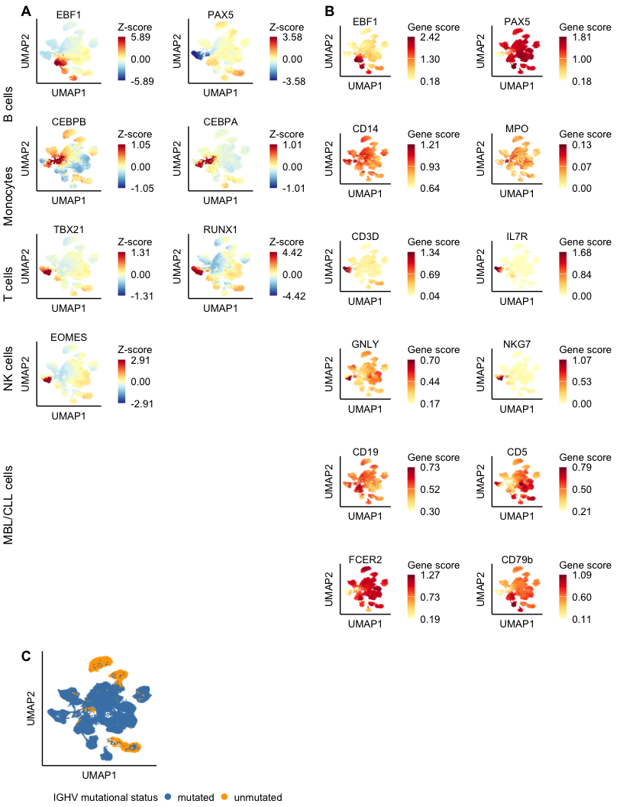<!-- -->

## Supp. 3 Marker Gene Expression RNA

``` r
subsupp3 <- annotate_figure(
  plot_grid(
    plot_grid(
      plotlist = gex_marker_gene_plots[c(
        "PAX5", "MS4A1", "EBF1", "MME", # B-cell trajectories
        "CD19", "CD5", "FCER2", "CD79B", # CLL B-Cell Marker
        "CD3D", "CD8A", "IL7R", "CD4", # T Cells
        "CD14", "MPO", "CD33", "CD33", # Monocytes
        "GNLY", "NKG7", "NCAM1", "NCAM1" # NK cells
      )], ncol = 4,
      nrow = 6,
      byrow = TRUE,
      labels = "A"
    ),
    plot_grid(celltype_marker_dotplot, GEX_IGHV_umap_plot, NULL,
      rel_widths = c(3, 1),
      labels = c("B", "C"), ncol = 2, nrow = 2, rel_heights = c(2, 1)
    ),
    nrow = 2,
    rel_heights = c(5, 2),
    ncol = 1
  ),
  left = text_grob("                                                                                              NK cells         Monocytes          T cells      MBL/CLL cells       B cells ",
    color = "black", rot = 90
  )
)

ggsave(
  filename = file.path(project_dir, "Summary_Plots/20250818_Submission_Supplement3.pdf"),
  plot = subsupp3,
  height = 11,
  width = 8.5,
  units = "in",
  bg = "white"
)

subsupp3
```

<!-- -->

## Supp. 4 Chromatin Tracks

``` r
subsupp4 <- plot_grid(celltype_tracks$CD5, NULL,
  celltype_tracks$FCER2, NULL,
  celltype_tracks$MME,
  nrow = 3, ncol = 2, labels = c("A", "", "B", "", "C")
)

ggsave(
  filename = file.path(project_dir, "Summary_Plots/20250818_Submission_Supplement4.pdf"),
  plot = subsupp4,
  width = 11,
  height = 8.5,
  units = "in",
  bg = "white"
)

subsupp4
```

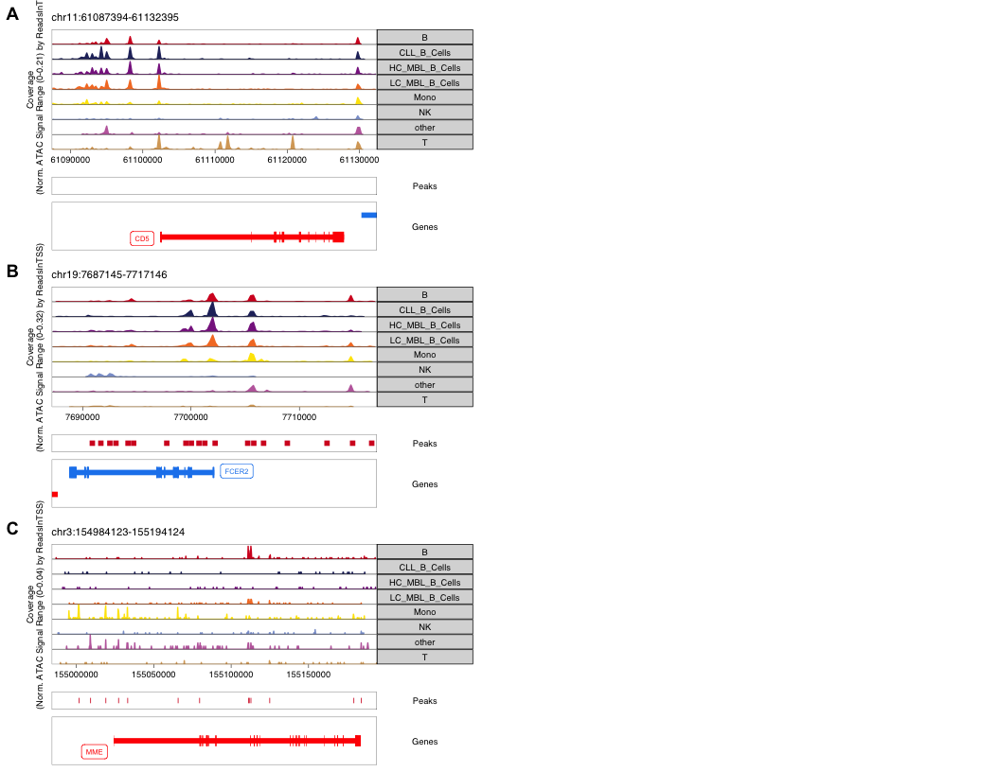<!-- -->

## Supp. 5 T cells

``` r
subsupp5 <- plot_grid(
  plot_grid(T_cell_counts_per_sample,
    T_cell_counts_per_condition,
    ncol = 3,
    nrow = 1,
    axis = "b",
    align = "h", rel_widths = c(0.5, 0.4, 0.1),
    labels = c("A", "B", "")
  ),
  plot_grid(umap_T_patients_lt_l2,
    umap_T_types_lt_l2,
    quantification_plot_l2_Tcells +
      theme(legend.key.size = unit(0.3, "cm")),
    rel_widths = c(1, 1, 1),
    nrow = 1,
    axis = "b",
    align = "hv",
    labels = c("C", "D", "E")
  ),
  nrow = 3,
  ncol = 1,
  align = "v"
)

ggsave(
  plot = subsupp5,
  filename = file.path(project_dir, "Summary_Plots/20250818_Submission_Supplement5.pdf"),
  width = 8.5,
  height = 11,
  unit = "in",
  bg = "white"
)

subsupp5
```

<!-- -->

## Supp. 6 Cell Surface Markers

``` r
subsupp6 <- plot_grid( # top
  plot_grid(volcanoplot_TSA + 
              theme(legend.position = "none") + labs(title = ""), 
            dotplot_surfacemarkers + 
              theme(legend.position = "right", legend.direction = "vertical", legend.box = "horizontal"),
    nrow = 1, ncol = 3, rel_widths = c(1, 2, 1), axis = "b", align = "h", labels="AUTO"),

  # middle
  plot_grid(NULL, NULL, nrow = 1, ncol = 1),

  # bottom
  plot_grid(NULL, NULL, nrow = 1, ncol = 1),
  nrow = 3,
  ncol = 1,
  rel_heights = c(1.5, 1, 1)
)

ggsave(
  filename = file.path(project_dir, "Summary_Plots/20250818_Submission_Supplement6.pdf"),
  plot = subsupp6,
  width = 8.5,
  height = 11,
  units = "in",
  bg = "white"
)

subsupp6
```

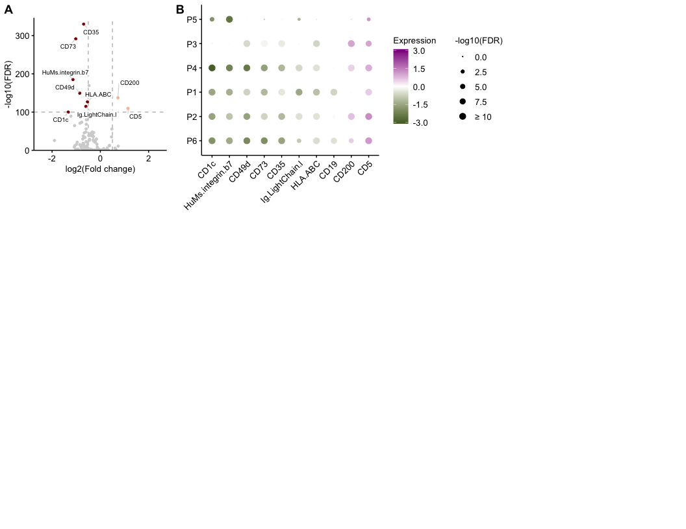<!-- -->

## Supp. 7 CNVs

``` r
subsupp7 <- plot_grid(LC_CNV_heatmaps$MBL12,
  LC_CNV_heatmaps$MBL15,
  hm_MBL12_grob,
  hm_MBL15_grob,
  nrow = 3,
  ncol = 2,
  labels = "AUTO"
)

ggsave(
  filename = file.path(project_dir, "Summary_Plots/20250818_Submission_Supplement7.pdf"),
  plot = subsupp7,
  width = 11,
  height = 8.5,
  units = "in",
  bg = "white"
)

subsupp7
```

<!-- -->

## Supp. 8 Heteroplasmy Analysis

``` r
subsupp8 <- ggarrange(
    ggarrange(
    WBCC_scatter +
      theme(aspect.ratio = 1),
    duration_scatter +
      theme(aspect.ratio = 1) + labs(y = "Fold change heteroplasmyn\n(CLL/MBL)"),
    nrow = 1, ncol = 2
  ),
  NULL,
  density_distributions,
  qqplots,
  ncol = 2,
  nrow = 2,
  heights = c(2.5, 7),
  labels = c("A", "B", "C", "D")
)

ggsave(
  filename = file.path(project_dir, "Summary_Plots/20250825_Submission_Supplement8.pdf"),
  plot = subsupp8,
  height = 11,
  width = 8.5,
  units = "in",
  bg = "white"
)

subsupp8
```

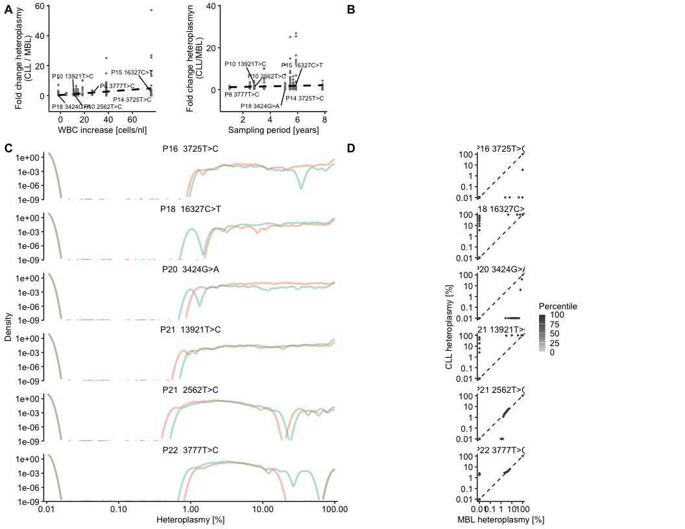<!-- -->

## Supp. 9 Differential ATAC Analysis

``` r
subsupp9 <- plot_grid(plot_grid(plotlist = enrichment_violinplots, nrow = 1, ncol = 3),
  plot_grid(volcano_TF_enrichment_pb_HC_CLL, nrow = 1, ncol = 3, rel_widths = c(1.5, 1, 1)),
  nrow = 3,
  ncol = 1,
  labels = c("A", "B", ""),
  rel_heights = c(1, 1, 0.5)
)
ggsave(
  filename = file.path(project_dir, "Summary_Plots/20250818_Submission_Supplement9.pdf"),
  plot = subsupp9,
  width = 11,
  height = 8.5,
  units = "in",
  bg = "white"
)

subsupp9
```

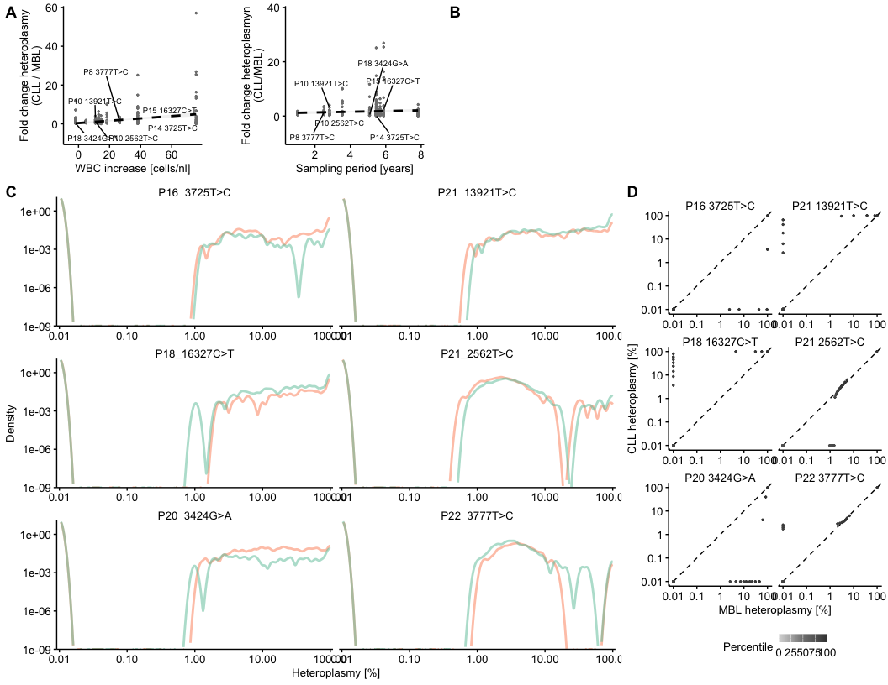<!-- -->

## Supp. 10 Differential RNA Analysis

``` r
subsupp10 <- plot_grid(
  plot_grid(
    reactome_dotplots$`B vs. LC-MBL` +
      theme(legend.position = "bottom", legend.direction = "horizontal", legend.box = "horizontal"),
    reactome_dotplots$`B vs. HC-MBL` +
      theme(legend.position = "bottom", legend.direction = "horizontal", legend.box = "horizontal"),
    reactome_dotplots$`B vs. CLL` +
      theme(legend.position = "bottom", legend.direction = "horizontal", legend.box = "horizontal"),
    ncol = 3,
    nrow = 1,
    common.legend = TRUE,
    legend = "bottom"
  ),
  plot_grid(
    volcano_GEX_pb_HC_CLL +
      theme(
        legend.position = "right",
        legend.direction = "vertical"
      ),
    rel_widths = c(1.5, 1, 1),
    nrow = 1,
    ncol = 3
  ),
  nrow = 3,
  ncol = 1,
  rel_heights = c(0.8, 0.5, 0.7), labels = "AUTO"
)

ggsave(
  filename = file.path(project_dir, "Summary_Plots/20250818_Submission_Supplement10.pdf"),
  plot = subsupp10,
  width = 11,
  height = 8.5,
  units = "in",
  bg = "white"
)

subsupp10
```

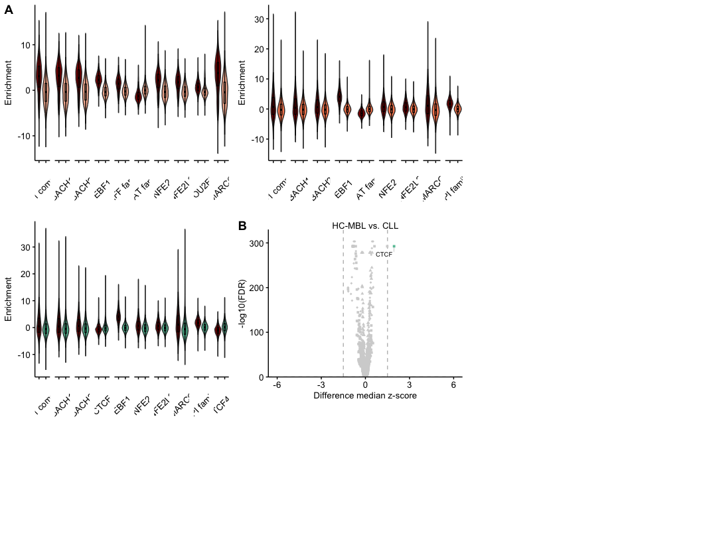<!-- -->

## Supp. 11 Nanoranger Analysis

``` r
subsupp11 <- plot_grid(
  plot_grid(mtDNA_coverage_GEX_plot + theme(legend.position = "top"),
    summary_scatterplot_1_5_fc_heteroplasmy_B_HC_MBL + theme(aspect.ratio = 1),
    summary_scatterplot_1.5_fc_heteroplasmy_B_HC_MBL_CLL + theme(aspect.ratio = 1),
    nrow = 1,
    ncol = 3,
    rel_widths = c(2, 1, 1),
    labels = c("", "B")
  ),
  plot_grid(
    plotlist = clone_matching_plots[c("MBL12", "MBL11", "MBL14", "MBL13", "MBL15", "MBL10")],
    nrow = 1,
    ncol = 6
  ),
  plot_grid(
    plot_grid(MBL12_celltype_umap + theme(legend.position = "none"),
      MBL12_BCRclone_umap + theme(legend.position = "none"),
      MBL12_2435_umap + theme(legend.position = "none"),
      MBL12_CNV_umap + theme(legend.position = "none"),
      nrow = 2,
      ncol = 2
    ),
    gotcha_quantification_plot,
    SNV_CNV_heteroplasmy_heatmaps$MBL4,
    nrow = 1,
    ncol = 3,
    rel_widths = c(1, 0.5, 1.5),
    labels = c("", "E", "F")
  ),
  nrow = 3,
  ncol = 1,
  labels = c("A", "C", "D")
)


ggsave(
  filename = file.path(project_dir, "Summary_Plots/20250818_Submission_Supplement11.pdf"),
  plot = subsupp11,
  width = 11,
  height = 8.5,
  units = "in",
  bg = "white"
)

subsupp11
```

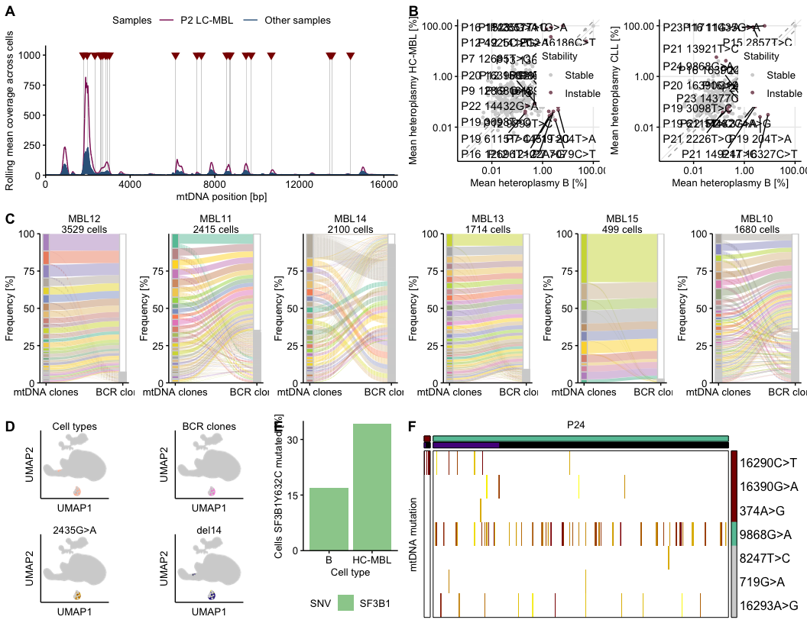<!-- -->

## Supp. 12 Heteroplasmy of mtDNA Mutation from mtscATAC-seq with CNVs

``` r
subsupp12 <- plot_grid( # top
  plot_grid(
    plot_grid(all_CNV_signif_variant_heatmaps[["MBL12"]],
      all_signif_variant_heatmaps[["MBL11"]],
      all_CNV_signif_variant_heatmaps[["MBL15"]],
      nrow = 4,
      ncol = 1, labels = c("A"), rel_heights = c(1, 1, 1, 0.5)
    ),
    plot_grid(NULL, NULL, nrow = 1, ncol = 1),
    plot_grid(NULL, NULL, nrow = 1, ncol = 1),
    nrow = 1, ncol = 3
  ),
  # middle
  plot_grid(NULL, NULL, nrow = 1, ncol = 1),
  # bottom
  plot_grid(NULL, NULL, nrow = 1, ncol = 1),
  nrow = 3,
  ncol = 1,
  rel_heights = c(2.3, 0.7, 0.7)
)

ggsave(
  filename = file.path(project_dir, "Summary_Plots/20250818_Submission_Supplement12.pdf"),
  plot = subsupp12,
  width = 8.5,
  height = 11,
  units = "in",
  bg = "white"
)

subsupp12
```

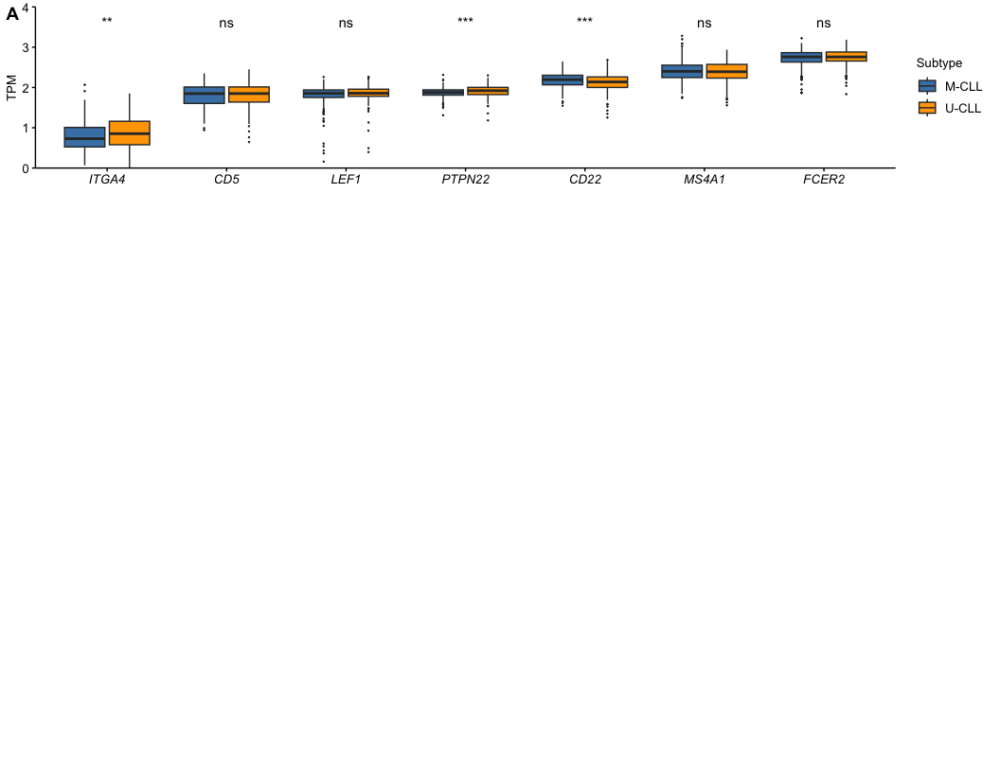<!-- -->

## Supp. 13 Heteroplasmy of mtRNA Clones from Nanoranger

``` r
subsupp13 <- plot_grid(
  plotlist = nanoranger_mtDNAclone_celltype_heteroplasmy_heatmaps[c(paste0("P", 1:12))],
  nrow = 4, ncol = 2, byrow = TRUE, labels = c("A")
)

ggsave(
  filename = file.path(project_dir, "Summary_Plots/20250818_Submission_Supplement13.pdf"),
  plot = subsupp13,
  width = 8.5,
  height = 11,
  units = "in",
  bg = "white"
)

subsupp13
```

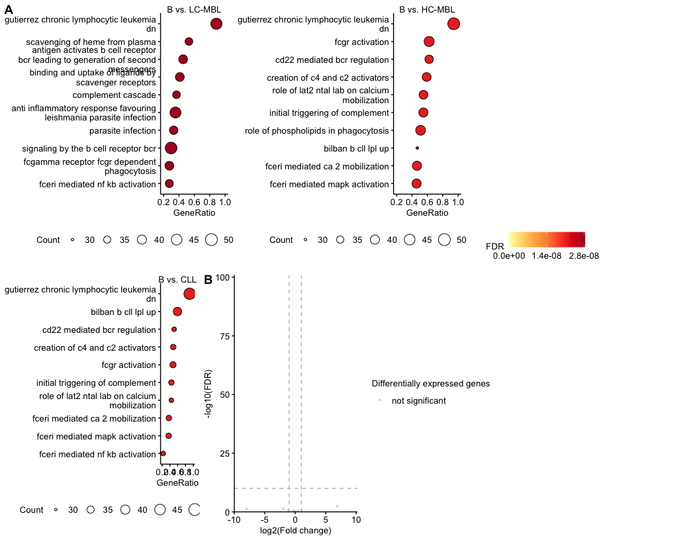<!-- -->

## Supp. 14 Clonotypes

``` r
subsupp14 <- plot_grid(
  plot_grid(BCR_clonotypes_plot,
    BCR_clonotype_counts_plot +
      theme(legend.position = "right"),
    nrow = 1, ncol = 2, rel_widths = c(0.65, 0.35)
  ),
  plot_grid(BCR_clonotype_persistence_plot + theme(aspect.ratio = 1, legend.position = "right"),
    clonal_B_alc_scatter + theme(aspect.ratio = 1),
    clonal_B_all_scatter + theme(aspect.ratio = 1),
    nrow = 1, ncol = 3, rel_widths = c(2, 1, 1), labels = c("", "C")
  ),
  plot_grid(
    mt_clones_expansion_data_plot +
      labs(title = "mtDNA clones"),
    mt_mutation_counts_plot +
      theme(legend.position = "right"),
    ncol = 2, nrow = 1, rel_widths = c(0.65, 0.35)
  ),
  plot_grid(
    mt_clone_scatter_stability_plot +
      theme(
        legend.position = "none",
        aspect.ratio = 1
      ),
    mt_clone_hist_stability_plot +
      theme(
        legend.position = "right",
        aspect.ratio = 1
      ),
    nrow = 1, ncol = 3, rel_widths = c(1, 2)
  ),
  nrow = 5, ncol = 1, labels = c("A", "B", "D", "E")
)

ggsave(
  filename = file.path(project_dir, "Summary_Plots/20250818_Submission_Supplement14.pdf"),
  plot = subsupp14,
  width = 8.5,
  height = 11,
  units = "in",
  bg = "white"
)

subsupp14
```

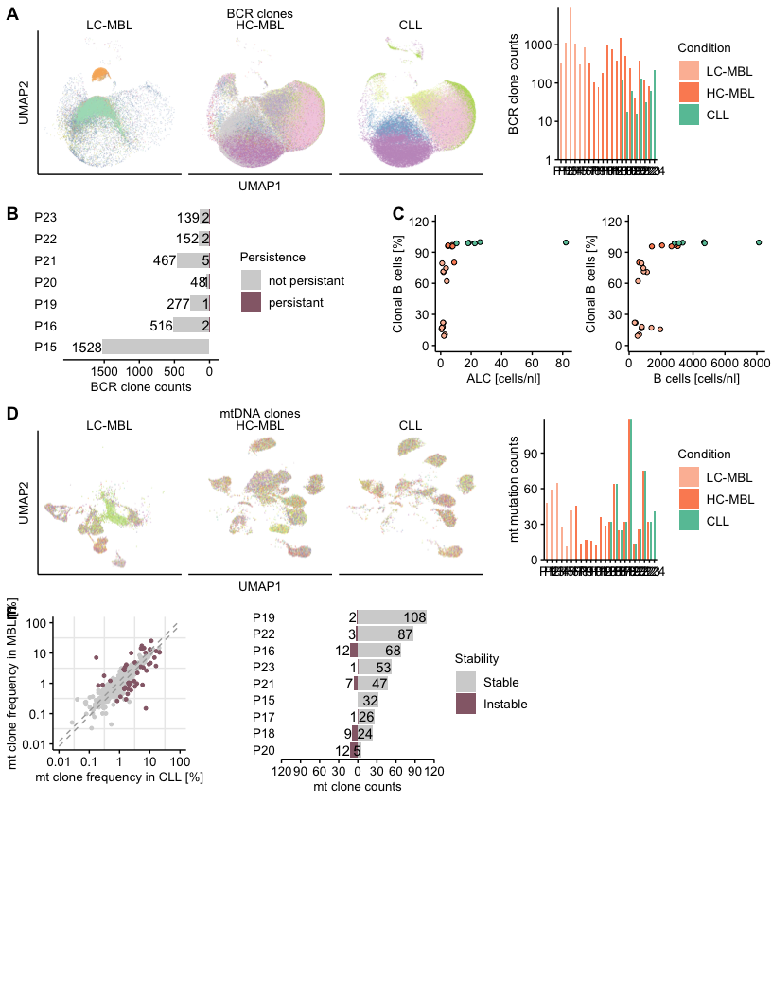<!-- -->

## Supp. 15 Heteroplasmy of mtDNA Clones from mtscATAC-seq

``` r
subsupp15.1 <- plot_grid(
  plotlist = mtDNAclone_celltype_heteroplasmy_heatmaps_filtered[c(paste0("P", 1:12))],
  nrow = 6, ncol = 2, byrow = TRUE, labels = c("A")
)

subsupp15.2 <- plot_grid(
  plotlist = mtDNAclone_celltype_heteroplasmy_heatmaps_filtered[c(paste0("P", c(13, 15:24)))],
  nrow = 6, ncol = 2, byrow = TRUE
)

ggsave(
  filename = file.path(project_dir, "Summary_Plots/20250818_Submission_Supplement15.2.pdf"),
  plot = subsupp15.1,
  width = 8.5,
  height = 11,
  units = "in",
  bg = "white"
)

ggsave(
  filename = file.path(project_dir, "Summary_Plots/20250818_Submission_Supplement15.2.pdf"),
  plot = subsupp15.2,
  width = 8.5,
  height = 11,
  units = "in",
  bg = "white"
)

subsupp15.1
```

<!-- -->

``` r
subsupp15.2
```

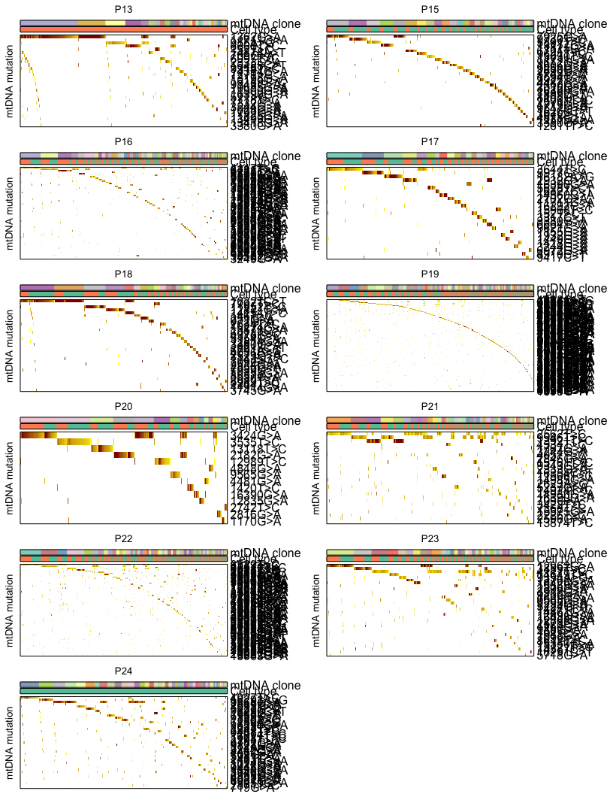<!-- -->
